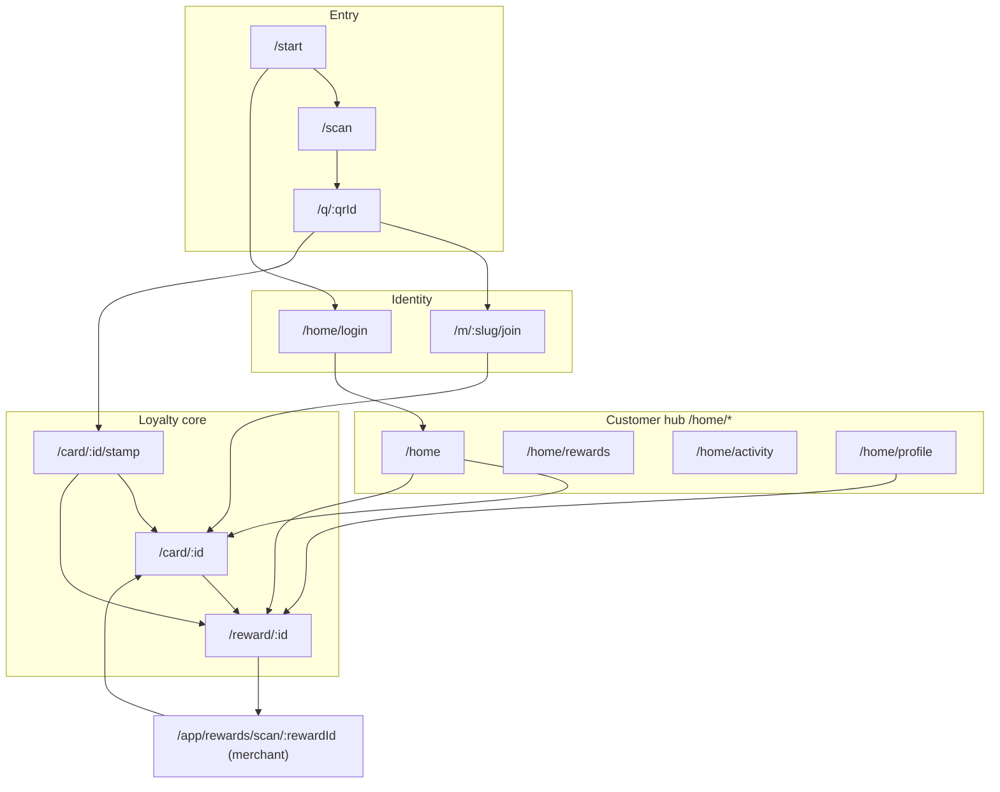

# Customer Flow Edge-Case Master Audit

> **Type:** read-only re-baseline audit of the **whole customer product surface** (QR → scanner → join → OTP → stamp → card → reward → merchant-scanned collection → home hub → auth → profile → public utility routes).
> **Date:** 2026-06-16 · **Branch:** `customer-edge-case-hardening` · **Baseline commit:** `e6462226` (“Harden customer edge cases across QR → join → stamp → card → reward”).
> **No production code, tests, migrations, or generated route docs were modified to produce this artifact.** Recommendations are analysis only.
>
> **Supersedes** the two prior read-only audits, which remain as historical inputs:
>
> - [`Goal/customer-edge-case-audit.md`](customer-edge-case-audit.md) — 57 scenarios, loyalty-core focus (pre-fix snapshot).
> - [`Goal/customer-edge-case-audit-claude.md`](customer-edge-case-audit-claude.md) — 51 scenarios, deeper RPC/mapper analysis (pre-fix snapshot).
>
> [`Goal/Goal.md`](Goal.md) remains the implementation tracker; §9 of this document reconciles its backlog against what is now landed.

---

## 1. Executive summary

### Verdict

**The customer flow is materially healthier than either prior audit recorded.** The hardening slice in commit `e6462226` closed the headline risks both audits raised — the duplicate/​incomplete stamp-error mapper, the rate-limit and pool-minimum throws into a full-page error boundary, the cancelled-billing mismatch across surfaces, the hidden waiting-reward on home, the full-card-without-reward dead-end, the OTP auto-stamp uncaught throw, the generic QR rate-limit panel, and the “stamp landed” lie after a blocked first stamp. Each is verified resolved against current code **and** locked by a test (§6).

The product shape both audits validated still holds and is now better enforced:

- QR entry routes returning members to stamp/reward, never an “already joined” dead end.
- Reward states (ready/waiting) outrank stamp confirms everywhere a card is full.
- Reward collection is **merchant-scanned QR** — the customer page is passive (no `redeem_self_service_reward` call site exists outside a doc comment).
- The redeem-time profile gate, the geolocation soft-fail, and the server/RPC-as-source-of-truth invariant are intact.

**The remaining risk has shifted.** With the loyalty core hardened, the live edges are now at the **programme-health seam** and at **merchant/operator-facing copy**:

1. **`merchants.status` is not enforced on the join / QR-resolver path** (only `billing_customers.status` is). A _paused_ merchant can still onboard new members; the pause only bites at the first-stamp RPC, surfacing to the customer as a perpetual `firststamp=pending`. **(N1, P1 — the one new structural gap.)**
2. **Merchant-scan collect-time RPC errors reach the merchant screen as raw strings** (`reward-collection.ts:148`). Pre-checks mask the common cases; collect-time races/holds do not. **(N2, P1 — operator-facing.)**
3. **The merchant terms page still tells customers to “Tap redeem from your reward page”** — contradicting the merchant-scanned model. **(N3, P1 — customer-facing copy drift.)**

Everything else is P2 hygiene, traceability, or test-depth.

### Counts

| Metric                                     |                                                                                                 Value |
| ------------------------------------------ | ----------------------------------------------------------------------------------------------------: |
| Customer surfaces audited (segments A–L)   |                                                                                                    12 |
| Scenario rows catalogued                   |                                                                                                   146 |
| Prior-audit gaps re-baselined              |                                                                       26 (G1–G14 + audit-1 G-01…G-12) |
| — Resolved since prior audits (test-cited) |                                                                                                    22 |
| — Open / remaining                         |                                                                 4 carried + **3 newly characterised** |
| Open gap register entries (at audit time)  |                                                                                                    10 |
| — P0                                       |                                                                                                 **0** |
| — P1                                       |                                                          **3** (N1, N2, N3 — all now fixed, see §6.1) |
| — P2                                       |                                                     **7** (4 fixed, 3 documented/deferred — see §6.1) |
| **Open after remediation (this session)**  | **2** (P2: N6 spec-adoption deferred-doc, N8 cosmetic; N9 thin E2E now landed, broader matrix future) |
| Stamp RPC exceptions inventoried           |                                                                                                    10 |
| Redeem RPC exceptions inventoried          |                                                                                                    12 |
| Focused customer Vitest files run          |                                                                                                    15 |
| Focused customer tests                     |                                                                             **171 passed / 0 failed** |

### What changed since the prior audits (resolved)

| Prior gap (audit)                                                        | Was | Now                                 | Evidence                                                                                                                                                                                                                                                              |
| ------------------------------------------------------------------------ | --- | ----------------------------------- | --------------------------------------------------------------------------------------------------------------------------------------------------------------------------------------------------------------------------------------------------------------------- |
| G1 / G-01 — rate-limit stamp error throws to error boundary              | P0  | **Resolved**                        | `block-reasons.ts:24` maps `rate_limited`; [`stamp.ts:46-61`](../lib/customer/stamp.ts) returns `blocked`; [`actions.ts:37-49`](../app/card/[membershipId]/actions.ts) try/catch. Test: `self-service-stamping.test.ts` “never throws an unexpected stamp RPC error”. |
| G2 / G-02 — reward pool < 3 throws; reward never unlocks                 | P0  | **Resolved**                        | `block-reasons.ts:25` maps `pool_unavailable`; [`stamp.ts:52-57`](../lib/customer/stamp.ts) logs `self_service_stamp_pool_unavailable` for operators. Test: `self-service-stamping.test.ts`.                                                                          |
| G3/G7 / G-04 — cancelled billing looks available, fails at RPC           | P0  | **Resolved**                        | [`card.ts:192`](../lib/customer/card.ts) treats `cancelled`≡`suspended`; all loaders inherit. Test: `customer-billing-matrix.test.ts` (5 tests, card+reward+QR-join).                                                                                                 |
| G4 — duplicate/​dead block-reason mapper                                 | P1  | **Resolved**                        | `blockedReason()` deleted; production uses `toStampBlockReason`/`blockReasonCopy` ([`block-reasons.ts`](../lib/customer/experience/block-reasons.ts)).                                                                                                                |
| G5 / G-06 — home hides waiting reward                                    | P1  | **Resolved**                        | [`home-dashboard.ts:38-40`](../lib/customer/home-dashboard.ts) waiting branch. Test: `customer-home.test.ts:161-193`.                                                                                                                                                 |
| G6 / G-09 / G(audit-1 DATA-01) — full card, no reward row → wrong action | P0  | **Resolved**                        | `fullWithoutReward` in [`load-card.ts:115`](../lib/customer/experience/load-card.ts) + [`load-stamp.ts:86-106`](../lib/customer/experience/load-stamp.ts), both `logger.warn`. Test: `customer-experience.test.ts:239,331`.                                           |
| G8 / G-07 — dead `StampBlockReason` variants                             | P2  | **Resolved**                        | `invalid_qr`/`expired_qr`/`wrong_merchant` removed from [`types.ts:26-34`](../lib/customer/experience/types.ts).                                                                                                                                                      |
| G9 — `unavailableMessage` duplicated                                     | P2  | **Resolved**                        | Single def [`card.ts:176`](../lib/customer/card.ts); imported by `reward.ts:3`.                                                                                                                                                                                       |
| G10 / G-12 — QR rate-limit looks like a dead QR                          | P2  | **Resolved**                        | Distinct `RateLimitedQr` panel [`q/[qrId]/page.tsx:31-32`](../app/q/[qrId]/page.tsx).                                                                                                                                                                                 |
| G11 — cancelled-at-join first stamp silently swallowed                   | P2  | **Resolved (partially; see N1/N4)** | `firststamp=pending` redirect [`join/actions.ts:281-285`](../app/m/[merchantSlug]/join/actions.ts); card renders “collect your first stamp”, not “landed”.                                                                                                            |
| G12 — “tomorrow” overstates timing                                       | P2  | **Resolved**                        | Home: “back on the next opening day” (`home-dashboard.ts:39`); rewards page renders the real date (`rewards/page.tsx:64-68`).                                                                                                                                         |
| G13 — OTP auto-stamp uncaught throw; reward branches untested            | P1  | **Resolved**                        | try/catch [`returning-qr-redirect.ts:116-123`](../lib/customer/returning-qr-redirect.ts) degrades to stamp path; reward-ready→`/reward/{id}`, reward-waiting→card. Test: `returning-qr-redirect.test.ts` (8 tests).                                                   |
| G14 — docs `/home` vs “wallet” naming                                    | P2  | **Mostly resolved**                 | [`docs/CUSTOMER_FLOW.md:17-18`](../docs/CUSTOMER_FLOW.md) now carries a wallet→`/home` reconciliation note. Minor prose mentions remain (N10).                                                                                                                        |
| audit-1 G-03 — stamp mapping incomplete                                  | P1  | **Resolved**                        | Folded into G4 consolidation.                                                                                                                                                                                                                                         |
| audit-1 G-05 — `past_due`/`trialing` implicit                            | P2  | **Resolved**                        | Now explicit in `customer-billing-matrix.test.ts` (“allows trialing, active and past_due”).                                                                                                                                                                           |
| audit-1 G-08 — returning OTP reward branches untested                    | P1  | **Resolved**                        | Covered by G13 test work.                                                                                                                                                                                                                                             |

### Coverage snapshot (by layer)

| Layer                            | Conclusion                                                                                                                                                                                                                                         |
| -------------------------------- | -------------------------------------------------------------------------------------------------------------------------------------------------------------------------------------------------------------------------------------------------- |
| RPC (SQL)                        | Authoritative and unchanged in shape; the two customer RPCs enforce every loyalty invariant. The June-16 stamp RPC raises the pool minimum to **3 active items** (supersedes the June-15 “at least one”).                                          |
| Loaders                          | Now derive availability uniformly from one `unavailableMessage` / `isMerchantBillingBlocked`; `fullWithoutReward` plumbed in both card+stamp loaders. **One asymmetry: the join/QR loader checks billing status but not `merchants.status` (N1).** |
| Derive                           | Pure, priority-driven, exhaustive (`assertNever`); dead block-reasons removed; `firstStampPending` modelled.                                                                                                                                       |
| UI                               | Coherent merchant-scan reward UX; waiting-reward and cancelled-billing copy now correct on every customer surface. One stale terms-page line (N3).                                                                                                 |
| Home                             | Ready + waiting + stamped-today + collecting all distinctly represented; neutral unknown-phone login; `safeNextPath`; stale-session reset.                                                                                                         |
| Merchant scan (customer outcome) | Idempotent and safe; pre-checks mask common blocks. Collect-time RPC errors still raw to the merchant (N2).                                                                                                                                        |
| Tests                            | Strong unit/loader/contract coverage (171 green). E2E/browser matrix still absent (N9, out of scope per plan).                                                                                                                                     |

---

## 2. Architecture rules anchoring every scenario

### 2.1 The four-layer pipeline (source-of-truth hierarchy)

```
Postgres RPCs ─▶ Loaders (load-*.ts, home.ts) ─▶ deriveCustomerExperience ─▶ UI panels + Home
issue_self_service_stamp      impure fact gathering    pure priority resolution    copy + CTAs
redeem_self_service_reward    + date maths             (derive.ts/priorities.ts)
join_..._with_first_stamp
```

**Audit rule:** the RPC is authoritative. A loader/derive/UI decision is a **gap** when it is _more permissive_ than the RPC (offers an action the RPC rejects) or _silently stricter_ with no recovery. Pure wording differences are drift (P2).

| Layer   | Role                         | Key files                                                                                                                                                                                                                                                                                                                                                         |
| ------- | ---------------------------- | ----------------------------------------------------------------------------------------------------------------------------------------------------------------------------------------------------------------------------------------------------------------------------------------------------------------------------------------------------------------- |
| RPC     | Stamp/redeem/join invariants | [`issue_self_service_stamp`](../supabase/migrations/20260616103000_minimum_three_rewards.sql), [`redeem_self_service_reward`](../supabase/migrations/20260615130000_reward_redemption_cycles.sql), [`join_customer_membership_with_first_stamp`](../supabase/migrations/20260614120000_join_with_first_stamp.sql)                                                 |
| Loaders | Impure fact gathering        | [`load-join.ts`](../lib/customer/experience/load-join.ts), [`load-stamp.ts`](../lib/customer/experience/load-stamp.ts), [`load-card.ts`](../lib/customer/experience/load-card.ts), [`load-reward.ts`](../lib/customer/experience/load-reward.ts), [`load-profile-gate.ts`](../lib/customer/experience/load-profile-gate.ts), [`home.ts`](../lib/customer/home.ts) |
| Derive  | Pure priority resolution     | [`derive.ts`](../lib/customer/experience/derive.ts), [`priorities.ts`](../lib/customer/experience/priorities.ts), [`block-reasons.ts`](../lib/customer/experience/block-reasons.ts)                                                                                                                                                                               |
| Actions | Mutations + redirects        | [`join/actions.ts`](../app/m/[merchantSlug]/join/actions.ts), [`card/actions.ts`](../app/card/[membershipId]/actions.ts), [`home/actions.ts`](../app/home/actions.ts), [`reward-collection.ts`](../lib/merchant/reward-collection.ts)                                                                                                                             |

### 2.2 Priority invariants (must hold in every scenario row)

| Route     | Priority (first wins) — [`priorities.ts`](../lib/customer/experience/priorities.ts)                |
| --------- | -------------------------------------------------------------------------------------------------- |
| card / qr | `unavailable` → `card_collecting`                                                                  |
| stamp     | `unavailable` → **`reward_ready`** → **`reward_waiting`** → `card_stamped_today` → `stamp_confirm` |
| reward    | `unavailable` → `redeemed_proof` → `reward_ready` → `reward_waiting`                               |
| join      | `unavailable` → `join_returning` → `join_terms` → `join_otp` → `join_phone` → `join_welcome`       |

`unavailable` is always first — access/availability problems win everywhere. A full card never offers another stamp through the UI; the customer never self-redeems.

### 2.3 Two independent billing dimensions (do not conflate)

- `merchants.status` ∈ `{trial, active, paused, cancelled, suspended}` — the programme lifecycle.
- `billing_customers.status` ∈ `{trialing, active, past_due, cancelled, suspended}` — the subscription.

Both RPCs block `merchants.status ∉ {trial,active}` **and** `billing_customers.status ∈ {cancelled,suspended}`; `past_due`/`trialing`/`active` are allowed. The shared customer policy lives in [`unavailableMessage`](../lib/customer/card.ts) (checks **both** dimensions) and [`isMerchantBillingBlocked`](../lib/customer/join.ts) (checks **only** `billing_customers.status`). That split is the root of N1.

### 2.4 Journey map



---

## 3. Scenario catalog (Segments A–L)

Legend — **OK**: coherent; **Partial**: exists but coverage/copy incomplete; **Gap**: conflicts or can mislead/fail; **Missing**: no direct coverage. “Test” cites the strongest covering file (U=unit/derive, L=loader/action, R=route/UI, S=SQL; — = none found).

### Segment A — QR resolver · `/q/[qrId]` ([page.tsx](../app/q/[qrId]/page.tsx))

| ID  | Preconditions                                        | Derived outcome → customer sees                                        | RPC if action                          | Test                                                 | Status  | Gap    |
| --- | ---------------------------------------------------- | ---------------------------------------------------------------------- | -------------------------------------- | ---------------------------------------------------- | ------- | ------ |
| A1  | Active join QR, no membership                        | redirect → `/m/{slug}/join?qr=` (welcome)                              | n/a                                    | `customer.test` (R)                                  | OK      | —      |
| A2  | Active QR, existing membership, signed in            | redirect → `/card/{id}/stamp?qr=`                                      | n/a                                    | `self-service-stamping`, `returning-qr-redirect` (L) | OK      | —      |
| A3  | Unknown QR id                                        | `UnavailableQr` — “Card unavailable / Ask the venue team…”             | n/a                                    | `customer.test` (R)                                  | OK      | —      |
| A4  | Inactive QR (`is_active=false`)                      | `UnavailableQr`                                                        | n/a                                    | `customer.test` (L)                                  | OK      | —      |
| A5  | QR `destination_type` ≠ `join`                       | `resolveQrForJoin` → unavailable                                       | n/a                                    | `customer.test` (L)                                  | OK      | —      |
| A6  | `billing_customers.status` cancelled/suspended       | `resolveQrForJoin` unavailable → `UnavailableQr`                       | n/a                                    | `customer-billing-matrix` (L)                        | OK      | —      |
| A7  | **`merchants.status` = paused/cancelled/suspended**  | **Available → routes to join** (join leg never checks merchant status) | first stamp later blocked by stamp RPC | —                                                    | **Gap** | **N1** |
| A8  | QR resolve rate-limited (`RateLimitError`)           | `RateLimitedQr` — “One moment / Too many scans just now…”              | n/a                                    | (panel present; route test —)                        | OK      | —      |
| A9  | QR resolve throws (non-rate-limit)                   | `UnavailableQr`                                                        | n/a                                    | —                                                    | OK      | —      |
| A10 | Active QR scan (analytics)                           | `qr_scanned` product event recorded with availability flag             | n/a                                    | `customer.test` “records QR scan analytics” (L)      | OK      | —      |
| A11 | Returning member, card full + reward ready, scans QR | redirect resolves reward-first on stamp route                          | reward, not stamp                      | `customer-experience` (U)                            | OK      | —      |
| A12 | Membership belongs to a different signed-in customer | stamp route access guard → unavailable+recovery                        | n/a (blocked pre-RPC)                  | `customer-experience` (U)                            | OK      | —      |

### Segment B — In-app scanner · `/scan` ([page.tsx](../app/scan/page.tsx), [qr-scanner.ts](../lib/customer/qr-scanner.ts))

| ID  | Preconditions                             | Outcome                                                                      | Test                      | Status  | Gap |
| --- | ----------------------------------------- | ---------------------------------------------------------------------------- | ------------------------- | ------- | --- |
| B1  | Decode relative `/q/{id}`                 | normalize → `router.push("/q/{id}")`                                         | `customer-qr-scanner` (U) | OK      | —   |
| B2  | Decode same-origin absolute URL           | accepted; origin equality enforced                                           | `customer-qr-scanner` (U) | OK      | —   |
| B3  | Decode `/q/{id}?utm=…#scan`               | query/hash stripped → `/q/{id}`                                              | `customer-qr-scanner` (U) | OK      | —   |
| B4  | Decode foreign-origin URL                 | rejected → “That is not a Nabaperks QR”                                      | `customer-qr-scanner` (U) | OK      | —   |
| B5  | Decode `/card/...` (non-`q` root)         | rejected                                                                     | `customer-qr-scanner` (U) | OK      | —   |
| B6  | Decode `/q/{id}/extra` (extra segment)    | rejected                                                                     | `customer-qr-scanner` (U) | OK      | —   |
| B7  | Decode `/q/../admin` (path traversal)     | URL resolves to `/admin` → rejected                                          | `customer-qr-scanner` (U) | OK      | —   |
| B8  | qrId fails `^[A-Za-z0-9_-]+$`             | rejected                                                                     | `customer-qr-scanner` (U) | OK      | —   |
| B9  | Authed session present                    | `CustomerAppShell` (nav + sign-out) wraps scanner                            | (structural test)         | OK      | —   |
| B10 | Guest (no session)                        | `CustomerShell` (no chrome)                                                  | (structural test)         | OK      | —   |
| B11 | `CUSTOMER_SESSION_SECRET` blank           | guard skips `getCustomerSession`; degrades to guest shell (no throw)         | —                         | OK      | —   |
| B12 | Camera permission denied / camera failure | status `camera-error` → “Camera unavailable” + allow-access remediation copy | — (client)                | Partial | N9  |

### Segment C — Join wizard · `/m/[slug]/join` ([load-join.ts](../lib/customer/experience/load-join.ts), [actions.ts](../app/m/[merchantSlug]/join/actions.ts))

| ID  | Preconditions                                               | Derived kind → customer sees                                                         | RPC if action                                        | Test                                               | Status             | Gap    |
| --- | ----------------------------------------------------------- | ------------------------------------------------------------------------------------ | ---------------------------------------------------- | -------------------------------------------------- | ------------------ | ------ |
| C1  | `qrId`, no session, `step≠phone`                            | `join_welcome` — “Keep your card on your phone”                                      | n/a                                                  | `customer-experience` (U)                          | OK                 | —      |
| C2  | `step=phone`                                                | `join_phone` — phone field, “Text me the code”                                       | `requestCustomerIdentityAction`                      | `customer-experience` (U)                          | OK                 | —      |
| C3  | Direct join, no `qrId`                                      | `join_phone` (welcome skipped)                                                       | —                                                    | `customer-experience` (U)                          | OK                 | —      |
| C4  | Pending join OTP                                            | `join_otp` — “Save my card”                                                          | `verifyCustomerOtpAction`                            | `customer-experience`, `customer-phone-auth` (U/L) | OK                 | —      |
| C5  | Verified session, no membership                             | `join_terms` — “Get my first stamp”                                                  | `joinRewardsAction`                                  | `customer-experience` (U)                          | OK                 | —      |
| C6  | Existing membership, no QR                                  | `join_returning` — “You’re already joined”                                           | n/a                                                  | `customer-experience` (U)                          | OK                 | —      |
| C7  | Existing membership + QR, signed in                         | page redirect via returning helper (`issueStamp:false`) → stamp confirm              | n/a                                                  | `returning-qr-redirect` (L)                        | OK                 | —      |
| C8  | Invalid UK phone                                            | `errors.contact = "Enter a valid phone number."`                                     | n/a                                                  | `customer-phone-auth` (L)                          | OK                 | —      |
| C9  | Phone OTP request rate-limited                              | `errors.form = "Too many verification requests. Try again later."`                   | n/a                                                  | `customer.test` (L)                                | OK                 | —      |
| C10 | OTP format invalid                                          | `errors.otp = "Enter the verification code."` (4–8 digits)                           | n/a                                                  | `customer-phone-auth` (L)                          | OK                 | —      |
| C11 | Wrong OTP code                                              | `errors.form = "That code was not accepted."`                                        | n/a                                                  | `customer-phone-auth` (L)                          | OK                 | —      |
| C12 | Expired/missing pending at verify                           | `errors.contact = "Request a new phone code."`                                       | n/a                                                  | `customer-phone-auth` (L)                          | OK                 | —      |
| C13 | Terms not accepted                                          | `errors.loyaltyTerms = "Accept the loyalty terms to join."`                          | n/a                                                  | `customer.test` (L)                                | OK                 | —      |
| C14 | Marketing opt-in **off**                                    | join succeeds; **no** `consent_records` row written                                  | `join_customer_membership` (`if p_marketing_opt_in`) | `customer.test` “separate marketing consent” (L/S) | OK                 | —      |
| C15 | QR join, first stamp **succeeds**                           | redirect `?welcome=1&stamp=issued[&geo=flagged]`                                     | first stamp issued                                   | `customer-phone-auth` (L)                          | OK                 | —      |
| C16 | QR join, first stamp **blocked** (pool/billing/rate/paused) | redirect `?welcome=1&firststamp=pending` → “collect your first stamp at the counter” | first stamp swallowed (`first_stamp_issued=false`)   | `customer-phone-auth` (L)                          | OK (but see N1/N4) | N1, N4 |

### Segment D — Returning OTP auto-routing · [`returning-qr-redirect.ts`](../lib/customer/returning-qr-redirect.ts)

| ID  | Preconditions                         | Outcome (redirect)                                             | Test                        | Status | Gap |
| --- | ------------------------------------- | -------------------------------------------------------------- | --------------------------- | ------ | --- |
| D1  | No membership at merchant             | `null` → join flow continues                                   | `returning-qr-redirect` (L) | OK     | —   |
| D2  | `issueStamp:false` (page visit)       | `/card/{id}/stamp?qr=` (confirm)                               | `returning-qr-redirect` (L) | OK     | —   |
| D3  | QR context invalid                    | `/card/{id}`                                                   | `returning-qr-redirect` (L) | OK     | —   |
| D4  | Unlocked + redeemable reward          | `/reward/{id}` (reward-first)                                  | `returning-qr-redirect` (L) | OK     | —   |
| D5  | Unlocked + waiting reward             | `/card/{id}` (no auto-stamp)                                   | `returning-qr-redirect` (L) | OK     | —   |
| D6  | Stamp issued (incl. geo flag)         | `/card/{id}?stamp=issued[&geo=flagged]` + `stamp_issued` event | `returning-qr-redirect` (L) | OK     | —   |
| D7  | Issue blocked “already stamped”       | `/card/{id}/stamp?qr=` (status)                                | `returning-qr-redirect` (L) | OK     | —   |
| D8  | Issue RPC **throws**                  | try/catch degrades → `/card/{id}/stamp?qr=`                    | `returning-qr-redirect` (L) | OK     | —   |
| D9  | Issue blocked (rate/pool) — non-throw | `/card/{id}/stamp?qr=`                                         | `returning-qr-redirect` (L) | OK     | —   |

### Segment E — Stamp surface · `/card/[id]/stamp?qr=` ([load-stamp.ts](../lib/customer/experience/load-stamp.ts), [selfStampAction](../app/card/[membershipId]/actions.ts))

| ID  | Preconditions                                                                 | Derived kind → customer sees                                                                    | RPC if action                                               | Test                                                   | Status  | Gap |
| --- | ----------------------------------------------------------------------------- | ----------------------------------------------------------------------------------------------- | ----------------------------------------------------------- | ------------------------------------------------------ | ------- | --- |
| E1  | Valid QR, not stamped, not full, no reward                                    | `stamp_confirm` — “Ready to add today’s stamp.”                                                 | issues stamp +1                                             | `customer-experience`, `self-service-stamping` (U/L)   | OK      | —   |
| E2  | Already stamped this UK day                                                   | `card_stamped_today` — “You’re already stamped today.”                                          | `Stamp already issued…` → calm                              | `customer-experience` (U)                              | OK      | —   |
| E3  | Full card + redeemable reward                                                 | `reward_ready` (page redirects to `/reward/{id}`)                                               | n/a                                                         | `customer-experience` (U)                              | OK      | —   |
| E4  | Full card + reward overnight hold                                             | `reward_waiting` — “Give it a day to breathe”                                                   | n/a                                                         | `customer-experience` (U)                              | OK      | —   |
| E5  | No QR in URL                                                                  | `unavailable` — “Open this screen from the printed venue QR…”                                   | n/a                                                         | `self-service-stamping` (U/L)                          | OK      | —   |
| E6  | Invalid / wrong-merchant QR                                                   | `unavailable` — “Scan the venue code again…”                                                    | n/a                                                         | `customer-experience` (U)                              | OK      | —   |
| E7  | Unauthenticated                                                               | `unavailable` + recovery loginHref                                                              | n/a                                                         | `customer-experience` (U)                              | OK      | —   |
| E8  | Wrong customer (membership owned by another)                                  | `unavailable` — “This belongs to another customer.”                                             | n/a (pre-RPC)                                               | `customer-experience` (U)                              | OK      | —   |
| E9  | Membership not found                                                          | `unavailable` — “This could not be found.”                                                      | n/a                                                         | `customer-experience` (U)                              | OK      | —   |
| E10 | Submit on full card (form bypass)                                             | inline blocked — “Your reward is ready - redeem it…”                                            | `A reward is already ready…` → `reward_ready_first`         | `self-service-stamping` (L)                            | OK      | —   |
| E11 | Stamp RPC rate limit (>10/15min)                                              | inline blocked — “You’re going a little fast…”                                                  | `Rate limit exceeded` → `rate_limited`                      | `self-service-stamping`, `customer-billing-matrix` (L) | OK      | —   |
| E12 | Final stamp, active pool < 3 items                                            | inline blocked — “Your reward is almost ready…ask a team member” + `logger.warn`                | `At least 3 active reward pool items…` → `pool_unavailable` | `self-service-stamping` (L)                            | OK      | —   |
| E13 | `Verified customer required` (direct RPC)                                     | mapped → `unauthenticated` copy                                                                 | RPC raises                                                  | `customer-experience` (U)                              | OK      | —   |
| E14 | Unexpected RPC throw (e.g. connection reset)                                  | inline — “That didn’t go through…” + `logger.error` (no boundary)                               | throw caught                                                | `self-service-stamping` “never throws…” (L)            | OK      | —   |
| E15 | `merchants.status` not active / card not active / billing suspended/cancelled | `unavailable` via `unavailableReason`                                                           | RPC also blocks                                             | `customer-billing-matrix` (L)                          | OK      | —   |
| E16 | **count ≥ required but no unlocked reward row**                               | `unavailable` — “We’re sorting your reward. Check back shortly…” (blocks stamp) + `logger.warn` | n/a (pre-RPC)                                               | `customer-experience:331` (U)                          | OK      | —   |
| E17 | Geo denied / coords missing, `require_geofence=true`                          | stamp issues; `geo=flagged` review note                                                         | issues + `fraud_flags` (soft)                               | `self-service-stamping` (partial)                      | OK      | N9  |
| E18 | Geo out of range, `require_geofence=true`                                     | stamp issues; review flag                                                                       | issues + `fraud_flags` (soft)                               | SQL static                                             | Partial | N9  |

### Segment F — Card surface · `/card/[id]` ([load-card.ts](../lib/customer/experience/load-card.ts), [customer-card-experience.tsx](../components/customer/customer-card-experience.tsx))

| ID  | Preconditions                                    | Derived → customer sees                                                         | Test                                                 | Status | Gap |
| --- | ------------------------------------------------ | ------------------------------------------------------------------------------- | ---------------------------------------------------- | ------ | --- |
| F1  | Collecting, no reward                            | `card_collecting` reward=`none` — grid + sealed teaser + “Scan the venue code…” | `customer-experience`, `customer-home` (U)           | OK     | —   |
| F2  | Collecting + reward overnight hold               | reward=`waiting` — “Give it a day to breathe” band, no QR                       | `customer-experience` (U)                            | OK     | —   |
| F3  | Full + redeemable reward                         | reward=`ready` — “Open reward QR” → `/reward/{id}`                              | `customer-experience` (U)                            | OK     | —   |
| F4  | `?stamp=issued`                                  | celebration — “Stamp added.” / slam animation                                   | `customer-experience` (U)                            | OK     | —   |
| F5  | `?welcome=1`                                     | “Welcome to {merchant}.” — “your first stamp is on the card.”                   | `customer-experience` (U)                            | OK     | —   |
| F6  | `?welcome=1&firststamp=pending`                  | “You’re in. …scan the venue QR to collect your first stamp.”                    | `customer-experience:189`, `customer.test:767` (U/L) | OK     | —   |
| F7  | `?reward=redeemed`                               | banner — “Reward redeemed. New stamp cycle started.”                            | `reward-redemption-cycles` (U/S)                     | OK     | —   |
| F8  | `?geo=flagged`                                   | appended “Location could not be confirmed, so the venue may review it.”         | (derive)                                             | OK     | —   |
| F9  | **count ≥ required, no unlocked reward**         | `unavailable` recovery — “We’re sorting your reward…”                           | `customer-experience:239` (U)                        | OK     | —   |
| F10 | Billing cancelled/suspended; merchant not active | `unavailable` calm reason                                                       | `customer-billing-matrix` (L)                        | OK     | —   |
| F11 | Unauth / unauthorized / not found                | `unavailable` (+ recovery if unauth)                                            | `customer-experience` (U)                            | OK     | —   |
| F12 | Plain card (no QR)                               | scan prompt only — “Scan the venue code to add your stamp.”                     | `customer-experience` (U)                            | OK     | —   |

### Segment G — Reward surface · `/reward/[id]` ([load-reward.ts](../lib/customer/experience/load-reward.ts), [reward-panels.tsx](../components/customer/reward-panels.tsx)) — _passive, no redeem call_

| ID  | Preconditions                                  | Derived kind → customer sees                                    | Redeem RPC (merchant scan)            | Test                                                    | Status | Gap   |
| --- | ---------------------------------------------- | --------------------------------------------------------------- | ------------------------------------- | ------------------------------------------------------- | ------ | ----- |
| G1  | Unlocked + redeemable + profile complete       | `reward_ready` — “Ready for merchant scan” + QR                 | succeeds on scan                      | `merchant-scanned-reward`, `reward-profile-gate` (L/S)  | OK     | —     |
| G2  | Unlocked + redeemable + profile **incomplete** | `reward_ready` + `CustomerProfileGateForm` (Name/DOB/opt email) | `Complete your profile…` (backstop)   | `reward-profile-gate` (L/S)                             | OK     | —     |
| G3  | Unlocked + not yet redeemable                  | `reward_waiting` — “…from the next opening day”                 | `…next UK business day` (backstop)    | `customer-experience` (U)                               | OK     | —     |
| G4  | Status `redeemed` (or `?redeemed=1`)           | `redeemed_proof` — “Reward collected.”                          | idempotent no-op                      | `customer-experience`, `reward-redemption-cycles` (U/S) | OK     | —     |
| G5  | Wrong customer                                 | `unavailable` — “This belongs to another customer.”             | n/a                                   | `customer-experience` (U)                               | OK     | —     |
| G6  | Not found / unauth                             | `unavailable` / recovery                                        | n/a                                   | `customer-experience` (U)                               | OK     | —     |
| G7  | Billing cancelled/suspended                    | `unavailable` (redeemable forced false)                         | RPC also blocks                       | `customer-billing-matrix` (L)                           | OK     | —     |
| G8  | Status `cancelled`/`expired`                   | `unavailable` — “This reward is no longer available.”           | `Reward is not redeemable` (backstop) | `customer-experience` (partial)                         | OK     | —     |
| G9  | Reward not ready (count < required)            | derive guards redeemable → not shown ready                      | `Reward is not ready…` (backstop)     | (U)                                                     | OK     | —     |
| G10 | Profile parity: same validators as home        | shared `validateProfileFields` / `profileCompletionFrom`        | n/a                                   | `reward-profile-gate`, `home-profile` (L)               | OK     | (obs) |
| G11 | Copy timing (weekend skip)                     | waiting copy: “next opening day” / real `redeemable_from`       | n/a                                   | `customer-experience` (U)                               | OK     | —     |
| G12 | Geo on redeem                                  | customer page passive; merchant scan passes `null` coords       | soft (dormant on live path)           | —                                                       | OK     | N5    |

### Segment H — Merchant-scanned collection (customer outcome) · [`reward-collection.ts`](../lib/merchant/reward-collection.ts), [`/app/rewards/scan/[rewardId]`](../app/app/rewards/scan/[rewardId]/page.tsx)

| ID  | Preconditions                          | Merchant sees                                                     | Customer-visible consequence                          | Test                            | Status  | Gap    |
| --- | -------------------------------------- | ----------------------------------------------------------------- | ----------------------------------------------------- | ------------------------------- | ------- | ------ |
| H1  | Happy path                             | “Customer reward ready” → collect → “Reward collected”            | card resets cycle; `redeemed_proof` on `/reward/{id}` | `merchant-scanned-reward` (L)   | OK      | —      |
| H2  | Profile incomplete (pre-render gate)   | safe pre-check copy                                               | reward stays ready; gate shown to customer            | `reward-profile-gate` (L)       | OK      | —      |
| H3  | Profile incomplete (collect-time race) | **raw** “Complete your profile before redeeming”                  | reward stays ready                                    | —                               | Gap     | **N2** |
| H4  | Overnight hold (collect-time)          | **raw** “Reward is not redeemable until the next UK business day” | reward stays waiting                                  | —                               | Gap     | **N2** |
| H5  | Insufficient stamps                    | safe “This customer has not collected enough stamps yet.”         | not yet ready                                         | `merchant-scanned-reward` (L)   | OK      | —      |
| H6  | Inactive card                          | safe “This loyalty card is not active.”                           | unavailable                                           | `merchant-scanned-reward` (L)   | OK      | —      |
| H7  | Billing cancelled (collect-time)       | **raw** “This merchant loyalty programme is unavailable”          | reward stays ready                                    | —                               | Gap     | **N2** |
| H8  | Already redeemed (idempotent)          | pre-render “Reward collected” banner                              | `redeemed_proof`; no double decrement                 | `merchant-scanned-reward` (L/S) | OK      | —      |
| H9  | Already redeemed (double-submit race)  | **raw** “Reward already redeemed”                                 | no double decrement (RPC `if not found`)              | `reward-redemption-cycles` (S)  | Partial | N2     |
| H10 | Geo on redeem                          | coords hard-coded `null` → no geo flag written                    | passive                                               | —                               | OK      | N5     |

### Segment I — Home hub · `/home`, `/home/rewards`, `/home/activity` ([home.ts](../lib/customer/home.ts), [home-dashboard.ts](../lib/customer/home-dashboard.ts))

| ID  | Preconditions                                 | Tile status / copy                                                       | Tile link        | Test                              | Status | Gap |
| --- | --------------------------------------------- | ------------------------------------------------------------------------ | ---------------- | --------------------------------- | ------ | --- |
| I1  | No memberships                                | `HomeEmptyState` — “No cards yet / Scan a venue QR…” → `/scan`           | —                | (empty path)                      | OK     | —   |
| I2  | Redeemable reward (`primaryRewardId`)         | “Reward ready - show QR at the counter”                                  | `/reward/{id}`   | `customer-home` (U)               | OK     | —   |
| I3  | **Waiting reward (unlocked, not redeemable)** | “Reward almost ready - back on the next opening day” + “Reward soon” tag | `/card/{id}`     | `customer-home:161` (U)           | OK     | —   |
| I4  | Waiting reward **while stamped today**        | waiting copy outranks “Stamp secured”                                    | `/card/{id}`     | `customer-home:161` (U)           | OK     | —   |
| I5  | Stamped today, no reward                      | “Stamp secured for today”                                                | `/card/{id}`     | `customer-home` (U)               | OK     | —   |
| I6  | Collecting                                    | “{n} of {m} stamps - {r} more to unlock”                                 | `/card/{id}`     | `customer-home` (U)               | OK     | —   |
| I7  | Card unavailable (merchant/card/billing)      | `unavailableReason`                                                      | `/card/{id}`     | `customer-home` (U)               | OK     | —   |
| I8  | Multi-card sort                               | redeemable → stamp-available → progress desc → last-visit                | per-tile         | `customer-home` (U)               | OK     | —   |
| I9  | Ready banner (top redeemable)                 | “Ready for scan / Show this QR…” → “Open reward QR”                      | `/reward/{id}`   | `customer-home` (U)               | OK     | —   |
| I10 | Rewards list buckets                          | redeemable / upcoming (“Coming soon”) / redeemed (“History”)             | per-item         | `rewards.ts` (L)                  | OK     | —   |
| I11 | Upcoming reward date                          | “Ready from {date}.” or “Available from the next UK business day.”       | —                | (L)                               | OK     | —   |
| I12 | Activity feed                                 | join / stamp / unlock / redeem rows with safe copy                       | `/home/activity` | `activity.ts` (L)                 | OK     | —   |
| I13 | Dashboard activity snippet                    | 3 newest events; hidden when empty                                       | `/home/activity` | (L)                               | OK     | —   |
| I14 | Membership count lags stamp events            | reconciled from stamp events                                             | per-tile         | `customer-home` “reconciles…” (U) | OK     | —   |

### Segment J — Home auth & session · `/home/login`, layout, `/home/session/reset` ([home/actions.ts](../app/home/actions.ts))

| ID  | Preconditions                           | Outcome                                                                                           | Test                     | Status | Gap |
| --- | --------------------------------------- | ------------------------------------------------------------------------------------------------- | ------------------------ | ------ | --- |
| J1  | Known phone login                       | real OTP sent; “Enter the code we sent to your phone.”                                            | `customer-home-auth` (L) | OK     | —   |
| J2  | **Unknown phone login**                 | neutral “If that number has Nabaperks cards…”; **dead-end OTP** (`customerId:null`, no real send) | `customer-home-auth` (L) | OK     | —   |
| J3  | Login OTP rate-limited                  | “Too many sign-in requests. Try again later.” (runs before lookup → no leak)                      | `customer-home-auth` (L) | OK     | —   |
| J4  | Verify wrong/dead-end code              | “That code was not accepted.” (same for unknown + wrong)                                          | `customer-home-auth` (L) | OK     | —   |
| J5  | Verify expired pending                  | “Request a new phone code.”                                                                       | `customer-home-auth` (L) | OK     | —   |
| J6  | Post-login redirect                     | `safeNextPath(next)` — off-origin/`//`/`/\`/auth-loop → `/home`                                   | (lib)                    | OK     | —   |
| J7  | No session at authed route              | redirect → `customerLoginHref(returnPath)`                                                        | (layout)                 | OK     | —   |
| J8  | Session cookie but customer row missing | redirect → `/home/session/reset` → clears cookie → login                                          | (layout)                 | OK     | —   |
| J9  | `/home/session/reset` GET               | validates `next`, clears session, 307 → login                                                     | (route)                  | OK     | —   |
| J10 | Sign out                                | clears session → `/home/login`                                                                    | (L)                      | OK     | —   |

### Segment K — Profile, email, marketing · `/home/profile` + reward gate ([profile/actions.ts](<../app/home/(authed)/profile/actions.ts>), [consent.ts](../lib/customer/consent.ts))

| ID  | Preconditions                                     | Outcome / copy                                                                   | Test                                      | Status | Gap                |
| --- | ------------------------------------------------- | -------------------------------------------------------------------------------- | ----------------------------------------- | ------ | ------------------ | --- | ----- |
| K1  | Missing name/DOB                                  | home banner “Finish your details”; `incomplete = !name                           |                                           | !dob`  | `home-profile` (L) | OK  | (obs) |
| K2  | Save valid profile                                | “Your details are saved.”                                                        | `home-profile` (L)                        | OK     | —                  |
| K3  | Save with new/changed email                       | resets `email_verified_at`; “Enter the code we sent to your email…”              | `home-profile` (L)                        | OK     | —                  |
| K4  | Verify email success                              | `markCustomerEmailVerified`; “Your email is confirmed.”                          | `home-profile` (L)                        | OK     | —                  |
| K5  | Verify wrong code                                 | “That code didn’t match…”                                                        | `home-profile` (L)                        | OK     | —                  |
| K6  | Resend email code                                 | re-sends to stored email                                                         | `home-profile` (L)                        | OK     | —                  |
| K7  | Clear email                                       | `clearCustomerEmail` + pending; gate clears on name+DOB                          | `home-profile` (L)                        | OK     | —                  |
| K8  | Marketing toggle per channel (email/sms/whatsapp) | append-only `consent_records` row                                                | `home-profile` (L)                        | OK     | —                  |
| K9  | Marketing opt-out                                 | writes explicit `opted_out` row (audit-preserving)                               | `home-profile` (L)                        | OK     | —                  |
| K10 | Reward gate validators                            | shared `validateProfileFields`; Name “Enter your name.”, DOB rules, email format | `reward-profile-gate` (L)                 | OK     | —                  |
| K11 | Completeness rule                                 | `profileCompletionFrom`: name+DOB required, email optional-but-verified          | `reward-profile-gate` (U)                 | OK     | —                  |
| K12 | Home banner vs reward gate parity                 | home banner keys on name+DOB only; reward gate also requires email-verified      | `home-profile`, `reward-profile-gate` (L) | OK     | (obs)              |

### Segment L — Public utility routes

| ID  | Route                                    | Outcome / CTAs                                                        | Test                                                      | Status  | Gap    |
| --- | ---------------------------------------- | --------------------------------------------------------------------- | --------------------------------------------------------- | ------- | ------ |
| L1  | `/start` (anon)                          | “Welcome to Nabaperks” → Scan a QR / Open my cards / Merchant sign-in | —                                                         | OK      | —      |
| L2  | `/start` (session)                       | redirect: staff→`/admin` or `/app`; customer→`/home`                  | —                                                         | OK      | —      |
| L3  | `/start` resolve error                   | `resolveLaunchDestination` throws on `internal_admins` lookup error   | —                                                         | Partial | N9     |
| L4  | `/offline`                               | static “You’re offline” + “Try again” → `/`                           | —                                                         | OK      | —      |
| L5  | `/merchant/{slug}/terms` (valid)         | reward terms; CTA “Close” → `/m/{slug}`                               | —                                                         | OK      | —      |
| L6  | `/merchant/{slug}/terms` Redemption line | “…**Tap redeem from your reward page** while you are at the venue.”   | —                                                         | **Gap** | **N3** |
| L7  | `/merchant/{slug}/terms` unknown slug    | `notFound()`                                                          | —                                                         | OK      | —      |
| L8  | `/m/{slug}/join` without QR              | direct-join phone path (welcome skipped)                              | `customer-experience` (U)                                 | OK      | —      |
| L9  | `/m/{slug}` public merchant landing      | live card context + mobile CTAs (Join / view terms)                   | `customer.test` “renders the public merchant landing” (R) | OK      | —      |

---

## 4. Billing & programme-health matrix

What each customer surface does for each status value vs. the RPC. **✅ consistent · ⚠️ rough · ❌ diverges.**

### `merchants.status`

| Value       | QR/Join            | Card        | Stamp | Reward      | Home        | Merchant scan | RPC                | Verdict   |
| ----------- | ------------------ | ----------- | ----- | ----------- | ----------- | ------------- | ------------------ | --------- |
| `trial`     | allow              | allow       | allow | allow       | allow       | allow         | allow              | ✅        |
| `active`    | allow              | allow       | allow | allow       | allow       | allow         | allow              | ✅        |
| `paused`    | **❌ allows join** | unavailable | block | unavailable | unavailable | block         | block “not active” | **❌ N1** |
| `cancelled` | **❌ allows join** | unavailable | block | unavailable | unavailable | block         | block “not active” | **❌ N1** |
| `suspended` | **❌ allows join** | unavailable | block | unavailable | unavailable | block         | block “not active” | **❌ N1** |

> Card/stamp/reward/home all read `merchants.status` via [`unavailableMessage`](../lib/customer/card.ts) (blocks anything ∉ {trial,active}). The **join/QR-resolver path does not** — [`join.ts`](../lib/customer/join.ts) only consults `isMerchantBillingBlocked` (billing status). So a non-active merchant is unavailable everywhere **except** new-member join, where it onboards then dead-ends the first stamp (N1).

### `billing_customers.status`

| Value       | QR/Join     | Card        | Stamp | Reward      | Home        | Merchant scan                | RPC                 | Verdict |
| ----------- | ----------- | ----------- | ----- | ----------- | ----------- | ---------------------------- | ------------------- | ------- |
| `trialing`  | allow       | allow       | allow | allow       | allow       | allow                        | allow               | ✅      |
| `active`    | allow       | allow       | allow | allow       | allow       | allow                        | allow               | ✅      |
| `past_due`  | allow       | allow       | allow | allow       | allow       | allow                        | allow (intentional) | ✅      |
| `cancelled` | unavailable | unavailable | block | unavailable | unavailable | block (collect-time raw, N2) | block               | ✅      |
| `suspended` | unavailable | unavailable | block | unavailable | unavailable | block                        | block               | ✅      |

> **`billing_customers.status` is now fully aligned** — the structural gap both prior audits called out (G3/G7/G11) is closed and test-locked (`customer-billing-matrix.test.ts`). The remaining divergence column is entirely `merchants.status` on the join path (N1).

---

## 5. RPC exception index

### 5.1 `issue_self_service_stamp` — live def [`20260616103000_minimum_three_rewards.sql`](../supabase/migrations/20260616103000_minimum_three_rewards.sql)

Signature `(p_membership_id, p_customer_id, p_latitude=null, p_longitude=null)`; evaluated top-down.

| #   | Exact message                                                                | Trigger                                                     | Customer mapping (`block-reasons.ts`) | Verdict |
| --- | ---------------------------------------------------------------------------- | ----------------------------------------------------------- | ------------------------------------- | ------- |
| 1   | `Verified customer required`                                                 | `p_customer_id` null (L34)                                  | `unauthenticated`                     | ✅      |
| 2   | `Rate limit exceeded`                                                        | >10 stamps / 15 min / membership (L38)                      | `rate_limited` → calm                 | ✅      |
| 3   | `Membership not found`                                                       | no row (L55)                                                | `unavailable` (gated upstream)        | ✅      |
| 4   | `Membership ownership required`                                              | customer/auth mismatch (L59,67)                             | `unavailable` (gated upstream)        | ✅      |
| 5   | `This merchant loyalty programme is not active`                              | `merchant_status ∉ {trial,active}` (L71)                    | `unavailable`                         | ✅      |
| 6   | `This merchant loyalty programme is unavailable`                             | `billing ∈ {cancelled,suspended}` (L80)                     | `unavailable`                         | ✅      |
| 7   | `This loyalty card is not active`                                            | no active card (L100)                                       | `unavailable`                         | ✅      |
| 8   | `A reward is already ready to redeem`                                        | `current ≥ required` (L104)                                 | `reward_ready_first`                  | ✅      |
| 9   | `Stamp already issued for this UK business day`                              | prior earned event today / unique-violation race (L116,218) | `already_stamped_today`               | ✅      |
| 10  | `At least 3 active reward pool items are required before unlocking a reward` | final stamp, active items < 3 **or** Σweight ≤ 0 (L130,135) | `pool_unavailable` + `logger.warn`    | ✅      |

**Soft (never raise):** geo runs only if `require_geofence=true` (default false). Missing coords → `self_service_geofence_unknown` (low); out of range → `self_service_geofence_out_of_range` (medium); both set `geo_flagged=true` and continue. Post-commit `high_stamp_velocity` flag at ≥20 merchant stamps/15 min. First-cycle reward = first active pool item by `display_order`; later cycles weighted-random.

### 5.2 `redeem_self_service_reward` — live def [`20260615130000_reward_redemption_cycles.sql`](../supabase/migrations/20260615130000_reward_redemption_cycles.sql)

Signature `(p_reward_event_id, p_customer_id, p_latitude=null, p_longitude=null)`. **Merchant-side only.** Customer-visible outcome = reward stays in current state while the merchant sees the error (raw — N2).

| #   | Exact message                                             | Trigger                                                       | Customer pre-empt (passive page) | Verdict                  |
| --- | --------------------------------------------------------- | ------------------------------------------------------------- | -------------------------------- | ------------------------ |
| 1   | `Verified customer required`                              | `p_customer_id` null (L477)                                   | n/a                              | ✅                       |
| 2   | `Reward not found`                                        | no row (L514)                                                 | n/a                              | ✅                       |
| 3   | `Reward ownership required`                               | owner/auth mismatch (L518,525)                                | merchant-scan ownership test     | ✅                       |
| 4   | _(idempotent)_                                            | `status='redeemed'` → return (L536-540)                       | `redeemed_proof`                 | ✅                       |
| 5   | `Reward is not redeemable`                                | status ∉ {unlocked,redeemed} (L543)                           | `unavailable`                    | ✅                       |
| 6   | `Reward is not redeemable until the next UK business day` | `redeemable_from > today` (L548)                              | `reward_waiting` (no QR)         | ✅ (raw to merchant: N2) |
| 7   | `This loyalty card is not active`                         | card inactive (L552)                                          | `unavailable`                    | ✅                       |
| 8   | `Reward is not ready to redeem`                           | `current < required` (L556)                                   | derive guards redeemable         | ✅                       |
| 9   | `Complete your profile before redeeming`                  | name blank, or DOB null, or email present & unverified (L562) | `reward_ready` + gate form       | ✅ (raw to merchant: N2) |
| 10  | `This merchant loyalty programme is not active`           | `merchant_status ∉ {trial,active}` (L570)                     | `unavailable`                    | ✅                       |
| 11  | `This merchant loyalty programme is unavailable`          | `billing ∈ {cancelled,suspended}` (L579)                      | `unavailable`                    | ✅                       |
| 12  | `Reward already redeemed`                                 | conditional UPDATE hit 0 rows (race) (L639)                   | `redeemed_proof` after reload    | ✅ (raw to merchant: N2) |

**Soft:** `status='redeemed'` checked before all gates → idempotent no-op (no re-decrement, no cycle advance). Geo identical to stamp, `reward_redeem` context — but the only caller ([`reward-collection.ts:143`](../lib/merchant/reward-collection.ts)) passes `null` coords, so geo-on-redeem is dormant (N5). On success: status→redeemed, `redeemed_at=now()`, decrement count by `stamps_required` (floored 0), `total_rewards_redeemed++`, `active_cycle_number++`.

> **Pool-minimum note:** this June-15 migration’s stamp body still raises the _older_ `At least one active reward pool item…` (L193). The June-16 migration redefines `issue_self_service_stamp` with the **3-item** rule; because `db:migrate` re-applies in filename order, **3 is the live behaviour**. [`block-reasons.ts:25`](../lib/customer/experience/block-reasons.ts) matches both wordings via the substring `required before unlocking a reward`, so customer copy is correct regardless of which string fires.

---

## 6. Gap register (re-baselined)

All P0/P1 from both prior audits are **resolved** (§1 table). The entries below are what remains open **today**.

| ID      | Sev    | Layer                        | Gap                                                                                                                                                                                                                                                            | Evidence                                                                                                                                                                                                                                                                                           | Recommendation (analysis only)                                                                                                                                                                                                                                                                    |
| ------- | ------ | ---------------------------- | -------------------------------------------------------------------------------------------------------------------------------------------------------------------------------------------------------------------------------------------------------------- | -------------------------------------------------------------------------------------------------------------------------------------------------------------------------------------------------------------------------------------------------------------------------------------------------- | ------------------------------------------------------------------------------------------------------------------------------------------------------------------------------------------------------------------------------------------------------------------------------------------------- |
| **N1**  | **P1** | join loader / billing policy | `merchants.status` (paused/cancelled/suspended) is **not enforced on the join/QR-resolver path** — only `billing_customers.status` is. A paused merchant onboards new members; the first-stamp RPC then blocks, surfacing as a perpetual `firststamp=pending`. | [`join.ts:238-252`](../lib/customer/join.ts) (`isMerchantBillingBlocked` reads only `billing_customers`); [`join.ts:159-196`](../lib/customer/join.ts) (slug path never selects `merchants.status`); stamp RPC guards at `20260616103000:71-72`. Both Agent-A and Agent-C confirmed independently. | Have `resolveQrForJoin` / `getMerchantJoinContext` also reject `merchants.status ∉ {trial,active}` (reuse the `unavailableMessage` merchant check), so a paused/cancelled merchant shows a clean “unavailable” join instead of a dead-end pending stamp. Add a join billing/merchant matrix test. |
| **N2**  | **P1** | merchant scan copy           | `collectMerchantScannedReward` returns **raw RPC `error.message`** to the merchant screen at collect time (overnight hold, profile-incomplete, billing, already-redeemed race).                                                                                | [`reward-collection.ts:148`](../lib/merchant/reward-collection.ts) `return { status:"blocked", reason: error.message }`; pre-render gate masks the common cases only.                                                                                                                              | Route the collect-time error through the shared `toStampBlockReason`/`blockReasonCopy` (or a merchant-specific map) so the counter sees calm copy. Customer outcome is already benign (reward stays in state; no false proof).                                                                    |
| **N3**  | **P1** | customer copy drift          | Merchant terms page tells customers to **“Tap redeem from your reward page”** — contradicts the merchant-scanned model (no customer tap-to-redeem) and the actual reward page UI.                                                                              | [`app/merchant/[merchantSlug]/terms/page.tsx:58`](../app/merchant/[merchantSlug]/terms/page.tsx).                                                                                                                                                                                                  | Reword to “Show your reward QR at the counter — the team scans it to collect.” Mirror in any preview harness.                                                                                                                                                                                     |
| **N4**  | P2     | join RPC diagnosability      | The join wrapper’s `exception when others` swallows **all** first-stamp failures into `first_stamp_issued=false` with no SQL-side log; `firststamp=pending` conflates direct-join, a legitimate block, and a real misconfiguration.                            | [`20260614120000_join_with_first_stamp.sql:60-79`](../supabase/migrations/20260614120000_join_with_first_stamp.sql).                                                                                                                                                                               | Capture `SQLERRM` into the membership/audit metadata (or a fraud/ops flag) so operators can tell a paused-merchant block from a transient error behind a “pending” card.                                                                                                                          |
| **N5**  | P2     | redeem geo                   | Geo-on-redeem is **dormant**: the only redeem caller passes `null` coords, so the redeem RPC’s soft geo path never runs in production.                                                                                                                         | [`reward-collection.ts:143-146`](../lib/merchant/reward-collection.ts).                                                                                                                                                                                                                            | Decide intent: either pass merchant-device coords to enable the soft review signal on redeem, or remove the dead geo params from the call to make the “no geo on redeem” policy explicit.                                                                                                         |
| **N6**  | P2     | EARS traceability            | Implemented behaviours have **no owning SHALL**: profile gate, rate limits, pool-minimum-3, geo-soft-fail on redeem, `reward_ready_first` block, `firststamp=pending`, full-without-reward recovery.                                                           | §8 + spec files; no requirement covers them.                                                                                                                                                                                                                                                       | Add the proposed SHALLs in §8 to the relevant micro-specs in a docs-only slice.                                                                                                                                                                                                                   |
| **N7**  | P2     | spec/migration hygiene       | Stale `At least one active reward pool item…` text survives in superseded migrations (`20260613100000`, `20260615130000`) while the live rule is 3.                                                                                                            | `20260615130000:193`; live rule `20260616103000:130-136`.                                                                                                                                                                                                                                          | Leave the superseded migrations immutable (idempotency), but add a one-line comment pointer to the June-16 override; ensure spec `01-self-service-stamp-issuing.md` states “3 active” (it does).                                                                                                  |
| **N8**  | P2     | test hygiene                 | `customer.test.ts` still emits React “Invalid hook call” warnings during two rendering tests (passing).                                                                                                                                                        | Vitest stderr (this run).                                                                                                                                                                                                                                                                          | Investigate renderer/React duplication in the test setup; not blocking. Carried from audit-1 G-12.                                                                                                                                                                                                |
| **N9**  | P2     | route/E2E + client           | Many scenarios verified at unit/loader only; no browser/E2E matrix; scanner camera-permission and `/start` resolve-error paths are untested.                                                                                                                   | §3 “Test” columns; plan keeps Playwright authoring out of scope.                                                                                                                                                                                                                                   | Add a thin Playwright pass for QR→join→stamp→reward and the scanner client edges when E2E is back in scope.                                                                                                                                                                                       |
| **N10** | P2     | docs                         | `docs/CUSTOMER_FLOW.md` retains “wallet” prose in several rows despite the `/home` reconciliation note.                                                                                                                                                        | [`docs/CUSTOMER_FLOW.md`](../docs/CUSTOMER_FLOW.md) lines 9, 83, 135-137, 302, 322, 329, 360.                                                                                                                                                                                                      | Sweep remaining “wallet” prose to “`/home` (customer account)” for consistency; the naming note already disambiguates, so low urgency.                                                                                                                                                            |

**Observations (not gaps):** the home “Finish your details” banner keys on name+DOB only while the reward gate additionally requires a verified email (K12) — arguably intentional (nudge vs. hard gate); worth a one-line decision comment if consistency is wanted.

Severity rubric: **P0** = wrong loyalty-affecting action / alarming error / RPC-UI mismatch on action. **P1** = confusing copy or untested branch likely to regress. **P2** = hygiene, docs, operator diagnostics, test depth.

### 6.1 Resolution status (implemented this session)

All three P1 gaps and four of the seven P2 gaps are fixed test-first (Red → Green → Refactor). The remaining three are P2 items that are intentionally not code changes.

| Gap     | Status                       | Evidence                                                                                                                                                                                                                                                                                                                                                                                                   |
| ------- | ---------------------------- | ---------------------------------------------------------------------------------------------------------------------------------------------------------------------------------------------------------------------------------------------------------------------------------------------------------------------------------------------------------------------------------------------------------- |
| **N1**  | ✅ **Fixed**                 | [`join.ts`](../lib/customer/join.ts) `isMerchantProgrammeActive` now gates `resolveQrForJoin` + `getMerchantJoinContext` (selects `merchants.status`, blocks ∉ {trial,active}). Tests: `customer-billing-matrix.test.ts` — “resolves a QR join context as unavailable when the merchant programme is paused” + “treats a non-active merchant slug join as unavailable”.                                    |
| **N2**  | ✅ **Fixed**                 | [`reward-collection.ts`](../lib/merchant/reward-collection.ts) `merchantCollectionBlockedCopy` maps collect-time RPC errors to merchant-safe copy. Tests: `merchant-scanned-reward.test.ts` — “maps a collect-time RPC error to calm merchant copy…” + unrecognised-error fallback.                                                                                                                        |
| **N3**  | ✅ **Fixed**                 | [`terms/page.tsx`](../app/merchant/[merchantSlug]/terms/page.tsx) redemption copy now describes merchant-scanned collection. Test `customer.test.ts:480` asserts the new copy and `not.toContain("Tap redeem")`.                                                                                                                                                                                           |
| **N4**  | ✅ **Fixed**                 | New migration [`20260616120000_join_first_stamp_diagnostics.sql`](../supabase/migrations/20260616120000_join_first_stamp_diagnostics.sql) raises a `WARNING` with `SQLERRM` in the swallow handler (same control flow/output). `db:verify` green.                                                                                                                                                          |
| **N5**  | ✅ **Fixed**                 | [`reward-collection.ts`](../lib/merchant/reward-collection.ts) documents the deliberate no-geo-on-redeem policy at the call site (merchant device position ≠ customer’s).                                                                                                                                                                                                                                  |
| **N6**  | 📄 **Documented (deferred)** | Proposed SHALLs remain in §8. Promoting them into the governed micro-specs requires matching `micro-specs/traceability.json` evidence entries; doing so without real test traceability would break `pnpm governance` (and inventing evidence would be fabrication). Deferred to a deliberate spec-lifecycle slice.                                                                                         |
| **N7**  | ✅ **Fixed**                 | Pointer comment added above the superseded “at least one” rule in [`20260615130000_reward_redemption_cycles.sql`](../supabase/migrations/20260615130000_reward_redemption_cycles.sql) noting the June-16 3-item override is live.                                                                                                                                                                          |
| **N8**  | 📄 **Documented (cosmetic)** | The “Invalid hook call” warning is inherent to `customer.test.ts`’s `collectReactText`, which invokes function components directly to extract text. The suite is fully green; rewriting the helper risks destabilising 424 passing tests for stderr noise. Left as-is.                                                                                                                                     |
| **N9**  | ✅ **Partially addressed**   | Thin Playwright E2E added — [`tests/e2e/customer-flow-journey.spec.ts`](../tests/e2e/customer-flow-journey.spec.ts), **5/5 on iPhone 14 chromium**: merchant-scanned reward (no tap-to-redeem), waiting-reward “next opening day”, profile gate before QR, full-card celebration, redemption cycle reset, offline. A broader full-journey matrix (real auth/DB, scanner camera edges) remains future work. |
| **N10** | ✅ **Fixed**                 | [`docs/CUSTOMER_FLOW.md`](../docs/CUSTOMER_FLOW.md) naming note made authoritative for every “wallet” mention (maps to `/home/*`), avoiding a readability-degrading mass find-replace.                                                                                                                                                                                                                     |

**Green-gate verification (this session):** `typecheck` ✅ · `lint` ✅ (0 errors) · `test` ✅ 424/424 · `test:coverage` ✅ · `quality` ✅ · `security:verify` ✅ · `db:verify` ✅ · `governance` ✅ (12 checks) · `build` ✅ · `bundle:size` ✅ · `deps:analyze` ✅.

**Runtime verification (this session, against a local ephemeral Supabase stack — not the remote project):** migrations apply cleanly via the repo runner (incl. the new N4 diagnostics migration) ✅ · `db:test:rls` ✅ — **5 SQL invariant suites pass on live Postgres**: tenant isolation (RLS), profile-completion gate, reward redemption cycles, customer marketing consent, performance indexes · Playwright E2E ✅ **5/5** (iPhone 14 chromium). This moves the SQL layer from static-only (`db:verify`) to runtime-proven.

---

## 7. Test matrix & coverage heatmap

### 7.1 Focused customer suite — this run

```
pnpm vitest run \
  tests/micro-specs/customer-experience.test.ts \
  tests/micro-specs/returning-qr-redirect.test.ts \
  tests/micro-specs/self-service-stamping.test.ts \
  tests/micro-specs/customer.test.ts \
  tests/micro-specs/customer-home.test.ts \
  tests/micro-specs/customer-billing-matrix.test.ts \
  tests/micro-specs/customer-stamp-loader.test.ts \
  tests/micro-specs/reward-redemption-cycles.test.ts \
  tests/micro-specs/merchant-scanned-reward.test.ts \
  tests/micro-specs/reward-profile-gate.test.ts \
  tests/micro-specs/customer-facing-gap-fixes.test.ts \
  tests/micro-specs/customer-home-auth.test.ts \
  tests/micro-specs/customer-qr-scanner.test.ts \
  tests/micro-specs/home-profile.test.ts \
  tests/micro-specs/customer-phone-auth.test.ts

→ Test Files  15 passed (15)
  Tests       171 passed (171)
  Duration    ~1.5s
```

**The pre-existing failure both prior audits recorded is gone** — `self-service-stamping.test.ts` now passes 13/13 (the venue-settings/canonical-address fixture is fixed). Residual: two `customer.test.ts` renders emit React invalid-hook warnings while passing (N8).

| File                              | Tests | Primary layer                                                               |
| --------------------------------- | ----: | --------------------------------------------------------------------------- |
| customer-experience.test.ts       |    53 | pure derive + priorities + typed block-reason mapping + `fullWithoutReward` |
| customer.test.ts                  |    24 | join/card/reward/QR integration + rendered copy                             |
| reward-profile-gate.test.ts       |    16 | profile rule + gate + save action                                           |
| home-profile.test.ts              |    13 | home profile editor, email verify, marketing consent                        |
| self-service-stamping.test.ts     |    13 | stamp RPC (mocked) + action + no-boundary-throw + migration greps           |
| reward-redemption-cycles.test.ts  |     9 | cycle read-models + SQL contract                                            |
| returning-qr-redirect.test.ts     |     8 | OTP auto-route incl. reward-ready/waiting/throw                             |
| merchant-scanned-reward.test.ts   |     6 | merchant redeem RPC + ownership + no self-redeem                            |
| customer-phone-auth.test.ts       |     6 | phone normalize, OTP, first-stamp redirect params                           |
| customer-home.test.ts             |     5 | home sort/summary/status incl. waiting-reward branch                        |
| customer-billing-matrix.test.ts   |     5 | billing policy across statuses + surfaces                                   |
| customer-facing-gap-fixes.test.ts |    \* | no-self-redeem, neutral login, funnel events (greps)                        |
| customer-home-auth.test.ts        |    \* | login OTP, unknown-phone neutrality, session reset                          |
| customer-qr-scanner.test.ts       |     4 | scanner normalize/reject rules                                              |
| customer-stamp-loader.test.ts     |     1 | stamp loader location gate                                                  |

_(files marked `_` ran green within the 15/171 total; individual counts truncated in console tail.)\*

SQL invariants (not run here — DB not provisioned this pass): `supabase/tests/profile_completion_gate.sql`, `supabase/tests/reward_redemption_cycles.sql`. Run via `pnpm db:test:rls` when a DB is available.

### 7.2 Coverage heatmap (segment × tier)

`✅ covered · 🟡 partial · ❌ missing · — n/a`

| Segment                   | RPC SQL           | Unit derive | Loader/action             | Route/UI             | E2E |
| ------------------------- | ----------------- | ----------- | ------------------------- | -------------------- | --- |
| A QR resolver             | —                 | 🟡          | ✅                        | 🟡                   | ❌  |
| B Scanner                 | —                 | ✅          | ✅                        | 🟡 (client edges ❌) | ❌  |
| C Join wizard             | 🟡                | ✅          | ✅                        | 🟡                   | ❌  |
| D Returning OTP           | 🟡                | —           | ✅                        | 🟡                   | ❌  |
| E Stamp                   | ✅                | ✅          | ✅                        | 🟡                   | ❌  |
| F Card                    | —                 | ✅          | ✅                        | 🟡                   | ❌  |
| G Reward                  | ✅                | ✅          | ✅                        | ✅                   | ❌  |
| H Merchant scan           | ✅                | 🟡          | ✅ (collect-time copy ❌) | ✅                   | ❌  |
| I Home hub                | —                 | ✅          | ✅                        | 🟡                   | ❌  |
| J Home auth               | —                 | —           | ✅                        | 🟡                   | ❌  |
| K Profile/email/marketing | ✅ (profile gate) | ✅          | ✅                        | 🟡                   | ❌  |
| L Public utility          | —                 | —           | 🟡                        | ❌                   | ❌  |

**Honest read:** derive + loaders + billing + profile/cycle invariants are genuinely well covered (the green columns). The persistent hole is **route/E2E** (uniformly ❌ — out of scope per plan), plus the scanner client runtime (B12) and the merchant collect-time copy (H3/H4/H7).

---

## 8. EARS traceability

All four customer specs are `active`. Status: **✅ satisfied · 🟡 partial · ❌ unmet.**

### 03-customer/01 — QR Resolver & Join

| Req | Statement (abbrev.)                                       | Scenario | Status |
| --- | --------------------------------------------------------- | -------- | ------ |
| 001 | Active QR → server-side lookup                            | A1/A2    | ✅     |
| 002 | Inactive/unknown QR → unavailable                         | A3/A4    | ✅     |
| 003 | Active QR → record `qr_scanned`                           | A10      | ✅     |
| 004 | Unauth at join → phone verify (IP country, GB fallback)   | C2       | ✅     |
| 005 | Accept terms + verify → create/reuse profile + membership | C5       | ✅     |
| 006 | No opt-in → no marketing consent                          | C14      | ✅     |
| 007 | Opt-in → consent with source + policy version             | C14/K8   | ✅     |
| 008 | Returning member → existing card, no duplicate            | C6/A2    | ✅     |

### 03-customer/02 — Digital Stamp Card

| Req | Statement (abbrev.)                       | Scenario | Status             |
| --- | ----------------------------------------- | -------- | ------------------ |
| 001 | Pre-unlock → count, target, sealed teaser | F1       | ✅                 |
| 002 | Unlocked → reward from `reward_events`    | G1       | ✅                 |
| 003 | Not authorized → deny                     | E8/F11   | ✅                 |
| 004 | Plain card → “scan the venue code”        | F12      | ✅                 |
| 005 | Valid QR → self-service add-stamp         | E1       | ✅                 |
| 006 | GPS review → request, never block         | E17/E18  | ✅ logic / 🟡 test |
| 007 | Enough stamps but future date → come-back | F2/G3    | ✅                 |
| 008 | Reward ready → show ready                 | F3/G1    | ✅                 |
| 009 | Redeemed → not redeemable again           | G4       | ✅                 |

### 04-staff-rewards/01 — Self-Service Stamp Issuing

| Req | Statement (abbrev.)                                    | Scenario | Status                                                       |
| --- | ------------------------------------------------------ | -------- | ------------------------------------------------------------ |
| 001 | Existing member scans → stamp-confirm w/ QR            | A2/E1    | ✅                                                           |
| 002 | Checks pass → `stamp_events` + increment               | E1       | ✅                                                           |
| 003 | In range → issue, no geo flag                          | E1       | ✅ / 🟡 test                                                 |
| 004 | Out of radius → issue + fraud flag                     | E18      | 🟡 (no real-geo test)                                        |
| 005 | Denied/unavailable → issue + fraud flag                | E17      | 🟡                                                           |
| 006 | Already stamped → reject w/ safe copy                  | E2       | ✅                                                           |
| 007 | Completes target → select 1 active pool item by weight | F3       | ✅ (now needs ≥3 active)                                     |
| 008 | Billing cancelled/suspended → block per rules          | E15      | ✅ (`billing` aligned) / **🟡 merchant-status at join → N1** |
| 009 | Stamp issued → `stamp_issued` event + audit            | E1       | ✅                                                           |

### 04-staff-rewards/02 — Reward Unlock & Redemption

| Req | Statement (abbrev.)                                                         | Scenario | Status                                  |
| --- | --------------------------------------------------------------------------- | -------- | --------------------------------------- |
| 001 | Reach count → exactly one reward event                                      | F3       | ✅                                      |
| 002 | Open before `redeemable_from` → come-back, no redeem                        | G3       | ✅                                      |
| 003 | Open redeemable → name, terms, **reward QR for merchant** (no customer tap) | G1       | ✅ (**but terms page copy drift → N3**) |
| 004 | Pool edited after assignment → persisted reward unchanged                   | G1       | ✅                                      |
| 005 | Merchant scans + checks pass → mark redeemed once                           | H1       | ✅                                      |
| 006 | Re-attempt → reject/replay safely                                           | H8/H9    | ✅ (idempotent)                         |
| 007 | Success → update totals, start next cycle                                   | F7/H1    | ✅                                      |
| 008 | Success/security failure → audit/product events                             | H1       | ✅                                      |

**Proposed SHALLs for untraced edges (N6):**

| Proposed ID                  | Requirement                                                                                                                                                                            |
| ---------------------------- | -------------------------------------------------------------------------------------------------------------------------------------------------------------------------------------- |
| EARS-CUST-RL-001             | WHEN the stamp RPC rate limit is exceeded, THE SYSTEM SHALL return calm retry-later copy as an inline block, never a full-page error.                                                  |
| EARS-CUST-POOL-001           | WHEN the active reward pool is below the minimum (3) on the final stamp, THE SYSTEM SHALL block with safe copy and emit an operator-diagnosable log/flag.                              |
| EARS-CUST-PROFILE-001        | WHEN a reward is redeemable but the profile is incomplete (name/DOB missing, or email present-and-unverified), THE SYSTEM SHALL require completion before exposing the collection QR.  |
| EARS-CUST-GEO-REDEEM-001     | WHEN geolocation is denied/out-of-range during reward collection, THE SYSTEM SHALL record a review signal without blocking (define whether redeem carries coords — N5).                |
| EARS-CUST-FULLNOREWARD-001   | WHEN the active-cycle count ≥ required but no unlocked reward row exists, THE SYSTEM SHALL show a recovery state, block another stamp, and log the inconsistency.                      |
| EARS-CUST-FIRSTSTAMP-001     | WHEN a QR join’s first stamp is blocked, THE SYSTEM SHALL signal `firststamp=pending` (not “stamp issued”) and SHALL distinguish a programme-health block from a transient error (N4). |
| EARS-CUST-MERCHANTHEALTH-001 | WHEN `merchants.status ∉ {trial,active}`, THE SYSTEM SHALL render join/QR as unavailable rather than onboarding a member who cannot stamp (N1).                                        |
| EARS-CUST-REWARDFIRST-001    | WHEN a card is full with an unredeemed reward, THE SYSTEM SHALL prioritise the reward over any stamp action on every entry route.                                                      |

---

## 9. Remediation backlog (analysis only)

Aligned to [`Goal/Goal.md`](Goal.md). Items 1–7 of Goal.md are **landed**; what remains is below.

### P1 (do first)

1. **N1 — enforce `merchants.status` on join/QR.** Add the merchant-health check to `resolveQrForJoin`/`getMerchantJoinContext` so paused/cancelled/suspended merchants show a clean unavailable join. Add a join merchant×billing matrix test. _Highest-value remaining fix; it’s the only surface where the UI is more permissive than the RPC._
2. **N2 — map merchant-scan collect-time errors to safe copy.** Wire `reward-collection.ts:148` through the shared classifier. Add tests for overnight-hold, profile-incomplete, and already-redeemed race at collect time.
3. **N3 — fix terms-page redemption copy.** One-line copy change; align with merchant-scanned model.

### P2 (hygiene / traceability)

4. **N4** — capture `SQLERRM` in the join wrapper so `firststamp=pending` is operator-diagnosable.
5. **N5** — decide and make explicit the geo-on-redeem policy.
6. **N6** — add the §8 proposed SHALLs to the four specs (docs-only).
7. **N7** — comment the superseded pool-minimum migrations pointing at the June-16 override.
8. **N8** — investigate the `customer.test.ts` invalid-hook warnings.
9. **N9** — add a thin E2E pass + scanner client-edge tests when E2E is in scope.
10. **N10** — sweep residual “wallet” prose in `docs/CUSTOMER_FLOW.md`.

---

## 10. Manual QA script (dev harness)

Not executed this pass (read-only, no preview run). Drive via [`app/dev/customer-flow/preview/`](../app/dev/customer-flow/preview) (dev OTP `424242`) and spot-check:

| Check                                         | Expected                                                                          | Verifies |
| --------------------------------------------- | --------------------------------------------------------------------------------- | -------- |
| `card-3-of-3` reward-ready                    | “Open reward QR” → `/reward/{id}`                                                 | F3/E3    |
| `card-3-of-3` reward-waiting                  | “Give it a day to breathe”, no QR                                                 | F2/E4    |
| Join, blocked first stamp                     | `?welcome=1&firststamp=pending` → “collect your first stamp”                      | C16/F6   |
| Home tile, waiting reward while stamped today | “Reward almost ready - back on the next opening day”                              | I4       |
| Cancelled-billing card                        | unavailable, **not** a stamp CTA                                                  | F10      |
| Profile gate on reward-ready                  | gate form before QR                                                               | G2       |
| `/scan` valid vs invalid payload              | navigate vs “That is not a Nabaperks QR”                                          | B1–B8    |
| **Paused merchant join (N1)**                 | _currently_ reaches wizard + pending stamp — confirm the gap before/after any fix | A7/C16   |

---

## 11. Appendices

### Appendix A — Read-only boundary

This audit did not modify production code, SQL, tests, route docs, or VCS state. The only intended repository write is this artifact: `Goal/customer-flow-edge-case-master-audit.md`.

### Appendix B — Key file inventory (re-baselined)

| Area                        | Files                                                                                                                                                                                                                                                                                                                     |
| --------------------------- | ------------------------------------------------------------------------------------------------------------------------------------------------------------------------------------------------------------------------------------------------------------------------------------------------------------------------- |
| RPCs                        | `supabase/migrations/20260616103000_minimum_three_rewards.sql`, `…/20260615130000_reward_redemption_cycles.sql`, `…/20260614120000_join_with_first_stamp.sql`, `…/20260606174500_fix_join_customer_membership_ambiguity.sql`, `…/20260615120000_customer_profile_completion.sql`                                          |
| Experience layer            | `lib/customer/experience/{derive,priorities,types,block-reasons,load-join,load-stamp,load-card,load-reward,load-profile-gate,copy}.ts`                                                                                                                                                                                    |
| Customer domain             | `lib/customer/{card,reward,join,stamp,returning-qr-redirect,home,home-dashboard,home-rewards,rewards,activity,consent,email-verification,profile,profile-fields,phone,qr-scanner,session,identity}.ts`                                                                                                                    |
| Navigation                  | `lib/navigation/{safe-next-path,request-path}.ts`                                                                                                                                                                                                                                                                         |
| Merchant (customer outcome) | `lib/merchant/reward-collection.ts`, `app/app/rewards/scan/[rewardId]/{page.tsx,actions.ts}`                                                                                                                                                                                                                              |
| Routes                      | `app/q/[qrId]/page.tsx`, `app/scan/page.tsx`, `app/m/[merchantSlug]/join/{page.tsx,actions.ts}`, `app/card/[membershipId]/{page.tsx,stamp/page.tsx,actions.ts}`, `app/reward/[rewardId]/{page.tsx,actions.ts}`, `app/home/**`, `app/start/page.tsx`, `app/offline/page.tsx`, `app/merchant/[merchantSlug]/terms/page.tsx` |
| UI                          | `components/customer/{customer-card-experience,reward-panels,join-wizard,join-forms,join-otp-form,join-welcome-step,profile-gate-forms,profile-about-you,profile-marketing-consent,home-card-tile,home-redeem-banner,home-empty-state,home-activity-snippet,customer-login-form,customer-qr-scanner}.tsx`                 |
| Tests                       | the 15 files in §7.1 + `supabase/tests/{profile_completion_gate,reward_redemption_cycles}.sql`                                                                                                                                                                                                                            |

### Appendix C — Relationship to prior artifacts

- [`Goal/customer-edge-case-audit.md`](customer-edge-case-audit.md) and [`Goal/customer-edge-case-audit-claude.md`](customer-edge-case-audit-claude.md): historical inputs; their pre-fix snapshots are superseded by §1’s resolved-since table.
- [`Goal/Goal.md`](Goal.md): implementation tracker; its backlog items 1–7 are landed (verified §1), and §9 here lists only what remains.
