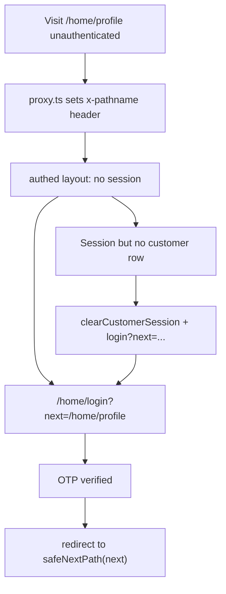

# Customer home auth redirect fixes

## Problem

Three gaps in the current flow:

1. **[`app/home/(authed)/layout.tsx`](app/home/(authed)/layout.tsx)** always redirects to `/home/login?next=/home`, even when the user tried `/home/profile`.
2. **[`app/home/actions.ts`](app/home/actions.ts)** `verifyCustomerLoginOtpAction` always `redirect("/home")` — ignores `next`.
3. **Orphan session**: session cookie exists but [`getCurrentCustomer()`](lib/customer/identity.ts) returns `null` → user stays “logged in” and [`/home/profile`](app/home/(authed)/profile/page.tsx) shows “No profile yet” instead of recovering cleanly.

**Intentionally unchanged:** incomplete profile (missing name/DOB) does **not** force login — dashboard remains accessible; redemption stays gated elsewhere per existing [`reward-profile-gate`](tests/micro-specs/reward-profile-gate.test.ts).

## Target flow



## Implementation

### 1. Expose request path to server components

Add a small header helper (alongside [`lib/observability/request-id.ts`](lib/observability/request-id.ts) pattern):

- New constant e.g. `REQUEST_PATH_HEADER = "x-nabaperks-path"` in [`lib/navigation/request-path.ts`](lib/navigation/request-path.ts) (or extend request-id module).
- In [`proxy.ts`](proxy.ts), set `x-nabaperks-path` to `pathname + search` on every request (Edge-safe, no DB).

### 2. Harden `safeNextPath`

In [`lib/navigation/safe-next-path.ts`](lib/navigation/safe-next-path.ts):

- Reject `/home/login` (and `/home/login?…`) as a `next` target → fall back to `/home` to prevent redirect loops.
- Add Vitest cases in [`tests/micro-specs/safe-next-path.test.ts`](tests/micro-specs/safe-next-path.test.ts).

### 3. Fix authed layout gate

Update [`app/home/(authed)/layout.tsx`](app/home/(authed)/layout.tsx):

```ts
const returnPath = readRequestPath(await headers()) // defaults /home
if (!session) redirect(customerLoginHref(returnPath))

const customer = await getCurrentCustomer()
if (!customer) {
  await clearCustomerSession()
  redirect(customerLoginHref(returnPath))
}
```

Uses existing [`customerLoginHref`](lib/navigation/safe-next-path.ts) — no new redirect string literals.

### 4. Thread `next` through login

| File | Change |
|------|--------|
| [`app/home/login/page.tsx`](app/home/login/page.tsx) | Accept `searchParams.next`; if already signed in, `redirect(safeNextPath(next))`; pass `next` prop to form |
| [`components/customer/customer-login-form.tsx`](components/customer/customer-login-form.tsx) | Hidden `<input name="next" />` on the OTP verify form |
| [`app/home/actions.ts`](app/home/actions.ts) | `verifyCustomerLoginOtpAction`: read `next` from formData → `redirect(safeNextPath(next))`; remove hardcoded `NEXT_PATH` |

### 5. Simplify profile orphan empty state (optional cleanup)

Once layout clears orphan sessions, the `if (!profile)` block in [`app/home/(authed)/profile/page.tsx`](app/home/(authed)/profile/page.tsx) becomes unreachable in normal operation. Either remove it or replace with a minimal defensive fallback — prefer removal to reduce confusion.

## Tests (TDD — Red → Green)

New file [`tests/micro-specs/customer-home-auth.test.ts`](tests/micro-specs/customer-home-auth.test.ts):

1. **`safeNextPath`** rejects `/home/login` as next target.
2. **`verifyCustomerLoginOtpAction`** redirects to `/home/profile` when `next=/home/profile` in formData (mock session/verification; expect `NEXT_REDIRECT`).
3. **Static wiring** (grep-style, matches repo convention):
   - `layout.tsx` contains `customerLoginHref` and `clearCustomerSession`
   - `login/page.tsx` passes `next` to `CustomerLoginForm`
   - `customer-login-form.tsx` contains hidden `name="next"`
   - `proxy.ts` sets `x-nabaperks-path`

Run: `pnpm vitest run tests/micro-specs/customer-home-auth.test.ts tests/micro-specs/safe-next-path.test.ts`

## Blast radius

- **In scope:** `proxy.ts`, `lib/navigation/*`, `app/home/(authed)/layout.tsx`, `app/home/login/page.tsx`, `app/home/actions.ts`, `components/customer/customer-login-form.tsx`, `app/home/(authed)/profile/page.tsx` (minor), tests.
- **Out of scope:** profile-completion gate on dashboard, merchant `/app/launch` redesign, DB/migrations.

## Verification

Manual smoke:

1. Sign out → visit `/home/profile` → lands on `/home/login?next=%2Fhome%2Fprofile`.
2. Complete OTP → returns to `/home/profile`.
3. With a stale session cookie pointing at a deleted customer → cleared and sent to login (not “No profile yet”).
