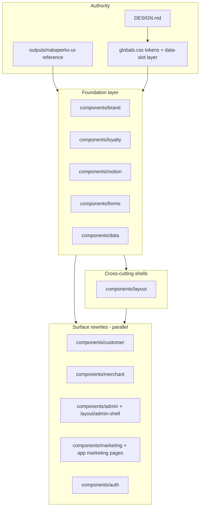
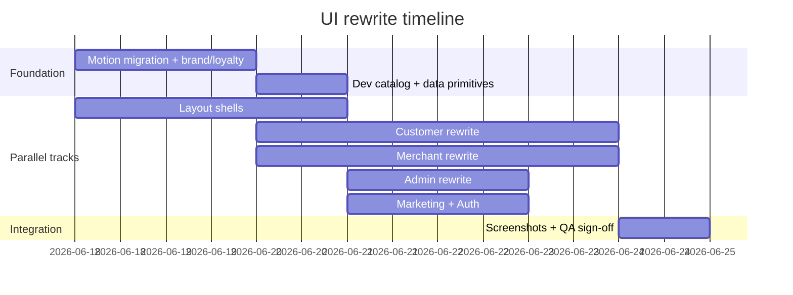

# Full UI/UX component rewrite (Wet Ink parity)

## Context and constraints

**What exists today**

| Layer                                                              | Role                                                                                                                                                                                                                                                     |
| ------------------------------------------------------------------ | -------------------------------------------------------------------------------------------------------------------------------------------------------------------------------------------------------------------------------------------------------- |
| [DESIGN.md](DESIGN.md) + [app/globals.css](app/globals.css)        | Authoritative Wet Ink tokens, shadcn `data-slot` restyles, tactile press                                                                                                                                                                                 |
| [components/brand/](components/brand/)                             | Production primitives (ReceiptCard, MonoTag, PageTitle, VenueMark…)                                                                                                                                                                                      |
| [components/motion/wet-ink.tsx](components/motion/wet-ink.tsx)     | Framer primitives exist; **not all consumers migrated**                                                                                                                                                                                                  |
| [outputs/nabaperks-ui-reference/](outputs/nabaperks-ui-reference/) | 94 decoded prototype components — **visual/interaction reference only**                                                                                                                                                                                  |
| [docs/screenshots/](docs/screenshots/) + Playwright specs          | Visual regression baseline                                                                                                                                                                                                                               |
| Existing redesign tests                                            | [customer-flow-redesign.test.ts](tests/micro-specs/customer-flow-redesign.test.ts), [earned-stamp-redesign.test.ts](tests/micro-specs/earned-stamp-redesign.test.ts), [admin-console-redesign.test.ts](tests/micro-specs/admin-console-redesign.test.ts) |

**Hard rules (do not violate)**

- **Routes and data stay:** `app/**` pages keep the same loaders, redirects, Server Actions, and RPC calls — only import paths and JSX composition change.
- **No shadcn restyling:** never edit [components/ui/](components/ui/) for visuals; theme via tokens, globals Wet Ink layer, and wrappers.
- **Production mechanics win over prototype:** retire handed-phone staff PIN, customer tap-to-redeem, and `localStorage` state machines from the reference — reuse **layout, copy tone, motion beats, and surface structure** only.
- **TDD binding:** each slice gets a micro-spec + failing Vitest contract before rewrite ([Instructions_tdd.md](Instructions_tdd.md)).
- **British copy, no emoji, no exclamation marks** ([DESIGN.md](DESIGN.md)).

**Explicitly out of scope**

- `outputs/nabaperks-ui-reference/components/staff/` and `PinPad` — retired mechanic; do not port.
- `components/tweaks/` and `JourneyMap` demo scaffolding — reference only.
- Backend/schema changes unless a visual requirement forces a read shape (unlikely).

---

## Target architecture



**Rewrite rule per file:** open the matching reference `.md` in `outputs/nabaperks-ui-reference/components/**`, extract visual purpose + UX behaviour + dependencies, re-implement in Tailwind + existing brand/loyalty/motion primitives, wire the same props the route already passes.

---

## Phase 0 — Governance and parity matrix (0.5 day)

### 0.1 Author umbrella micro-spec

Create [`micro-specs/01-foundation/04-wet-ink-full-ui-rewrite.md`](micro-specs/01-foundation/04-wet-ink-full-ui-rewrite.md) (`risk_class: ui-only`) with:

- Blast radius: `components/**`, `app/globals.css`, `app/dev/**`, `tests/micro-specs/*redesign*`, `tests/e2e/*screenshot*`
- EARS requirements per surface (parity, motion import rules, copy register, accessibility)
- Traceability links to reference component IDs

### 0.2 Build the parity matrix

Add [`docs/UI_PARITY_MATRIX.md`](docs/UI_PARITY_MATRIX.md) — one row per reference component (94 rows), columns:

| Reference     | Production target                                           | Verdict              | Status  |
| ------------- | ----------------------------------------------------------- | -------------------- | ------- |
| `Screen-card` | `customer-card-experience.tsx` + `customer-flow-system.tsx` | adapt (no PIN sheet) | pending |
| `McToday`     | `dashboard-home-streams.tsx` + `app/app/page.tsx`           | refactor             | pending |
| …             | …                                                           | …                    | …       |

Use verdicts from [component-inventory.md](outputs/nabaperks-ui-reference/component-inventory.md): skip 🔒 prototype-only rows that contradict production (staff PIN, tap-to-redeem); port ⚠️ rows.

### 0.3 Consolidate overlapping plans

Fold these into the matrix rather than running separately:

- [Goal/wet_ink_design_system_c4230b96.plan.md](Goal/wet_ink_design_system_c4230b96.plan.md) → Phase 1 motion migration + dev catalog
- [Goal/merchant_skeleton_overhaul_c87adad7.plan.md](Goal/merchant_skeleton_overhaul_c87adad7.plan.md) → Phase 2 merchant loading states
- Behavioral work in [Goal/Goal.md](Goal/Goal.md) → coordinate but do not block visual rewrite; error/empty states get Wet Ink treatment when touched

---

## Phase 1 — Foundation rewrite (blocking, ~2 days)

Complete before surface parallel work — every track imports from here.

### 1.1 Motion migration (finish [wet_ink plan](Goal/wet_ink_design_system_c4230b96.plan.md))

Remaining call sites still on CSS/`MotionReveal`:

- [components/loyalty/reward-celebration.tsx](components/loyalty/reward-celebration.tsx) — `animate-[w-pop_…]` → `WetInkPop`
- [components/loyalty/reward-seal.tsx](components/loyalty/reward-seal.tsx) — `animate-[w-wiggle_…]` → `WetInkWiggle`
- [components/merchant/dashboard-home-streams.tsx](components/merchant/dashboard-home-streams.tsx), [activity-detail-feed.tsx](components/merchant/activity-detail-feed.tsx) — `MotionReveal` → `WetInkRise`
- [components/loyalty/stamp-grid.tsx](components/loyalty/stamp-grid.tsx) — split client `stamp-dot.tsx` with `WetInkSlam` + `StampSlamSequence`
- [components/marketing/marquee.tsx](components/marketing/marquee.tsx) → `WetInkMarquee`
- [components/customer/legal-sheet.tsx](components/customer/legal-sheet.tsx) → `WetInkSheet`

Then remove `@keyframes w-*` from globals.css; add `--w-dur-shake: 300ms`; update DESIGN.md motion section.

**Tests:** extend [wet-ink-motion.test.ts](tests/micro-specs/wet-ink-motion.test.ts) (create if missing) + [earned-stamp-redesign.test.ts](tests/micro-specs/earned-stamp-redesign.test.ts).

### 1.2 Brand primitive alignment

Rewrite/extend [components/brand/](components/brand/) to cover all shared reference primitives:

| Reference                | Production action                                                                                                       |
| ------------------------ | ----------------------------------------------------------------------------------------------------------------------- |
| InkButton, GhostLink     | Document pattern: `Button` + globals press; add `GhostLink` wrapper if missing                                          |
| MonoTag, MonoLine        | Align [mono-tag.tsx](components/brand/mono-tag.tsx); add `MonoLine` if reference spacing/tracking differs               |
| ReceiptCard, ReceiptRule | [receipt-card.tsx](components/brand/receipt-card.tsx) — torn edge, `shaken` prop via `WetInkShake`                      |
| VenueMark                | [venue-mark.tsx](components/brand/venue-mark.tsx) — stamp-family rotation (-6° to -8°) per earned-stamp tests           |
| OtpBoxes                 | [components/forms/otp-input.tsx](components/forms/otp-input.tsx) — ink-bordered cells, shadow-as-cursor                 |
| Sheet                    | `WetInkSheet` wrapper used by all bottom sheets                                                                         |
| Seal, CelebrationBits    | [reward-seal.tsx](components/loyalty/reward-seal.tsx), [stamp-celebration.tsx](components/motion/stamp-celebration.tsx) |

### 1.3 Loyalty vocabulary (stamp family)

Rewrite [components/loyalty/](components/loyalty/) as the shared stamp/reward visual system — referenced by customer, merchant previews, and marketing:

- `stamp-grid`, `stamp-dot`, `progress-track`, `reward-ticket`, `reward-seal`, `qr-frame`, `status-banner`
- Retire [pint-reward.tsx](components/loyalty/pint-reward.tsx) from exports (already contractually retired)
- Mirror reference `StampRow` / `ProgressLine` / `Seal` behaviours

### 1.4 Dev design-system catalog

Add [`app/dev/design-system/page.tsx`](app/dev/design-system/page.tsx) — live gallery of tokens, typography, surfaces, motion primitives, loyalty states. This becomes the **acceptance gate** for foundation work before surface tracks merge.

### 1.5 Data display primitives

Align [components/data/](components/data/) with reference admin/merchant tables:

- `activity-feed.tsx` → reference `MoEventRow` / `McFeedLine` row shape
- `data-table.tsx` → reference `MerchantCustomers` privacy-first table patterns
- `funnel-chart.tsx` → admin quieter-ink styling

---

## Phase 2 — Parallel surface rewrites (~3–4 days each track, concurrent)

Each track follows the same playbook:

1. Mark matrix rows `in_progress`
2. Add/extend failing Vitest contract in `tests/micro-specs/<surface>-redesign.test.ts`
3. Rewrite `components/<surface>/**` files (composition + styling + motion)
4. Update matching [`app/dev/`](app/dev/) preview harness
5. Regenerate Playwright screenshots; compare to reference + prior baselines
6. Mark matrix rows `done`

### Track A — Customer (`components/customer/` + `components/layout/customer-*`)

**Reference map:** [components/customer/](outputs/nabaperks-ui-reference/components/customer/) (13 screens) + shared primitives.

| Production file                                                                   | Reference anchor                                                           | Key adaptation                                                                                                    |
| --------------------------------------------------------------------------------- | -------------------------------------------------------------------------- | ----------------------------------------------------------------------------------------------------------------- |
| [customer-flow-system.tsx](components/customer/customer-flow-system.tsx)          | CustomerFlow screen states                                                 | Self-service stamp via counter handshake, not PIN sheet                                                           |
| [join-wizard.tsx](components/customer/join-wizard.tsx), join-forms, join-otp-form | Screen-save, Screen-otp, Screen-landing                                    | Value-first copy from [copy-inventory.md](outputs/nabaperks-ui-reference/copy-inventory.md)                       |
| [customer-card-experience.tsx](components/customer/customer-card-experience.tsx)  | Screen-card, Screen-alreadyStamped                                         | `hideHeaderText`, celebrations inside receipt ([existing test](tests/micro-specs/customer-flow-redesign.test.ts)) |
| [reward-panels.tsx](components/customer/reward-panels.tsx)                        | Screen-sealed, revealed, ready, redeemed                                   | Unified `RewardTicket` + seal vocabulary                                                                          |
| [home-\*.tsx](components/customer/)                                               | multi-card hub (no direct prototype — compose from card + ticket patterns) | Waiting/ready banners per Goal edge-case copy                                                                     |
| [legal-sheet.tsx](components/customer/legal-sheet.tsx)                            | Sheet                                                                      | WetInkSheet enter                                                                                                 |

**Routes unchanged:** `app/q`, `app/m`, `app/card`, `app/reward`, `app/home`, `app/scan`.

**Harness:** [app/dev/customer-flow/preview/screens.tsx](app/dev/customer-flow/preview/screens.tsx) must mirror production components after each rewrite.

### Track B — Merchant (`components/merchant/` + `components/layout/merchant-app-shell.tsx`)

**Reference map:** [components/merchant/](outputs/nabaperks-ui-reference/components/merchant/) (24 components).

| Production file                                                                | Reference anchor                                                                         |
| ------------------------------------------------------------------------------ | ---------------------------------------------------------------------------------------- |
| [dashboard-home-streams.tsx](components/merchant/dashboard-home-streams.tsx)   | McToday, McStat, McFeedLine                                                              |
| [activity-\*-feed.tsx](components/merchant/)                                   | MerchantActivity, MoEventRow, MoChip                                                     |
| [customer-readback-table.tsx](components/merchant/customer-readback-table.tsx) | MerchantCustomers, MoMiniStamps                                                          |
| [launch/\*](components/merchant/launch/)                                       | McOnboarding, MerchantQrStudio, MoPoster/Till/Sticker previews                           |
| [account/\*](components/merchant/account/)                                     | MerchantSettings, MerchantBilling                                                        |
| [onboarding-form.tsx](components/merchant/onboarding-form.tsx)                 | McOnboarding wizard                                                                      |
| [loading-skeletons.tsx](components/merchant/loading-skeletons.tsx)             | structural mirrors per [skeleton plan](Goal/merchant_skeleton_overhaul_c87adad7.plan.md) |

**IA note:** honour [micro-specs/05-merchant-value/02-merchant-console-trust-and-ia-cleanup.md](micro-specs/05-merchant-value/02-merchant-console-trust-and-ia-cleanup.md) — Activity in nav, billing placement, PII masking in readbacks.

**Harness:** [app/dev/launch-preview/](app/dev/launch-preview/), [app/dev/skeleton-preview/](app/dev/skeleton-preview/).

### Track C — Admin (`components/admin/` + `components/layout/admin-shell.tsx`)

**Reference map:** [components/admin/](outputs/nabaperks-ui-reference/components/admin/) — "quieter ink" (less rotation, `--w-paper-2` panels).

| Production file                                      | Reference anchor                 |
| ---------------------------------------------------- | -------------------------------- |
| [support.tsx](components/admin/support.tsx)          | AdminSurface, AdPanel, AdFormRow |
| [admin-shell.tsx](components/layout/admin-shell.tsx) | AdNav, MFA gate banner           |

Extend [admin-console-redesign.test.ts](tests/micro-specs/admin-console-redesign.test.ts) for visual contracts (quieter ink classes, shared data primitives).

### Track D — Marketing (`components/marketing/` + root marketing pages)

**Reference map:** [components/marketing/](outputs/nabaperks-ui-reference/components/marketing/) (MkHero, MkPricing, MkFaqItem, MkFooter, MkLegal).

| Production file                                                | Reference anchor   |
| -------------------------------------------------------------- | ------------------ |
| [app/page.tsx](app/page.tsx)                                   | MarketingSite home |
| [app/pricing/page.tsx](app/pricing/page.tsx)                   | MkPricing          |
| [marketing-layout.tsx](components/layout/marketing-layout.tsx) | MkFooter, nav      |
| [marquee.tsx](components/marketing/marquee.tsx)                | WetInkMarquee      |

### Track E — Auth (`components/auth/`)

**Reference:** [McAuth.md](outputs/nabaperks-ui-reference/components/merchant/McAuth.md) (passwordless email + OTP layout).

| Production file                                | Reference anchor                  |
| ---------------------------------------------- | --------------------------------- |
| [auth-form.tsx](components/auth/auth-form.tsx) | McAuth, McField, OtpBoxes         |
| `app/(auth)/login`, `signup`                   | same shell as merchant auth stage |

### Track F — Layout shells (cross-cutting, start day 1)

Rewrite in parallel with Track A/B/C:

- [merchant-app-shell.tsx](components/layout/merchant-app-shell.tsx) — McBrand masthead, nav tabs
- [customer-app-shell.tsx](components/layout/customer-app-shell.tsx) + [customer-tab-bar.tsx](components/layout/customer-tab-bar.tsx) — thumb column, ≥44px targets
- [shell-navigation.tsx](components/layout/shell-navigation.tsx) — shared nav primitives
- [marketing-layout.tsx](components/layout/marketing-layout.tsx)

---

## Phase 3 — Integration, regression, and sign-off (~1 day)

### 3.1 Visual regression

```bash
npx playwright test tests/e2e/customer-flow-screenshots.spec.ts
npx playwright test tests/e2e/launch-redesign-screenshots.spec.ts
npx playwright test tests/e2e/customer-flow-harness-screenshots.spec.ts
# add: tests/e2e/design-system-catalog.spec.ts
```

Update [docs/screenshots/](docs/screenshots/) per [CUSTOMER_FLOW_SCREENSHOT_RUNBOOK.md](docs/CUSTOMER_FLOW_SCREENSHOT_RUNBOOK.md).

### 3.2 Quality gates

```bash
pnpm test
pnpm lint && pnpm typecheck
pnpm test:coverage  # lib/** thresholds
pnpm duplication  # <3% copy-paste
```

### 3.3 Documentation

- Mark complete rows in `docs/UI_PARITY_MATRIX.md`
- Update DESIGN.md component section with import rules and composed patterns
- Regenerate [docs/ROUTES.md](docs/ROUTES.md) if page composition imports change (`pnpm docs:routes`)

### 3.4 Manual QA matrix

| Surface   | Key paths                                                                | Check                                                  |
| --------- | ------------------------------------------------------------------------ | ------------------------------------------------------ |
| Customer  | `/q/*`, `/card/*`, `/reward/*`, `/home/*`                                | stamp slam, seal reveal, ticket states, reduced motion |
| Merchant  | `/app`, `/app/activity`, `/app/customers`, `/app/launch`, `/app/account` | skeleton → content, no double-flash, PII masking       |
| Admin     | `/admin/*`                                                               | quieter ink, MFA banner, support form                  |
| Marketing | `/`, `/pricing`                                                          | hero, marquee, footer                                  |
| Auth      | `/login`, `/signup`                                                      | OTP boxes, pressable targets                           |

---

## Suggested execution order (parallel team)

Even with "all surfaces parallel," **week 1** should concentrate shared foundation + shells so tracks do not fork incompatible primitives:



If staffing is single-threaded, strict order: **Foundation → Customer → Merchant → Admin → Marketing/Auth** (customer is the product's core verb).

---

## Risk register

| Risk                                            | Mitigation                                                                                                                                                        |
| ----------------------------------------------- | ----------------------------------------------------------------------------------------------------------------------------------------------------------------- |
| Prototype copy contradicts production mechanics | Parity matrix "adapt" column; [copy-inventory.md](outputs/nabaperks-ui-reference/copy-inventory.md) cross-checked against [PROJECT_SPEC.md](docs/PROJECT_SPEC.md) |
| Server Components vs client motion islands      | Split animated leaves into `"use client"` files (`stamp-dot`, seal, celebration) — pattern already in wet_ink plan                                                |
| Parallel tracks diverge on spacing/type         | Foundation catalog is gate; grep tests for forbidden patterns (emoji, exclamation marks, legacy naming)                                                           |
| Large blast radius breaks CI                    | One micro-spec slice per PR; matrix row granularity = PR unit                                                                                                     |
| Skeleton double-flash on merchant               | Execute [merchant skeleton plan](Goal/merchant_skeleton_overhaul_c87adad7.plan.md) inside Track B                                                                 |

---

## Definition of done

- Every ⚠️ reference row in `docs/UI_PARITY_MATRIX.md` is `done` or explicitly `skipped` with rationale
- No production file uses raw `animation: w-*` or `animate-[w-*]` — only `components/motion`
- All existing `*redesign*.test.ts` contracts pass; new contracts cover merchant, marketing, auth gaps
- `/dev/design-system` catalog documents every primitive and loyalty state
- Playwright screenshot suite green; manual QA matrix signed off
- DESIGN.md and parity matrix reflect final implementation
