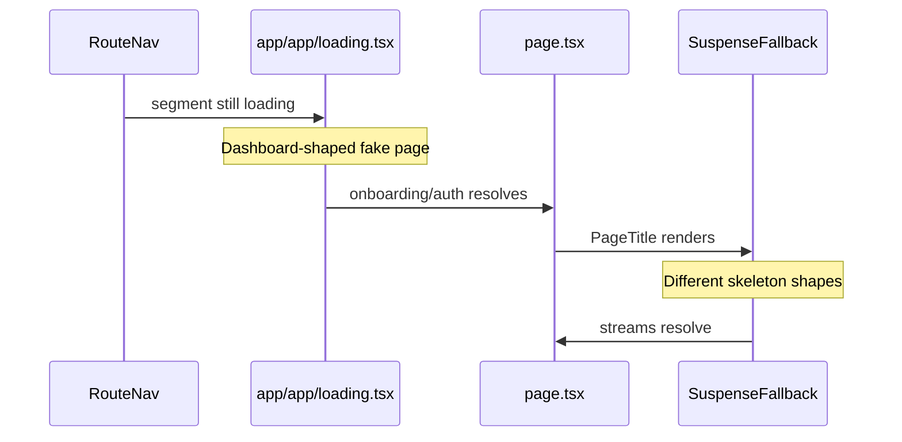
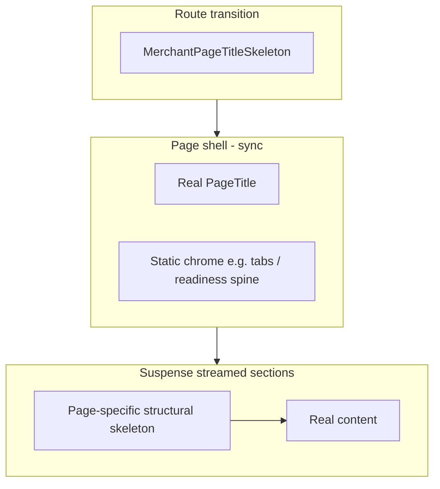

# Merchant skeleton overhaul

## Problem recap

Today merchant loading stacks two unrelated systems:



[`app/app/loading.tsx`](app/app/loading.tsx) is dashboard-shaped but applies to **all** `/app/*` routes (customers, launch, onboarding, reward scan). [`app/app/page.tsx`](app/app/page.tsx) and [`app/app/activity/page.tsx`](app/app/activity/page.tsx) then show a second, different skeleton via `Suspense`.

Redirect-only routes (`billing`, `profile`, `settings`) need no work.

## Target architecture

**One rule:** route `loading.tsx` = generic shell only; page `Suspense` = realistic section skeletons that mirror production layout.



### Skeleton design principles (Wet Ink)

- Mirror **structure**, not grey blobs: use real shells (`surface-card`, `border-2 border-ink`, [`ReceiptCard`](components/brand/receipt-card.tsx), correct grid breakpoints).
- Place thin ink-tinted lines inside shells for labels/values/rows — not solid filled rectangles.
- Drop decorative colours (`bg-primary/25`, `bg-accent/40`) from skeletons.
- Tune the primitive once via the Wet Ink layer on `[data-slot="skeleton"]` in [`app/globals.css`](app/globals.css): `rounded-lg`, ink-tinted muted fill, keep `animate-pulse`.
- Keep `aria-label` + `role="status"` on each skeleton region.

---

## 1. Shared skeleton module

Create [`components/merchant/loading-skeletons.tsx`](components/merchant/loading-skeletons.tsx) as the single source of truth. Export:

| Component                          | Mirrors                                                                                                                                                                                                                   |
| ---------------------------------- | ------------------------------------------------------------------------------------------------------------------------------------------------------------------------------------------------------------------------- |
| `MerchantPageTitleSkeleton`        | [`PageTitle`](components/brand/typography.tsx) — eyebrow, title, description, optional action slot                                                                                                                        |
| `MerchantDashboardMetricsSkeleton` | Members hero card + 5 [`MetricTile`](components/brand/typography.tsx) cards in `sm:grid-cols-2 lg:grid-cols-3`                                                                                                            |
| `MerchantCompactActivitySkeleton`  | [`ReceiptCard`](components/brand/receipt-card.tsx) + [`SectionHeader`](components/brand/typography.tsx) + [`ActivityCompactFeed`](components/merchant/activity-compact-feed.tsx) row shape (badge pill + time + headline) |
| `ActivityFeedSkeleton`             | [`ActivityDetailFeed`](components/merchant/activity-detail-feed.tsx) filter bar, pills, grouped timeline rows with dot + card                                                                                             |
| `MerchantCustomersTableSkeleton`   | [`CustomerReadbackTable`](components/merchant/customer-readback-table.tsx) — header row + 5–6 data rows (desktop table + stacked mobile cards via same grid classes)                                                      |
| `LaunchPanelSkeleton`              | Active launch tab body — form-field stack for card/venue; QR frame + asset buttons for qr tab (accept `tab` prop)                                                                                                         |
| `AccountProfilePanelSkeleton`      | “What customers see” card + multi-field form block from [`ProfilePanel`](components/merchant/account/profile-panel.tsx)                                                                                                   |
| `AccountBillingPanelSkeleton`      | [`ReceiptCard`](components/brand/receipt-card.tsx) receipt lines + action row from [`BillingPanel`](components/merchant/account/billing-panel.tsx)                                                                        |
| `OnboardingAsideSkeleton`          | Onboarding aside step list (3 numbered steps)                                                                                                                                                                             |
| `OnboardingFormSkeleton`           | [`OnboardingForm`](components/merchant/onboarding-form.tsx) field stack inside receipt card                                                                                                                               |
| `RewardScanContentSkeleton`        | [`RewardTicket`](components/loyalty) + detail card rows + banner/form placeholder                                                                                                                                         |

Remove the unexplained top `h-20` block from today's [`MerchantDashboardSkeleton`](components/merchant/dashboard-home-streams.tsx) (it does not map to any stable UI and causes layout shift).

Move skeleton exports out of [`dashboard-home-streams.tsx`](components/merchant/dashboard-home-streams.tsx) and inline `ActivityFeedSkeleton` out of [`activity/page.tsx`](app/app/activity/page.tsx) — those files keep only stream components.

---

## 2. Route-level loading (all `/app/*`)

Replace [`app/app/loading.tsx`](app/app/loading.tsx) with:

```tsx
<div
  className="grid gap-6"
  aria-label="Loading merchant workspace"
  role="status"
>
  <MerchantPageTitleSkeleton />
</div>
```

This removes the fake dashboard metrics/activity on customers, launch, etc., and makes the route → page transition a single predictable step (title placeholder → real title).

---

## 3. Per-page Suspense wiring

Each page keeps **fast sync work** outside `Suspense` (auth redirect, tab resolution, onboarding gate) and streams **slow data** inside.

### [`app/app/page.tsx`](app/app/page.tsx) — `/app`

- Keep `getMerchantOnboardingStatus()` blocking (redirect gate + real business name for `PageTitle`).
- Reuse improved `MerchantDashboardMetricsSkeleton` + `MerchantCompactActivitySkeleton` in existing `Suspense` boundaries.

### [`app/app/activity/page.tsx`](app/app/activity/page.tsx) — `/app/activity`

- Keep `PageTitle` sync; import `ActivityFeedSkeleton` from shared module.

### [`app/app/customers/page.tsx`](app/app/customers/page.tsx) — `/app/customers`

- Sync: `getCurrentMerchant()`, `searchParams`.
- New `CustomersTableStream` async child + `Suspense fallback={<MerchantCustomersTableSkeleton />}`.
- Move `getMerchantCustomers` + `buildMerchantCustomerReadback` into the stream; `PageTitle` actions (`MonoTag` counts) render inside the stream so counts are not wrong during load.

### [`app/app/launch/page.tsx`](app/app/launch/page.tsx) — `/app/launch`

- Sync: merchant, `getQrSetup`, `buildLaunchReadiness`, tab resolution, `PageTitle`, [`LaunchReadinessPanel`](components/merchant/launch-readiness-panel.tsx).
- Wrap `CardPanel` / `VenuePanel` / `QrPanel` in `Suspense` with `<LaunchPanelSkeleton tab={activeTab} />`.
- Extract panel rendering into a small `LaunchActivePanel` async wrapper so tab switches stream only the panel body.

### [`app/app/account/page.tsx`](app/app/account/page.tsx) — `/app/account`

- Sync: `PageTitle`, [`AccountTabBar`](components/merchant/account/account-tab-bar.tsx) (already has pending dot).
- Wrap `ProfilePanel` / `BillingPanel` in `Suspense` with tab-specific skeletons.
- Panels stay as-is internally; no data-fetch duplication.

### [`app/app/onboarding/page.tsx`](app/app/onboarding/page.tsx) — `/app/onboarding`

- Sync: `getMerchantOnboardingStatus()` (redirect + description copy + `initialFields`).
- Render receipt `PageTitle` + aside immediately after gate.
- Wrap `OnboardingForm` in `Suspense` with `OnboardingFormSkeleton` only if we split form hydration — **otherwise** (simpler): show `OnboardingFormSkeleton` as the route-level body below the real title while the single fetch runs, since `initialFields` must block the form anyway. Prefer: keep one fetch, but use route `loading.tsx` title skeleton → full page (no second skeleton) since form cannot stream without fields.

### [`app/app/rewards/scan/[rewardId]/page.tsx`](app/app/rewards/scan/[rewardId]/page.tsx) — reward scan

- Sync: `ScanShell` with `PageTitle` always visible.
- New `RewardScanStream` async child calling `loadMerchantRewardScanContext`; `Suspense fallback={<RewardScanContentSkeleton />}`.
- Keep auth/not-found/unauthorized branches inside the stream.

---

## 4. Primitive polish

Update [`components/ui/skeleton.tsx`](components/ui/skeleton.tsx) to drop hard-coded `rounded-2xl bg-muted` overrides that fight per-usage classes; let the Wet Ink globals layer own default skeleton appearance.

---

## 5. Tests and verification

Update [`tests/micro-specs/merchant-readbacks.test.ts`](tests/micro-specs/merchant-readbacks.test.ts):

- `loading.tsx` contract: still uses `Skeleton`, keeps `aria-label="Loading merchant workspace"`, imports shared `MerchantPageTitleSkeleton`, **no longer** contains dashboard metric/activity markup.
- Add readback assertions for new `Suspense` boundaries on customers, launch, account, reward scan.
- Assert skeletons live in `components/merchant/loading-skeletons.tsx`, not scattered in pages.

**Manual check** (dev server):

1. Navigate between every shell nav item — should see title skeleton once, then real title + section skeleton, then content (no layout swap from fake dashboard).
2. Throttle network — confirm dashboard members hero, metric tiles, activity rows, customers table, launch panel, account panels, and reward ticket shapes match loaded UI.
3. Tab switches on `/app/account` and `/app/launch?tab=` — panel skeleton only, title/tabs stay stable.

**Commands:** `pnpm test tests/micro-specs/merchant-readbacks.test.ts`, `pnpm lint`, `pnpm typecheck`.

---

## Files touched (blast radius)

| File                                             | Change                              |
| ------------------------------------------------ | ----------------------------------- |
| `components/merchant/loading-skeletons.tsx`      | **New** — all skeleton components   |
| `app/app/loading.tsx`                            | Minimal route fallback              |
| `app/app/page.tsx`                               | Import skeletons from shared module |
| `app/app/activity/page.tsx`                      | Import shared skeleton              |
| `app/app/customers/page.tsx`                     | Add stream + Suspense               |
| `app/app/launch/page.tsx`                        | Suspense-wrap active panel          |
| `app/app/account/page.tsx`                       | Suspense-wrap tab panels            |
| `app/app/rewards/scan/[rewardId]/page.tsx`       | Extract stream + Suspense           |
| `components/merchant/dashboard-home-streams.tsx` | Remove skeleton exports             |
| `components/ui/skeleton.tsx`                     | Slim defaults                       |
| `app/globals.css`                                | Wet Ink skeleton layer              |
| `tests/micro-specs/merchant-readbacks.test.ts`   | Contract updates                    |

Redirect pages (`billing`, `profile`, `settings`) and [`onboarding`](app/app/onboarding/page.tsx) (single blocking fetch) are intentionally light-touch.
