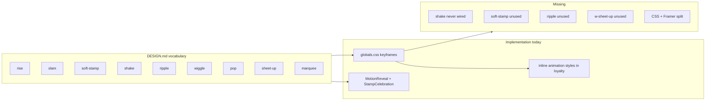
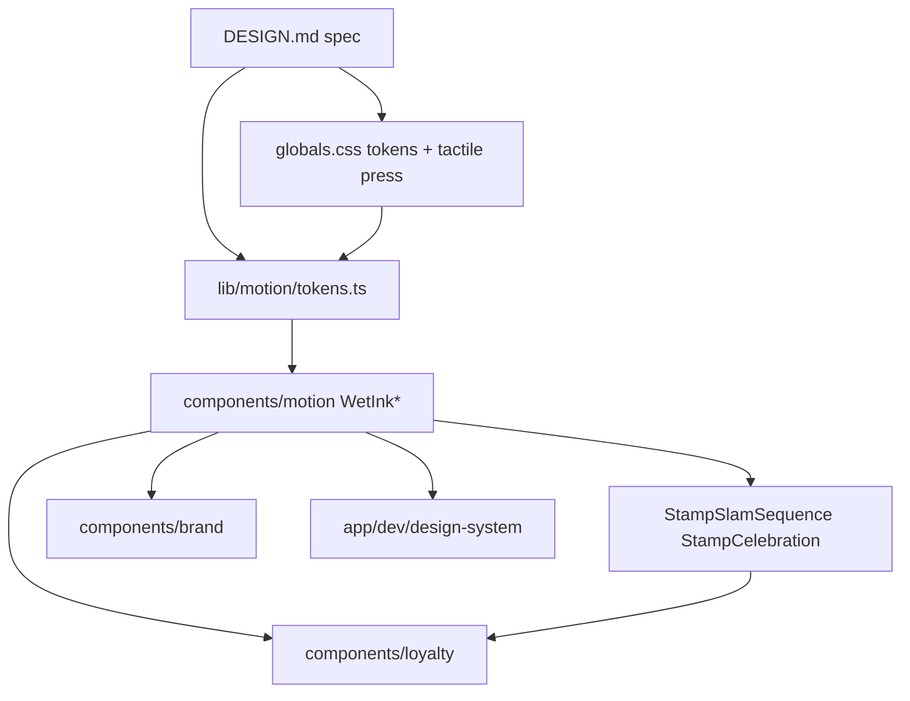

# Wet Ink design system — 100% completion (Framer Motion)

## Goal

Make the **design system** complete and self-contained: every motion beat defined in [DESIGN.md](DESIGN.md) is available as a **reusable Framer Motion primitive**, all production animation call sites use that library (not inline CSS `animation:`), tokens are complete, and there is a **dev catalog** to verify the system—not a full-app UX reskin.

**In scope:** `components/motion/`, motion tokens, loyalty/brand consumers, [app/globals.css](app/globals.css) token/keyframe cleanup, [DESIGN.md](DESIGN.md), micro-spec, tests, `app/dev/design-system/`.

**Out of scope:** Edge-case customer audit work in [Goal/Goal.md](Goal/Goal.md), new product flows, editing shadcn primitives in `components/ui/`.

## Current gaps (from audit)



| Vocabulary | CSS defined | Used today                        | Target                                       |
| ---------- | ----------- | --------------------------------- | -------------------------------------------- |
| slam       | yes         | `stamp-grid` inline CSS           | `WetInkSlam`                                 |
| shake      | yes         | never                             | `WetInkShake` + composed `StampSlamSequence` |
| soft-stamp | yes         | never                             | `WetInkSoftStamp`                            |
| pop        | yes         | CSS in `reward-celebration`       | `WetInkPop`                                  |
| wiggle     | yes         | CSS class on `reward-seal`        | `WetInkWiggle`                               |
| rise       | yes         | `MotionReveal` (different easing) | `WetInkRise` (canonical)                     |
| ripple     | yes         | never                             | `WetInkRipple`                               |
| sheet-up   | yes         | Tailwind `animate-in` on sheets   | `WetInkSheet`                                |
| marquee    | yes         | CSS on `marketing/marquee`        | `WetInkMarquee`                              |

**Tactile press** (shadow collapse, 90ms translate) stays in [app/globals.css](app/globals.css) Wet Ink layer on `[data-slot="button"]` and `.pressable`—that is instant feedback, not choreographed motion. Framer owns timed sequences only.

---

## Phase 0 — Micro-spec and TDD contract

Author [`micro-specs/01-foundation/03-wet-ink-motion-system.md`](micro-specs/01-foundation/03-wet-ink-motion-system.md) (`risk_class: ui-only`).

EARS requirements to encode (each gets a failing Vitest assertion before implementation):

1. **WHEN** `prefers-reduced-motion` is set **THEN** every motion primitive renders static children with no transform animation.
2. **WHEN** a stamp earns with `slammed` **THEN** `WetInkSlam` runs 380ms with overshoot easing and lands on `--stamp-rot`.
3. **WHEN** a stamp slams **THEN** the parent receipt may run `WetInkShake` for 300ms (composed helper).
4. **WHEN** the motion library is imported **THEN** all nine vocabulary exports exist from `@/components/motion`.
5. **WHEN** loyalty components animate **THEN** they import motion primitives—no `animation: "w-*"` inline styles remain.
6. **WHEN** `--w-dur-shake` is read **THEN** it equals 300ms (token gap today).

Primary test file: [`tests/micro-specs/wet-ink-motion.test.ts`](tests/micro-specs/wet-ink-motion.test.ts). Update [`tests/micro-specs/earned-stamp-redesign.test.ts`](tests/micro-specs/earned-stamp-redesign.test.ts) to assert Framer slam contract instead of CSS keyframe body content.

---

## Phase 1 — Motion tokens (single source of timing)

Add [`lib/motion/tokens.ts`](lib/motion/tokens.ts):

- Read durations/easings aligned with CSS vars in [app/globals.css](app/globals.css):
  - `--w-dur-press: 90ms` (document only; CSS press)
  - `--w-dur-move: 320ms`
  - `--w-dur-slam: 380ms`
  - **`--w-dur-shake: 300ms`** (add to globals)
  - `--w-ease`, `--w-ease-slam` as Framer-compatible cubic-bezier arrays
- Export `wetInkTransition.slam`, `.move`, `.press`, `.shake` helpers.

Add [`lib/motion/use-reduced-motion.ts`](lib/motion/use-reduced-motion.ts) — thin wrapper over `useReducedMotion()` from `motion/react` for consistent static fallbacks.

---

## Phase 2 — Framer motion primitive library

Expand [`components/motion/`](components/motion/) (all `"use client"`):

| Export            | Replaces                 | Key behaviour                                           |
| ----------------- | ------------------------ | ------------------------------------------------------- |
| `WetInkRise`      | `w-rise`, `MotionReveal` | y: 14 → 0, standard ease, optional delay                |
| `WetInkSlam`      | `w-slam`                 | scale 2.6 → 1, rotate to `--stamp-rot`, slam ease 380ms |
| `WetInkSoftStamp` | `w-soft-stamp`           | gentler stamp for previews                              |
| `WetInkShake`     | `w-shake`                | paper jitter 300ms                                      |
| `WetInkPop`       | `w-pop`                  | scale pop with overshoot                                |
| `WetInkWiggle`    | `w-wiggle`               | infinite gentle rotate (reward-ready)                   |
| `WetInkRipple`    | `w-ripple`               | expanding fade ring                                     |
| `WetInkMarquee`   | `w-marquee`              | horizontal loop, pauses when reduced motion             |
| `WetInkSheet`     | `w-sheet-up`             | bottom sheet enter/exit wrapper                         |

**Composed patterns** (design-system-level recipes from DESIGN.md):

- `StampSlamSequence` — `WetInkSlam` on dot + optional `WetInkShake` on receipt wrapper
- Refactor [`components/motion/stamp-celebration.tsx`](components/motion/stamp-celebration.tsx) to use `WetInkPop` / `WetInkRipple` + shared tokens (retire ad-hoc easing constants)
- Deprecate `MotionReveal` → alias to `WetInkRise` for one release, then remove

Barrel: [`components/motion/index.ts`](components/motion/index.ts).

---

## Phase 3 — Migrate consumers (CSS animation → Framer)

**Client island pattern:** [components/loyalty/stamp-grid.tsx](components/loyalty/stamp-grid.tsx) is currently a Server Component. Split animated parts:

- New [`components/loyalty/stamp-dot.tsx`](components/loyalty/stamp-dot.tsx) (`"use client"`) — wraps earned disc with `WetInkSlam`
- New [`components/loyalty/reward-chip.tsx`](components/loyalty/reward-chip.tsx) if needed for `WetInkPop` on chip slam

| File                                                                                                                                                                                                                         | Change                                                          |
| ---------------------------------------------------------------------------------------------------------------------------------------------------------------------------------------------------------------------------- | --------------------------------------------------------------- |
| [components/loyalty/stamp-grid.tsx](components/loyalty/stamp-grid.tsx)                                                                                                                                                       | Import client `StampDot`; remove inline `animation: w-slam`     |
| [components/loyalty/reward-seal.tsx](components/loyalty/reward-seal.tsx)                                                                                                                                                     | `WetInkPop` / `WetInkWiggle` instead of `animate-[w-*]` classes |
| [components/loyalty/reward-celebration.tsx](components/loyalty/reward-celebration.tsx)                                                                                                                                       | `WetInkPop` for confetti dots                                   |
| [components/loyalty/stamp-journey-preview.tsx](components/loyalty/stamp-journey-preview.tsx)                                                                                                                                 | `WetInkSlam` / `WetInkSoftStamp`                                |
| [components/marketing/marquee.tsx](components/marketing/marquee.tsx)                                                                                                                                                         | `WetInkMarquee`                                                 |
| [components/brand/receipt-card.tsx](components/brand/receipt-card.tsx)                                                                                                                                                       | Optional `shaken?: boolean` prop → `WetInkShake` on wrapper     |
| [components/customer/customer-flow-system.tsx](components/customer/customer-flow-system.tsx)                                                                                                                                 | `CustomerStampCard` passes `shaken={slamIndex >= 0}` to receipt |
| [components/customer/legal-sheet.tsx](components/customer/legal-sheet.tsx)                                                                                                                                                   | Wrap content in `WetInkSheet`                                   |
| [app/page.tsx](app/page.tsx), [components/merchant/dashboard-home-streams.tsx](components/merchant/dashboard-home-streams.tsx), [components/merchant/activity-detail-feed.tsx](components/merchant/activity-detail-feed.tsx) | `MotionReveal` → `WetInkRise`                                   |

---

## Phase 4 — CSS cleanup and token completeness

In [app/globals.css](app/globals.css):

1. Add `--w-dur-shake: 300ms`.
2. **Remove** `@keyframes w-*` blocks once all consumers migrated (keep `prefers-reduced-motion` global rules).
3. Update DESIGN.md Motion section: **implementation = Framer primitives in `components/motion/`**; CSS vars are timing tokens only.
4. Leave tactile press rules (`[data-slot="button"]:active`, `.pressable:active`) unchanged.

---

## Phase 5 — Design system catalog (not a UX prototype)

Add [`app/dev/design-system/page.tsx`](app/dev/design-system/page.tsx) behind existing dev gating ([app/dev/layout.tsx](app/dev/layout.tsx)):

Sections:

- **Tokens** — colour swatches, radii, shadows, motion durations
- **Typography** — Eyebrow, PageTitle, MonoTag
- **Surfaces** — ReceiptCard (plain + edge + shaken demo)
- **Motion** — live toggles for each `WetInk*` primitive + `StampSlamSequence`
- **Loyalty** — StampGrid states, RewardSeal states, RewardTicket states

Mirror updates in dev preview harnesses only where they showcase system components ([app/dev/customer-flow/preview/screens.tsx](app/dev/customer-flow/preview/screens.tsx) imports motion from the library).

Optional Playwright: [`tests/e2e/design-system-catalog.spec.ts`](tests/e2e/design-system-catalog.spec.ts) — smoke that catalog loads and slam demo runs (screenshot evidence).

---

## Phase 6 — Documentation and hygiene

Update [DESIGN.md](DESIGN.md):

- Motion section: Framer vocabulary table (primitive → duration → easing → when to use)
- Composed patterns: stamp slam + card shake, celebration burst
- Import rule: **product code must not use raw CSS `animation: w-*`**

Design-system cleanup (low risk):

- Mark [`components/loyalty/pint-reward.tsx`](components/loyalty/pint-reward.tsx) deprecated in export comment (already retired from customer experience per [tests/micro-specs/customer-flow-redesign.test.ts](tests/micro-specs/customer-flow-redesign.test.ts)); do not delete until dead-code gate allows.

Update [AGENTS.md](AGENTS.md) / [micro-specs/GLOBAL_CONTEXT.md](micro-specs/GLOBAL_CONTEXT.md) one-liner: motion implementation surface is `components/motion/`.

---

## Verification gates

```bash
pnpm vitest run tests/micro-specs/wet-ink-motion.test.ts
pnpm vitest run tests/micro-specs/earned-stamp-redesign.test.ts
pnpm vitest run tests/micro-specs/customer-flow-redesign.test.ts
pnpm lint && pnpm typecheck && pnpm test
# optional
npx playwright test tests/e2e/design-system-catalog.spec.ts
```

Manual: open `/dev/design-system`, trigger each primitive; confirm stamp confirm + card pages still slam without layout shift; confirm reduced-motion shows static UI.

---

## Architecture (target state)



---

## Estimated effort

| Phase                 | Size       |
| --------------------- | ---------- |
| 0 Micro-spec + tests  | 0.5 day    |
| 1–2 Motion library    | 1–1.5 days |
| 3 Consumer migration  | 1 day      |
| 4 CSS cleanup         | 0.25 day   |
| 5 Dev catalog         | 0.5 day    |
| 6 Docs + verification | 0.25 day   |

**Total: ~3–4 focused days**, sequenced TDD per repo binding workflow.
