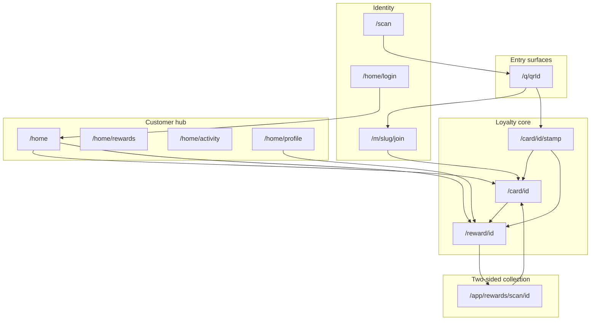

# Whole Customer Flow Edge-Case Audit

## Context

You asked for the **whole customer flow**, all edge cases, and all scenarios. Two read-only audits already exist:

- [`Goal/customer-edge-case-audit.md`](Goal/customer-edge-case-audit.md) — 57 scenarios, loyalty-core focus
- [`Goal/customer-edge-case-audit-claude.md`](Goal/customer-edge-case-audit-claude.md) — 51 scenarios, deeper RPC/mapper analysis

[`Goal/Goal.md`](Goal/Goal.md) now tracks an **implementation** slice on top of those audits. The live codebase has already moved ahead of both documents on several P0/P1 items (billing alignment, shared error mapper, waiting-reward home copy, QR rate-limit panel, full-card-without-reward recovery, OTP auto-stamp guard, `firststamp=pending`). This plan therefore has two jobs:

1. **Expand scope** from loyalty-core to the full customer product surface.
2. **Re-baseline** every scenario against current code/tests so the deliverable is accurate today, not a stale snapshot.

**Deliverable:** one master artifact — [`Goal/customer-flow-edge-case-master-audit.md`](Goal/customer-flow-edge-case-master-audit.md) — with executive summary, full scenario catalog, gap register, test matrix, billing matrix, EARS traceability, and manual QA script.



---

## Architecture rules to anchor every scenario

**Source-of-truth hierarchy** (from [`lib/customer/experience/derive.ts`](lib/customer/experience/derive.ts)):

| Layer   | Role                                      | Key files                                                                                                                                                                                                                                                                                                |
| ------- | ----------------------------------------- | -------------------------------------------------------------------------------------------------------------------------------------------------------------------------------------------------------------------------------------------------------------------------------------------------------- |
| RPC     | Authoritative for stamp/redeem invariants | [`issue_self_service_stamp`](supabase/migrations/20260616103000_minimum_three_rewards.sql), [`redeem_self_service_reward`](supabase/migrations/20260615130000_reward_redemption_cycles.sql), [`join_customer_membership_with_first_stamp`](supabase/migrations/20260614120000_join_with_first_stamp.sql) |
| Loaders | Impure fact gathering                     | [`load-join.ts`](lib/customer/experience/load-join.ts), [`load-stamp.ts`](lib/customer/experience/load-stamp.ts), [`load-card.ts`](lib/customer/experience/load-card.ts), [`load-reward.ts`](lib/customer/experience/load-reward.ts), [`home.ts`](lib/customer/home.ts)                                  |
| Derive  | Pure priority resolution                  | [`derive.ts`](lib/customer/experience/derive.ts), [`priorities.ts`](lib/customer/experience/priorities.ts)                                                                                                                                                                                               |
| Actions | Mutations + redirects                     | [`join/actions.ts`](app/m/[merchantSlug]/join/actions.ts), [`card/actions.ts`](app/card/[membershipId]/actions.ts), [`home/actions.ts`](app/home/actions.ts), [`merchant/reward-collection.ts`](lib/merchant/reward-collection.ts)                                                                       |

**Priority invariants** (must hold in every scenario row):

- Stamp route: `unavailable` → `reward_ready` → `reward_waiting` → `card_stamped_today` → `stamp_confirm` ([`STAMP_PRIORITY`](lib/customer/experience/priorities.ts))
- Reward route: `unavailable` → `redeemed_proof` → `reward_ready` → `reward_waiting`
- Customer never self-redeems; merchant scans QR at [`/app/rewards/scan/[rewardId]`](app/app/rewards/scan/[rewardId]/page.tsx)

**Billing dimensions** (do not conflate):

- `merchants.status` — programme active/paused/cancelled
- `billing_customers.status` — RPC blocks `cancelled` + `suspended`; allows `trialing`, `active`, `past_due`

Current shared policy lives in [`unavailableMessage`](lib/customer/card.ts) and [`isMerchantBillingBlocked`](lib/customer/join.ts).

---

## Journey segments and scenario taxonomy

Catalog **~120–140 scenario rows** using one standard template:

`ID | Preconditions | Entry route | Derived kind / outcome | RPC if action | Customer copy/CTA | Tests | Status (OK/Partial/Gap/Missing) | Gap ref`

### Segment A — QR resolver (`/q/[qrId]`)

Key file: [`app/q/[qrId]/page.tsx`](app/q/[qrId]/page.tsx)

| Scenario cluster   | Examples                                                                    |
| ------------------ | --------------------------------------------------------------------------- |
| Membership routing | New visitor → join; returning member → stamp                                |
| QR validity        | Unknown, inactive, wrong destination_type                                   |
| Programme health   | Merchant paused; billing cancelled/suspended (now blocked in join resolver) |
| Rate limits        | `RateLimitError` → distinct retry panel (already implemented)               |
| Analytics          | `qr_scanned` recorded with `available` flag                                 |

### Segment B — In-app scanner (`/scan`)

Key files: [`lib/customer/qr-scanner.ts`](lib/customer/qr-scanner.ts), [`app/scan/page.tsx`](app/scan/page.tsx)

| Scenario cluster      | Examples                                                            |
| --------------------- | ------------------------------------------------------------------- |
| Payload normalization | Relative `/q/id`, same-origin absolute URL, query/hash stripped     |
| Rejection             | Foreign origin, `/card/...`, `/q/id/extra`, path traversal          |
| Session shell         | Authed → `CustomerAppShell`; guest → `CustomerShell`                |
| Client runtime        | Camera permission denied, scan cancel, no `CUSTOMER_SESSION_SECRET` |

### Segment C — Join wizard (`/m/[slug]/join`)

Key files: [`load-join.ts`](lib/customer/experience/load-join.ts), [`join/actions.ts`](app/m/[merchantSlug]/join/actions.ts), [`join-wizard.tsx`](components/customer/join-wizard.tsx)

| Scenario cluster | Examples                                                                                                                                        |
| ---------------- | ----------------------------------------------------------------------------------------------------------------------------------------------- |
| Step machine     | welcome → phone → otp → terms; direct join (no QR skips welcome); `step=phone` back-nav                                                         |
| Returning member | `join_returning`; signed-in + QR auto-redirect via [`returning-qr-redirect.ts`](lib/customer/returning-qr-redirect.ts)                          |
| Phone/OTP errors | Invalid UK phone, OTP format, wrong code, expired pending, rate limit                                                                           |
| Terms/consent    | Loyalty terms required; marketing opt-in on/off → separate consent row                                                                          |
| First stamp      | `first_stamp_issued=true` → `welcome=1&stamp=issued`; `false` → `firststamp=pending`                                                            |
| Billing at join  | Cancelled/suspended QR unavailable (re-baseline against [`customer-billing-matrix.test.ts`](tests/micro-specs/customer-billing-matrix.test.ts)) |

### Segment D — Returning OTP auto-routing

Key file: [`returning-qr-redirect.ts`](lib/customer/returning-qr-redirect.ts)

| Scenario cluster    | Examples                                                               |
| ------------------- | ---------------------------------------------------------------------- |
| No auto-issue       | `issueStamp:false` → stamp confirm                                     |
| Reward-first        | Redeemable → `/reward/id`; waiting → card                              |
| Stamp issue         | Success → `?stamp=issued`; geo flagged; already stamped → stamp status |
| Failure degradation | RPC throw / unmapped error → stamp path (try/catch now present)        |

### Segment E — Stamp surface (`/card/[id]/stamp?qr=`)

Key files: [`load-stamp.ts`](lib/customer/experience/load-stamp.ts), [`selfStampAction`](app/card/[membershipId]/actions.ts)

| Scenario cluster | Examples                                                            |
| ---------------- | ------------------------------------------------------------------- |
| Priority states  | confirm, stamped today, reward ready/waiting, unavailable           |
| QR guards        | Missing QR, invalid QR, wrong merchant                              |
| Access           | Unauthenticated (recovery login), unauthorized, not found           |
| RPC blocks       | Duplicate day, full card, rate limit, pool < 3, billing unavailable |
| Data drift       | Full count, no unlocked reward → recovery unavailable (re-baseline) |
| Geo soft-fail    | Denied / out of range → stamp still issues + review flag            |

### Segment F — Card surface (`/card/[id]`)

Key files: [`load-card.ts`](lib/customer/experience/load-card.ts), [`customer-card-experience.tsx`](components/customer/customer-card-experience.tsx)

| Scenario cluster    | Examples                                                                                   |
| ------------------- | ------------------------------------------------------------------------------------------ |
| Progress states     | Collecting, waiting reward band, ready reward CTA                                          |
| Celebration flags   | `stamp=issued`, `welcome=1`, `reward=redeemed`, `geo=flagged`, `firststamp=pending`        |
| Full-without-reward | Recovery copy + operator log ([`fullWithoutReward`](lib/customer/experience/load-card.ts)) |
| Plain card          | No QR in URL → scan prompt only                                                            |

### Segment G — Reward surface (`/reward/[id]`)

Key files: [`load-reward.ts`](lib/customer/experience/load-reward.ts), [`reward-panels.tsx`](components/customer/reward-panels.tsx)

| Scenario cluster | Examples                                                                                                                         |
| ---------------- | -------------------------------------------------------------------------------------------------------------------------------- |
| States           | ready QR, waiting (no QR), redeemed proof, unavailable                                                                           |
| Profile gate     | Incomplete name/DOB/email → gate form before QR ([`reward-profile-gate.test.ts`](tests/micro-specs/reward-profile-gate.test.ts)) |
| Access           | Wrong customer, not found, unauthenticated                                                                                       |
| Billing          | Cancelled/suspended → unavailable (shared `unavailableMessage`)                                                                  |
| Copy timing      | "Tomorrow" vs next UK business day / weekend skip                                                                                |

### Segment H — Merchant-scanned collection (customer outcome)

Key files: [`lib/merchant/reward-collection.ts`](lib/merchant/reward-collection.ts), [`merchant-scanned-reward.test.ts`](tests/micro-specs/merchant-scanned-reward.test.ts)

Customer-visible outcomes only:

| Scenario cluster | Examples                                                                                  |
| ---------------- | ----------------------------------------------------------------------------------------- |
| Happy path       | Merchant collects → customer card resets cycle; proof screen                              |
| Merchant blocks  | Profile incomplete, overnight hold, insufficient stamps, inactive card, billing cancelled |
| Idempotency      | Already redeemed → proof / no double decrement                                            |
| Geo on redeem    | Soft flag at RPC; customer page passive                                                   |

### Segment I — Home hub (`/home`, `/home/rewards`, `/home/activity`)

Key files: [`home.ts`](lib/customer/home.ts), [`home-dashboard.ts`](lib/customer/home-dashboard.ts), [`rewards.ts`](lib/customer/rewards.ts), [`activity.ts`](lib/customer/activity.ts)

| Scenario cluster | Examples                                                              |
| ---------------- | --------------------------------------------------------------------- |
| Dashboard        | Empty state; multi-card sort; ready banner; waiting status copy       |
| Tile semantics   | Ready → `/reward`; waiting → card; stamped today; collecting progress |
| Rewards list     | redeemable / upcoming / redeemed buckets                              |
| Activity feed    | join, stamp, unlock, redeem events; snippet on dashboard              |
| Reconciliation   | Stamp event count vs membership count after cycle reset               |

### Segment J — Home auth and session (`/home/login`, session reset)

Key files: [`home/actions.ts`](app/home/actions.ts), [`home/(authed)/layout.tsx`](<app/home/(authed)/layout.tsx>), [`session/reset/route.ts`](app/home/session/reset/route.ts)

| Scenario cluster | Examples                                                           |
| ---------------- | ------------------------------------------------------------------ |
| Login OTP        | Known phone → code; unknown phone → neutral message + dead-end OTP |
| Rate limits      | Login OTP rate limit copy                                          |
| Redirect safety  | `safeNextPath` for post-login destination                          |
| Stale session    | Session cookie present but customer row missing → reset route      |
| Sign out         | Clears session → `/home/login`                                     |

### Segment K — Profile, email, marketing (`/home/profile`)

Key files: [`home/profile/actions.ts`](<app/home/(authed)/profile/actions.ts>), [`consent.ts`](lib/customer/consent.ts), [`email-verification.ts`](lib/customer/email-verification.ts)

| Scenario cluster     | Examples                                             |
| -------------------- | ---------------------------------------------------- |
| Profile completeness | Missing name/DOB banner; save validation             |
| Email verify         | New email → OTP; verify success; resend; clear email |
| Marketing consent    | Per-channel toggle; opt-out creates no marketing row |
| Reward gate parity   | Same validators as home profile vs reward gate       |

### Segment L — Public utility routes

| Route                                                                  | Customer relevance                            |
| ---------------------------------------------------------------------- | --------------------------------------------- |
| [`/start`](app/start/page.tsx)                                         | Launcher → scan / home login / merchant login |
| [`/offline`](app/offline/page.tsx)                                     | Offline messaging                             |
| [`/merchant/[slug]/terms`](app/merchant/[merchantSlug]/terms/page.tsx) | Join terms deep link                          |
| [`/m/[slug]/join`](app/m/[merchantSlug]/join/page.tsx) without QR      | Direct join path                              |

---

## Phase 1 — Re-baseline RPC and mapper inventory

Extract every `raise exception` from the three customer RPCs and map to:

- [`toStampBlockReason`](lib/customer/experience/block-reasons.ts) + [`blockReasonCopy`](lib/customer/experience/block-reasons.ts)
- Loader `unavailableReason` / derive kinds
- Merchant scan `blockedReason` (raw RPC message today — note if customer-safe mapping is missing on merchant side)

**Already landed (mark as resolved in master audit, do not re-report as open gaps):**

- Shared mapper in production [`stamp.ts`](lib/customer/stamp.ts) (no duplicate `blockedReason`)
- `rate_limited`, `pool_unavailable`, `Verified customer required` mappings
- Billing `cancelled` aligned in card/reward/join
- QR rate-limit distinct copy
- `fullWithoutReward` recovery state
- Home waiting-reward status copy
- OTP auto-stamp try/catch degradation
- `firststamp=pending` join outcome

---

## Phase 2 — Build the master scenario catalog

Merge rows from both existing audits, dedupe IDs, then add Segments A–L above.

**High-priority scenarios to ensure are explicitly rowed** (your original question plus whole-flow extras):

1. Full card (3/3) + unredeemed reward + QR scan → reward-first, not stamp
2. Full card + waiting reward + stamped today → home vs stamp vs card copy
3. Full card + no reward row → recovery, not stamp CTA
4. Cancelled billing across join, stamp, card, reward, home, merchant scan
5. Rate limit on QR resolve, stamp submit, join phone OTP, home login OTP
6. Pool < 3 on final stamp (join wrapper + stamp submit)
7. Profile incomplete at reward-ready (customer QR suppressed)
8. Merchant scan fails after customer showed ready QR
9. Unknown phone home login (neutral UX, no account leak)
10. Post-redemption new cycle + same-UK-day stamp eligibility
11. Multi-venue customer with competing ready/waiting cards on home sort

---

## Phase 3 — Gap register (re-baselined)

Produce a fresh P0/P1/P2 register. Preliminary **remaining** areas to validate during execution (may close to zero after re-baseline):

| Area                                      | Why still worth checking                                                                    |
| ----------------------------------------- | ------------------------------------------------------------------------------------------- |
| Route/E2E coverage                        | Many scenarios OK at unit layer but not browser-level                                       |
| Merchant scan error copy                  | [`collectMerchantScannedReward`](lib/merchant/reward-collection.ts) returns raw RPC strings |
| Geo on redeem                             | Merchant path; SQL static only                                                              |
| Spec drift                                | Micro-specs still mention self-redeem / older pool minimum in places                        |
| `docs/CUSTOMER_FLOW.md` vs `/home` naming | Doc reconciliation (called out in Goal.md)                                                  |
| Scanner client edges                      | Camera permission / runtime failures largely untested                                       |
| Activity vs home dashboard                | Event ordering when membership count reconciles                                             |

Severity rubric (unchanged):

- **P0** — wrong action offered, alarming error surface, RPC/UI mismatch on loyalty-affecting action
- **P1** — confusing copy, untested branch likely to regress
- **P2** — hygiene, docs, operator diagnostics

---

## Phase 4 — Test matrix and verification runbook

### Vitest baseline (run and record pass/fail in master audit appendix)

Core customer suite (from both audits + new billing test):

```bash
pnpm vitest run \
  tests/micro-specs/customer-experience.test.ts \
  tests/micro-specs/returning-qr-redirect.test.ts \
  tests/micro-specs/self-service-stamping.test.ts \
  tests/micro-specs/customer.test.ts \
  tests/micro-specs/customer-home.test.ts \
  tests/micro-specs/customer-billing-matrix.test.ts \
  tests/micro-specs/customer-stamp-loader.test.ts \
  tests/micro-specs/reward-redemption-cycles.test.ts \
  tests/micro-specs/merchant-scanned-reward.test.ts \
  tests/micro-specs/reward-profile-gate.test.ts \
  tests/micro-specs/customer-facing-gap-fixes.test.ts \
  tests/micro-specs/customer-home-auth.test.ts \
  tests/micro-specs/customer-qr-scanner.test.ts \
  tests/micro-specs/home-profile.test.ts \
  tests/micro-specs/customer-phone-auth.test.ts
```

SQL invariants:

```bash
pnpm db:test:rls   # if DB available
# or targeted:
# supabase/tests/profile_completion_gate.sql
# supabase/tests/reward_redemption_cycles.sql
```

### Coverage heatmap dimensions

For each segment A–L, score: `RPC SQL | Unit derive | Loader/action | Route/UI | E2E`

### Manual QA script (dev harness)

Drive via [`app/dev/customer-flow/preview/`](app/dev/customer-flow/preview/) and spot-check:

- `card-3-of-3` reward-ready vs reward-waiting
- Join with blocked first stamp → `firststamp=pending` welcome card
- Home tile with waiting reward while stamped today
- Cancelled billing card (unavailable, not stamp CTA)
- Profile gate on reward-ready
- `/scan` valid vs invalid payload

---

## Phase 5 — EARS traceability

Map scenario groups to active micro-specs:

- [`micro-specs/03-customer/01-qr-resolver-and-customer-join.md`](micro-specs/03-customer/01-qr-resolver-and-customer-join.md)
- [`micro-specs/03-customer/02-digital-stamp-card.md`](micro-specs/03-customer/02-digital-stamp-card.md)
- [`micro-specs/04-staff-rewards/01-self-service-stamp-issuing.md`](micro-specs/04-staff-rewards/01-self-service-stamp-issuing.md)
- [`micro-specs/04-staff-rewards/02-reward-unlock-and-redemption.md`](micro-specs/04-staff-rewards/02-reward-unlock-and-redemption.md)

Add **proposed SHALLs** for gaps with no spec owner today: profile gate, rate limits, pool minimum (3 active rewards), geo soft-fail on redeem, home waiting-reward representation, `firststamp=pending`, full-without-reward recovery.

---

## Phase 6 — Write deliverable and backlog

### Master document structure

1. Executive summary (verdict, counts, what's fixed since prior audits)
2. Architecture rule map + mermaid
3. Scenario catalog (Segments A–L, ~120–140 rows)
4. Billing & programme health matrix
5. RPC exception index
6. Gap register (re-baselined P0/P1/P2)
7. Test matrix heatmap
8. EARS traceability
9. Remediation backlog (analysis recommendations only unless you later choose implementation)
10. Appendices: vitest output, manual QA notes, file inventory

### Relationship to existing files

- Keep [`Goal/customer-edge-case-audit.md`](Goal/customer-edge-case-audit.md) and [`Goal/customer-edge-case-audit-claude.md`](Goal/customer-edge-case-audit-claude.md) as historical inputs; the master audit supersedes them with a "resolved since" section.
- [`Goal/Goal.md`](Goal/Goal.md) remains the implementation tracker; the master audit's backlog should align with it but note items already implemented.

---

## Out of scope (unless you explicitly widen later)

- Merchant console onboarding/launch flows (except reward scan customer outcome)
- Admin console
- Production code changes during the audit pass
- Playwright E2E authoring (manual harness only in audit)

---

## Success criteria

- Every customer route in [`docs/ROUTES.md`](docs/ROUTES.md) that a customer can hit is represented in at least one scenario cluster
- Every P0/P1 gap is either **resolved (with test citation)** or **open (with owner layer + recommendation)**
- Billing matrix covers both `merchants.status` and `billing_customers.status` across all acting surfaces
- Master audit is accurate against **current** code, not the pre-fix snapshot in the older audit files
