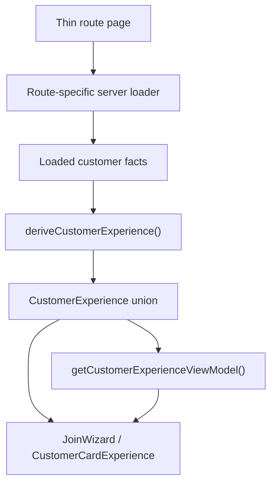

# Customer flow route redesign

## Decisions (confirmed)

- **Routes:** Keep existing URLs (`/q`, `/m/.../join`, `/card/.../stamp`, `/card/...`, `/reward/...`) as **thin wrappers**; shared UI lives in one experience layer.
- **Join order:** Keep current backend order (verify phone → terms → membership → first stamp), but present it as a **step wizard** with one job per screen.
- **Trust model:** Keep **self-service QR stamp/redeem** (no staff PIN); aligns with [docs/CUSTOMER_FLOW.md](docs/CUSTOMER_FLOW.md) and [AGENTS.md](AGENTS.md).
- **Abstraction shape:** Split experience layer into **loaders → pure derivation → view-model copy → panels**. Do **not** build a monolithic `resolveCustomerExperience()` god resolver.
- **State machine library:** Not needed — TypeScript discriminated union + exhaustive switches + `assertNever` is sufficient.

## Target architecture



Route pages stay thin. Derivation stays pure. Copy stays easy to change. Tests stay fast.

### Module layout (not one god file)

```txt
lib/customer/experience/
  types.ts        # CustomerExperience union, CustomerExperienceEntry, StampBlockReason
  derive.ts       # pure deriveCustomerExperience({ entry, context }) — no DB imports
  copy.ts         # getCustomerExperienceViewModel(exp) — headline, support, CTAs
  priorities.ts   # route-aware state priority tables
  load-join.ts    # server-only
  load-card.ts    # server-only
  load-stamp.ts   # server-only
  load-reward.ts  # server-only
  block-reasons.ts # centralise RPC error string → StampBlockReason mapping (one place)
```

Example route page pattern:

```ts
const context = await loadStampExperienceContext(params, searchParams)
const experience = deriveCustomerExperience({ entry: "stamp", context })
return <CustomerCardExperience experience={experience} />
```

## Separate state from copy

The `CustomerExperience` union describes **what is true**, not how it is phrased:

```ts
type CustomerExperience =
  | { kind: "card_stamped_today"; membershipId: string; merchantName: string; nextStampDate?: string }
  | { kind: "reward_ready"; rewardId: string; membershipId: string; rewardName: string }
  // ...
```

View-model mapping lives in [lib/customer/experience/copy.ts](lib/customer/experience/copy.ts):

```ts
function getCustomerExperienceViewModel(exp: CustomerExperience) {
  switch (exp.kind) {
    case "card_stamped_today":
      return {
        headline: "You've already collected today's stamp",
        supportLine: "Come back tomorrow to keep building your card.",
        primaryAction: { label: "View card", href: `/card/${exp.membershipId}` },
      }
    // ...
  }
}
```

Use `assertNever(value: never)` in every switch for compile-time safety.

## Route-aware derivation

Same backend facts can mean different UI depending on entry route. Include explicit entrypoint:

```ts
type CustomerExperienceEntry = "qr" | "join" | "card" | "stamp" | "reward"
```

Pass `entry` into `deriveCustomerExperience({ entry, context })`. Document **route-specific priority tables** in [lib/customer/experience/priorities.ts](lib/customer/experience/priorities.ts) to prevent ambiguous matches (e.g. ready reward + valid stamp QR).

Example priority order (exact order per route TBD in tests):

| Priority | State kinds |
|---|---|
| 1 | unavailable / invalid / unauthorized |
| 2 | redeemed_proof |
| 3 | reward_ready |
| 4 | reward_waiting |
| 5 | stamp_confirm |
| 6 | card_stamped_today |
| 7 | card_collecting |
| 8 | join_terms |
| 9 | join_otp |
| 10 | join_phone |
| 11 | join_welcome |

Define separate arrays: `CARD_PRIORITY`, `STAMP_PRIORITY`, `REWARD_PRIORITY`, `JOIN_PRIORITY`.

## Experience states → panels (one job, one primary CTA)

| State kind | Panel | Route entry |
|---|---|---|
| `join_welcome` | WelcomePanel | `/join?qr=` (see join rules below) |
| `join_phone` | PhonePanel | `/join` (no session) |
| `join_otp` | OtpPanel | `/join` (OTP pending in session) |
| `join_terms` | TermsPanel | `/join` (verified, no membership) |
| `stamp_confirm` | StampConfirmPanel | `/card/.../stamp?qr=` |
| `card_collecting` | CardProgressPanel | `/card/...` |
| `card_stamped_today` | AlreadyStampedPanel | `/card/...` or stamp blocked |
| `reward_waiting` | RewardWaitingPanel | `/card/...` or `/reward/...` |
| `reward_ready` | RewardReadyPanel | `/reward/...` |
| `redeemed_proof` | RedeemedProofPanel | `/reward/...?redeemed=1` |
| `unavailable` | UnavailablePanel | any |

## Join welcome — explicit step rules

Backend state alone cannot distinguish welcome vs phone for a brand-new visitor (no session in both cases).

**Chosen approach: query-driven welcome for QR joins**

- QR-driven: `/join?qr=abc` → `join_welcome`; CTA links to `/join?qr=abc&step=phone`
- Direct join without QR: skip welcome → `join_phone`
- Resolver rule sketch:

```ts
if (!session && hasQr && searchParams.step !== "phone") return { kind: "join_welcome", ... }
if (!session) return { kind: "join_phone", ... }
```

Alternative (client-local welcome transition) deferred unless query approach feels too jumpy in review.

## Typed block reasons (not string matching in UI)

Prefer typed reasons over panel-level error string inspection:

```ts
type StampBlockReason =
  | "already_stamped_today"
  | "invalid_qr"
  | "expired_qr"
  | "wrong_merchant"
  | "unauthenticated"
  | "unknown"
```

Centralise RPC message → `StampBlockReason` mapping in [lib/customer/experience/block-reasons.ts](lib/customer/experience/block-reasons.ts) (single place, tested). UI panels never inspect raw error strings.

If lower-level [lib/customer/stamp.ts](lib/customer/stamp.ts) only returns text today, bridge there first; optionally extend RPC result types in a follow-up.

## Redeemed proof — reward-specific URL

Do **not** use `/card/...?reward=redeemed` alone (ambiguous when multiple rewards exist).

Use:

```txt
/reward/[rewardId]?redeemed=1
```

Reward route already has object identity. Card links back after proof. Update post-redeem redirect in [app/reward/[rewardId]/actions.ts](app/reward/[rewardId]/actions.ts) accordingly.

## Wallet recovery — safe `next`

Unauthenticated/unauthorized panels link to `/wallet/login?next=...`.

Add [lib/navigation/safe-next-path.ts](lib/navigation/safe-next-path.ts) (or similar):

```ts
function safeNextPath(path: string): string {
  if (!path.startsWith("/")) return "/wallet"
  if (path.startsWith("//")) return "/wallet"
  return path
}
```

Test allowed and rejected paths.

## Implementation phases (vertical slices, reviewable PRs)

### Phase 1 — Experience skeleton (no route refactor yet)

Create `lib/customer/experience/{types,derive,copy,priorities,block-reasons}.ts`.

Add pure tests in [tests/micro-specs/customer-experience.test.ts](tests/micro-specs/customer-experience.test.ts) for card/stamp/reward/join states using fixture contexts.

Goal: prove union shape and priority rules before touching route pages.

### Phase 2 — Simplify card chrome

Refactor [components/customer/customer-flow-system.tsx](components/customer/customer-flow-system.tsx):

- One headline rule (shell *or* receipt title, not both)
- Drop `ProgressTrack` from `CustomerStampCard` when `StampGrid` is visible
- Footer hooks for saved-phone / stamp dates (mono receipt voice)

Keep Wet Ink motifs guarded by [tests/micro-specs/customer-flow-redesign.test.ts](tests/micro-specs/customer-flow-redesign.test.ts).

### Phase 3 — Card route only

Add [components/customer/customer-card-experience.tsx](components/customer/customer-card-experience.tsx) + initial panels.

Move [app/card/[membershipId]/page.tsx](app/card/[membershipId]/page.tsx) onto shared layer.

Support: `card_collecting`, `reward_waiting`, `reward_ready` (link-out), `unavailable`.

Add [lib/customer/experience/load-card.ts](lib/customer/experience/load-card.ts).

### Phase 4 — Stamp route

Move [app/card/[membershipId]/stamp/page.tsx](app/card/[membershipId]/stamp/page.tsx) onto shared layer.

Add: `stamp_confirm`, `card_stamped_today`, QR unavailable.

Replace error-tone "already stamped" with calm `AlreadyStampedPanel`.

Add [lib/customer/experience/load-stamp.ts](lib/customer/experience/load-stamp.ts).

### Phase 5 — Reward route

Move [app/reward/[rewardId]/page.tsx](app/reward/[rewardId]/page.tsx) onto shared layer.

Add: `reward_ready`, `reward_waiting`, `redeemed_proof`, `unavailable`.

Redirect after redeem → `/reward/[rewardId]?redeemed=1`.

Add [lib/customer/experience/load-reward.ts](lib/customer/experience/load-reward.ts).

Wrap existing [components/customer/self-service-forms.tsx](components/customer/self-service-forms.tsx) in panels (stamp/redeem forms unchanged at action layer).

### Phase 6 — Join wizard (after card/stamp/reward validated)

Add [components/customer/join-wizard.tsx](components/customer/join-wizard.tsx) + `components/customer/join/*` step panels.

Thin [app/m/[merchantSlug]/join/page.tsx](app/m/[merchantSlug]/join/page.tsx): `loadJoinExperienceContext` → derive → `<JoinWizard />`.

Keep [app/m/[merchantSlug]/join/actions.ts](app/m/[merchantSlug]/join/actions.ts) redirects (post-terms → `/card/.../stamp?qr=`).

Add [lib/customer/experience/load-join.ts](lib/customer/experience/load-join.ts).

TDD: extend [tests/micro-specs/customer.test.ts](tests/micro-specs/customer.test.ts) — one step per screen; terms isolated; no "register/account" copy.

### Phase 7 — Auth recovery + unavailable

Unified `UnavailablePanel` copy. Wallet login links with `safeNextPath`.

Keep [app/q/[qrId]/page.tsx](app/q/[qrId]/page.tsx) redirect-only; improve unavailable QR via shared panel if needed.

### Phase 8 — Dev preview + screenshots

Update [lib/dev/customer-flow-preview.ts](lib/dev/customer-flow-preview.ts) and [app/dev/customer-flow/preview/screens.tsx](app/dev/customer-flow/preview/screens.tsx) for new steps/panels.

Re-run `pnpm customer-flow:capture-mocks` → [docs/screenshots/customer-flow/](docs/screenshots/customer-flow/).

### Phase 9 — Verification

- Vitest: `customer-experience`, `customer`, `customer-flow-redesign`, `customer-flow-dev-harness`, `customer-flow-preview`, `safe-next-path`
- Playwright: [tests/e2e/customer-flow-harness-screenshots.spec.ts](tests/e2e/customer-flow-harness-screenshots.spec.ts)
- Manual: `/q/bean-test-qr` → join wizard → stamp → card → reward → redeem proof

## Out of scope (this pass)

- True stamp-before-signup (prototype order)
- Route URL consolidation into a single `/card` hub
- Full state-machine library (XState etc.)
- PWA / add-to-home-screen prompt
- Wallet page redesign (recovery links only)

## Key files

| Area | Files |
|---|---|
| Experience layer | `lib/customer/experience/*` (new module) |
| Shared UI | `components/customer/customer-card-experience.tsx`, `components/customer/join-wizard.tsx`, `components/customer/join/*`, refactor `customer-flow-system.tsx` |
| Routes | `app/q/...`, `app/m/.../join/page.tsx`, `app/card/...`, `app/reward/...`, `app/reward/.../actions.ts` (redeem redirect) |
| Navigation safety | `lib/navigation/safe-next-path.ts` |
| Dev mocks | `lib/dev/customer-flow-preview.ts`, `app/dev/customer-flow/preview/*` |
| Tests | `tests/micro-specs/customer-experience.test.ts`, updates to existing customer tests |

## What stays strong from the original plan

- Existing URLs as thin wrappers + shared experience layer
- State union instead of scattered route conditionals
- Join wizard with one task per screen
- Missing emotional/product states (already stamped, reward waiting/ready, redeemed proof, unavailable, wallet recovery)
- `/q` mostly redirect-only
- TDD around derivation (regression guard)
- Dev preview / screenshot refresh
- Product principle: **one screen, one job, one primary CTA**
