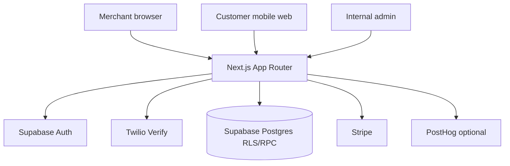
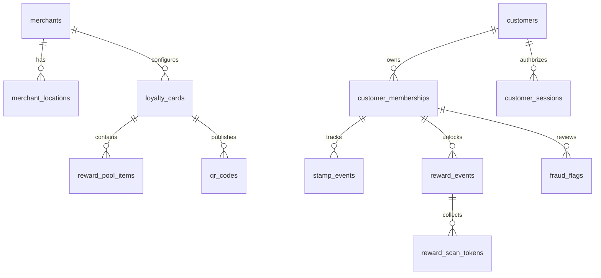
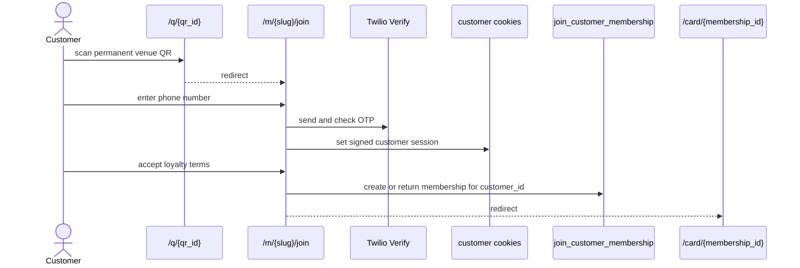
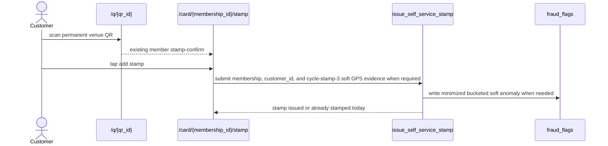
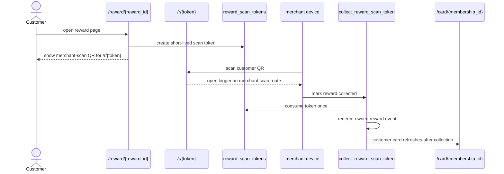

# Nabaperks Architecture

Last reviewed: 2026-06-17

This map reflects the static-QR self-service stamp implementation and is the
as-built source of truth for the system. Binding cross-cutting rules live in
`micro-specs/GLOBAL_CONTEXT.md`; the `micro-specs/` folder is the intent backlog.

## 1. System Summary

Nabaperks is a UK no-app QR loyalty MVP. Merchants configure one active mystery
visit card, one reward pool, venue location checks, and one permanent venue QR.
Customers join, add stamps, and show reward QR pages for venue-assisted
collection through mobile web.

The core trust boundary is server-side self-service stamping:

1. The permanent QR resolves to join for new visitors or stamp-confirm for
   existing members.
2. The customer taps to stamp from the QR context.
3. Postgres enforces one stamp per UK business day.
4. Optional GPS checks never block. Cycle stamp 1 and 2 do not request GPS and
   cycle stamp 1 and 2 do not write GPS unknown fraud flags; cycle stamp 3
   requires a browser GPS attempt when soft geofence is enabled, and denied,
   timeout, unsupported, unavailable, or poor-accuracy GPS still issues the stamp.
5. Reward collection uses short-lived scan tokens, so customer QR pages never
   expose durable reward event IDs to merchant devices.

## 2. Actors And Access

| Actor ID         | Actor                            | Primary routes                                                                                 | Auth                                              | Authorization                                                                                  |
| ---------------- | -------------------------------- | ---------------------------------------------------------------------------------------------- | ------------------------------------------------- | ---------------------------------------------------------------------------------------------- |
| `Actor.Merchant` | Merchant owner                   | `/login`, `/signup`, `/app/*`, `/pricing`                                                      | Supabase session                                  | Merchant layout and server modules read owned merchant state; mutation RPCs enforce ownership. |
| `Actor.Customer` | Loyalty customer                 | `/q/[qrId]`, `/m/[merchantSlug]/join`, `/card/[membershipId]`, `/reward/[rewardId]`, `/home/*` | Twilio Verify plus signed customer session cookie | Customer modules use explicit ownership checks before returning card, reward, and stamp state. |
| `Actor.Admin`    | Internal admin                   | `/admin/*`                                                                                     | Supabase session plus `internal_admins`           | Admin layout validates access; admin actions use support RPCs and audit logs.                  |
| `Actor.System`   | Webhooks and trusted server code | `/api/stripe/webhook`, server modules                                                          | Stripe signature or server runtime                | Service-role writes billing state, product events, and audit records.                          |

## 3. Route Catalog

| Route ID                   | Path                           | Gate                                 | Primary module/actions                                          | Notes                                                                          |
| -------------------------- | ------------------------------ | ------------------------------------ | --------------------------------------------------------------- | ------------------------------------------------------------------------------ |
| `Route.Home`               | `/`                            | Public                               | `app/page.tsx`                                                  | Marketing entry.                                                               |
| `Route.Pricing`            | `/pricing`                     | Public page, checkout needs merchant | `startCheckoutAction`                                           | Starts Stripe Checkout.                                                        |
| `Route.AuthLogin`          | `/login`                       | Public                               | `signInAction`                                                  | Merchant password login.                                                       |
| `Route.AuthSignup`         | `/signup`                      | Public                               | `signUpAction`                                                  | Merchant signup.                                                               |
| `Route.AuthConfirm`        | `/auth/confirm`                | Public callback                      | Supabase code exchange                                          | Redirects to `next`.                                                           |
| `Route.MerchantDashboard`  | `/app`                         | Merchant                             | `lib/merchant/dashboard.ts`                                     | Dashboard and pilot metrics.                                                   |
| `Route.MerchantOnboarding` | `/app/onboarding`              | User                                 | `create_merchant_onboarding`                                    | Creates merchant and first location.                                           |
| `Route.MerchantLaunch`     | `/app/launch`                  | Merchant                             | Card, venue, and QR panels                                      | Launch checklist for card, rewards, venue checks, QR.                          |
| `Route.MerchantCustomers`  | `/app/customers`               | Merchant                             | `getMerchantCustomers`                                          | Customer readback.                                                             |
| `Route.MerchantActivity`   | `/app/activity`                | Merchant                             | `getMerchantActivity`                                           | Product event activity feed.                                                   |
| `Route.MerchantSettings`   | `/app/settings`                | Merchant                             | Redirect to `/app/account`                                      | Legacy Settings route now lives inside the Account hub.                        |
| `Route.MerchantBilling`    | `/app/billing`                 | Merchant                             | Redirect to `/app/account?tab=billing`                          | Legacy billing route preserves Stripe checkout and portal outcome params.      |
| `Route.QRResolver`         | `/q/[qrId]`                    | Public                               | `resolveQrForJoin`                                              | Records scan and routes join or stamp-confirm.                                 |
| `Route.CustomerJoin`       | `/m/[merchantSlug]/join`       | Public then OTP session              | Customer identity and join actions                              | Loyalty terms and marketing consent.                                           |
| `Route.CustomerCard`       | `/card/[membershipId]`         | Customer owner                       | `getCustomerCardState`                                          | Card state and reward links.                                                   |
| `Route.CustomerStamp`      | `/card/[membershipId]/stamp`   | Customer owner and QR context        | `selfStampAction`                                               | Self-service stamp confirmation.                                               |
| `Route.CustomerReward`     | `/reward/[rewardId]`           | Customer owner                       | `getCustomerRewardState`, profile actions, `RewardCollectionQr` | Reward state, profile gate, and merchant-scanned collection QR.                |
| `Route.RewardScanHandoff`  | `/r/[token]`                   | Public                               | Redirect to merchant scan route                                 | Public URL encoded in customer-held reward QRs.                                |
| `Route.MerchantRewardScan` | `/app/rewards/scan/[rewardId]` | Merchant                             | `getRewardScanContext`, `collectRewardScanToken`                | The segment value is a short-lived reward scan token, not a durable reward ID. |
| `Route.AdminFraud`         | `/admin/fraud`                 | Internal admin                       | `getAdminFraudSignals`                                          | Fraud flags and redemption failures with minimized bucketed location readback. |
| `Route.StripeWebhook`      | `/api/stripe/webhook`          | Stripe signature                     | `lib/stripe/billing.ts`, `lib/stripe/webhook-events.ts`         | Idempotent billing sync.                                                       |

## 4. Server Module Map

| Module ID          | Files                                                                                                                                                | Supabase client                                          | Responsibility                                                                                                                        |
| ------------------ | ---------------------------------------------------------------------------------------------------------------------------------------------------- | -------------------------------------------------------- | ------------------------------------------------------------------------------------------------------------------------------------- |
| `Module.Auth`      | `lib/auth/session.ts`, `app/(auth)/actions.ts`                                                                                                       | Server client                                            | Current user, merchant session, signup, login, logout.                                                                                |
| `Module.Customer`  | `lib/customer/join.ts`, `lib/customer/card.ts`, `lib/customer/reward.ts`, `lib/customer/stamp.ts`, `lib/customer/session.ts`, customer route actions | Service role plus explicit ownership checks              | QR resolution, OTP join, revocable customer session state, card state, reward state, self-service stamp, and reward QR/profile state. |
| `Module.Merchant`  | `lib/merchant/dashboard.ts`, `lib/merchant/loyalty-card.ts`, `lib/merchant/qr-code.ts`, `lib/merchant/location.ts`, `lib/merchant/geocode.ts`        | Server client and service role                           | Dashboard, card, reward pool, QR, venue checks, activity, ROI settings.                                                               |
| `Module.Admin`     | `lib/admin/auth.ts`, `lib/admin/data.ts`, `app/admin/actions.ts`                                                                                     | Server client for RPC writes; service role for readbacks | Internal access check, support reads, support mutations.                                                                              |
| `Module.Stripe`    | `lib/stripe/**`, billing actions, Stripe webhook route                                                                                               | Service role                                             | Checkout, portal, webhook verification, subscription sync.                                                                            |
| `Module.Analytics` | `lib/analytics/events.ts`, `lib/analytics/funnels.ts`                                                                                                | Service role                                             | `product_events` source of truth plus PostHog mirror.                                                                                 |
| `Module.Security`  | `lib/security/rate-limit.ts`, `scripts/verify-security.mjs`, `enforce_rate_limit`                                                                    | Service-role RPC                                         | Durable hashed-key rate limiting and static security checks.                                                                          |

## 5. Data Architecture

| Table ID                      | Table                   | Purpose                                                                                                                                                                                                                                                                                                                                                                                                                                   |
| ----------------------------- | ----------------------- | ----------------------------------------------------------------------------------------------------------------------------------------------------------------------------------------------------------------------------------------------------------------------------------------------------------------------------------------------------------------------------------------------------------------------------------------- |
| `Table.merchant_locations`    | `merchant_locations`    | Venue name, structured UK address with provenance (`address_source` = `manual_entry`/`provider_lookup`, `address_provider`/`address_provider_id`), latitude/longitude from Nominatim geocode or an optional Google Places (New) merchant-setup lookup, soft GPS radius and toggle, plus `geofence_pin_source` for a merchant-dragged pin override. Google Places is a merchant venue-setup helper only — customer stamp GPS is unchanged. |
| `Table.loyalty_cards`         | `loyalty_cards`         | Active card setup and target visit count.                                                                                                                                                                                                                                                                                                                                                                                                 |
| `Table.reward_pool_items`     | `reward_pool_items`     | Weighted mystery reward pool.                                                                                                                                                                                                                                                                                                                                                                                                             |
| `Table.qr_codes`              | `qr_codes`              | Permanent venue QR records.                                                                                                                                                                                                                                                                                                                                                                                                               |
| `Table.stamp_events`          | `stamp_events`          | Auditable stamp ledger.                                                                                                                                                                                                                                                                                                                                                                                                                   |
| `Table.reward_events`         | `reward_events`         | Assigned reward snapshots and redemption state.                                                                                                                                                                                                                                                                                                                                                                                           |
| `Table.reward_scan_tokens`    | `reward_scan_tokens`    | Short-lived merchant collection tokens for reward QR scans.                                                                                                                                                                                                                                                                                                                                                                               |
| `Table.customer_sessions`     | `customer_sessions`     | Revocable customer browser session registry keyed by signed cookie session.                                                                                                                                                                                                                                                                                                                                                               |
| `Table.stripe_webhook_events` | `stripe_webhook_events` | Stripe event idempotency ledger for webhook replay protection.                                                                                                                                                                                                                                                                                                                                                                            |
| `Table.fraud_flags`           | `fraud_flags`           | Soft geofence and abuse review signals; new stamp evidence stores no raw customer latitude or longitude by default.                                                                                                                                                                                                                                                                                                                       |
| `Table.product_events`        | `product_events`        | Product analytics source of truth.                                                                                                                                                                                                                                                                                                                                                                                                        |
| `Table.audit_logs`            | `audit_logs`            | Admin, support, and security-sensitive mutation audit trail.                                                                                                                                                                                                                                                                                                                                                                              |

## 6. Mutation Boundary

| Layer                            | Boundary                                                                  | Examples                                                                                                                                      | Notes                                              |
| -------------------------------- | ------------------------------------------------------------------------- | --------------------------------------------------------------------------------------------------------------------------------------------- | -------------------------------------------------- |
| RLS reads and constrained writes | Supabase server client with current cookies                               | Merchant reads, card setup reads, admin RPC calls                                                                                             | RLS applies to authenticated server clients.       |
| Security-definer RPC writes      | Postgres validates ownership, billing, rate limits, and ledger invariants | `create_merchant_onboarding`, `join_customer_membership`, `issue_self_service_stamp`, `create_reward_scan_token`, `collect_reward_scan_token` | Primary boundary for high-risk business mutations. |
| Service-role server writes       | Trusted server-only modules                                               | Product events, admin readbacks, billing webhook ledger, QR resolution, customer session registry                                             | Must stay out of client bundles.                   |

## 7. Core Flows

### Customer Join

### Self-Service Stamp

### Reward Redemption

## 8. Observability And Compliance

Source of truth:

- `product_events` for product and funnel activity.
- `audit_logs` for admin/support/security-sensitive mutations.
- `fraud_flags` for abuse review and soft geofence anomalies.
- `billing_customers` for Stripe-derived access state.
- `stripe_webhook_events` for Stripe replay/idempotency state.
- `customer_sessions` for customer session revocation and last-seen state.
- `consent_records` for loyalty terms and marketing consent evidence.

Cycle-stamp-3 soft GPS is the approved active geofence scope for v1. Reward-cycle
reset reapplies the cycle stamp 3 trigger for the new cycle. Admin fraud readback
is minimized and bucketed: cycle stamp number, location status, distance bucket,
accuracy bucket, confidence, reason, merchant, masked customer, severity, status,
and created_at. Raw customer coordinates and raw metadata are not exposed by the
admin read model.

Release proof for DB and browser layers must use a disposable DB before qa:db,
qa:e2e, or qa:visual because those gates can reset, seed, or mutate customer
flow data.

Product events include `qr_scanned`, `customer_joined`, `stamp_issued`,
`join_page_viewed`, `join_phone_requested`, `join_otp_verified`,
`join_terms_accepted`, `customer_card_viewed`, `reward_unlocked`,
`reward_redeemed`, `reward_redemption_failed`, `merchant_signed_up`,
`loyalty_card_created`, `qr_created`, `qr_downloaded`,
`subscription_started`, and `subscription_cancelled`.
