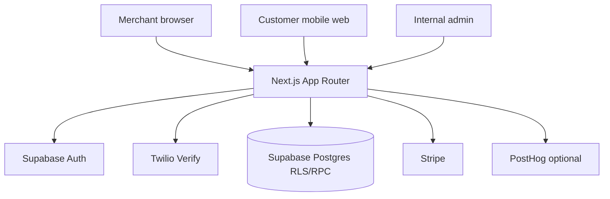
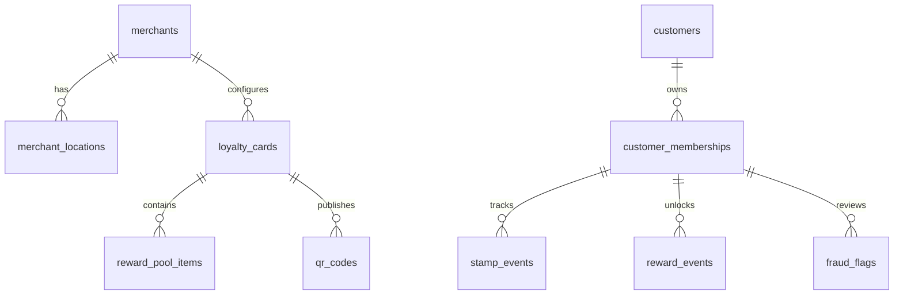
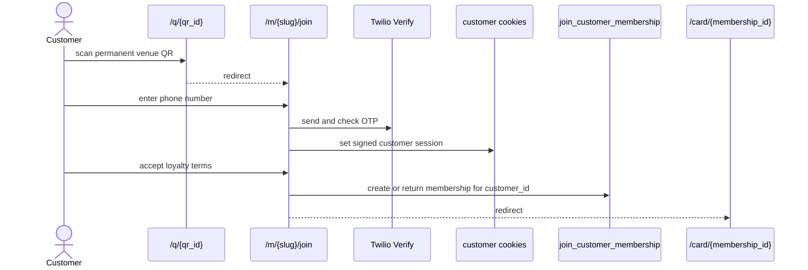
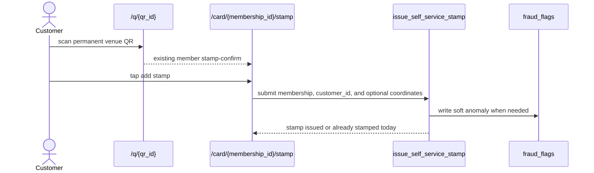
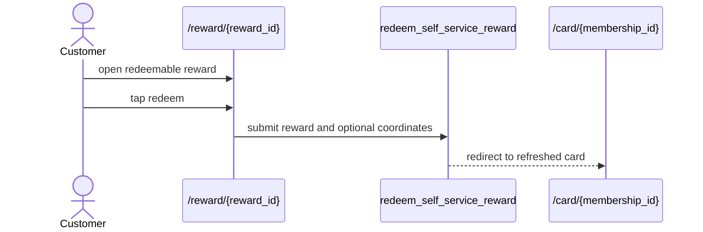

# Nabaperks Architecture

Last reviewed: 2026-06-13

This map reflects the static-QR self-service stamp implementation. The binding
spec remains `nabaperks-micro-specs-final.md`.

## 1. System Summary

Nabaperks is a UK no-app QR loyalty MVP. Merchants configure one active mystery
visit card, one reward pool, venue location checks, and one permanent venue QR.
Customers join, add stamps, and redeem rewards through mobile web.

The core trust boundary is server-side self-service stamping:

1. The permanent QR resolves to join for new visitors or stamp-confirm for
   existing members.
2. The customer taps to stamp from the QR context.
3. Postgres enforces one stamp per UK business day.
4. Optional GPS checks never block; they write `fraud_flags` for review when
   location is outside the configured radius or unavailable.

## 2. Actors And Access

| Actor ID         | Actor                            | Primary routes                                                                                   | Auth                                              | Authorization                                                                                  |
| ---------------- | -------------------------------- | ------------------------------------------------------------------------------------------------ | ------------------------------------------------- | ---------------------------------------------------------------------------------------------- |
| `Actor.Merchant` | Merchant owner                   | `/login`, `/signup`, `/app/*`, `/pricing`                                                        | Supabase session                                  | Merchant layout and server modules read owned merchant state; mutation RPCs enforce ownership. |
| `Actor.Customer` | Loyalty customer                 | `/q/[qrId]`, `/m/[merchantSlug]/join`, `/card/[membershipId]`, `/reward/[rewardId]`, `/wallet/*` | Twilio Verify plus signed customer session cookie | Customer modules use explicit ownership checks before returning card, reward, and stamp state. |
| `Actor.Admin`    | Internal admin                   | `/admin/*`                                                                                       | Supabase session plus `internal_admins`           | Admin layout validates access; admin actions use support RPCs and audit logs.                  |
| `Actor.System`   | Webhooks and trusted server code | `/api/stripe/webhook`, server modules                                                            | Stripe signature or server runtime                | Service-role writes billing state, product events, and audit records.                          |

## 3. Route Catalog

| Route ID                   | Path                         | Gate                                 | Primary module/actions                       | Notes                                                 |
| -------------------------- | ---------------------------- | ------------------------------------ | -------------------------------------------- | ----------------------------------------------------- |
| `Route.Home`               | `/`                          | Public                               | `app/page.tsx`                               | Marketing entry.                                      |
| `Route.Pricing`            | `/pricing`                   | Public page, checkout needs merchant | `startCheckoutAction`                        | Starts Stripe Checkout.                               |
| `Route.AuthLogin`          | `/login`                     | Public                               | `signInAction`                               | Merchant password login.                              |
| `Route.AuthSignup`         | `/signup`                    | Public                               | `signUpAction`                               | Merchant signup.                                      |
| `Route.AuthConfirm`        | `/auth/confirm`              | Public callback                      | Supabase code exchange                       | Redirects to `next`.                                  |
| `Route.MerchantDashboard`  | `/app`                       | Merchant                             | `lib/merchant/dashboard.ts`                  | Dashboard and pilot metrics.                          |
| `Route.MerchantOnboarding` | `/app/onboarding`            | User                                 | `create_merchant_onboarding`                 | Creates merchant and first location.                  |
| `Route.MerchantLaunch`     | `/app/launch`                | Merchant                             | Card, venue, and QR panels                   | Launch checklist for card, rewards, venue checks, QR. |
| `Route.MerchantCustomers`  | `/app/customers`             | Merchant                             | `getMerchantCustomers`                       | Customer readback.                                    |
| `Route.MerchantActivity`   | `/app/activity`              | Merchant                             | `getMerchantActivity`                        | Product event activity feed.                          |
| `Route.MerchantSettings`   | `/app/settings`              | Merchant                             | `saveRoiSettingsAction`                      | ROI estimate settings.                                |
| `Route.MerchantBilling`    | `/app/billing`               | Merchant                             | Stripe billing actions                       | Checkout and Customer Portal.                         |
| `Route.QRResolver`         | `/q/[qrId]`                  | Public                               | `resolveQrForJoin`                           | Records scan and routes join or stamp-confirm.        |
| `Route.CustomerJoin`       | `/m/[merchantSlug]/join`     | Public then OTP session              | Customer identity and join actions           | Loyalty terms and marketing consent.                  |
| `Route.CustomerCard`       | `/card/[membershipId]`       | Customer owner                       | `getCustomerCardState`                       | Card state and reward links.                          |
| `Route.CustomerStamp`      | `/card/[membershipId]/stamp` | Customer owner and QR context        | `selfStampAction`                            | Self-service stamp confirmation.                      |
| `Route.CustomerReward`     | `/reward/[rewardId]`         | Customer owner                       | `getCustomerRewardState`, `selfRedeemAction` | Reward state and redemption.                          |
| `Route.AdminFraud`         | `/admin/fraud`               | Internal admin                       | `getAdminFraudSignals`                       | Fraud flags and redemption failures.                  |
| `Route.StripeWebhook`      | `/api/stripe/webhook`        | Stripe signature                     | `lib/stripe/billing.ts`                      | Billing sync.                                         |

## 4. Server Module Map

| Module ID          | Files                                                                                                                                         | Supabase client                                          | Responsibility                                                                        |
| ------------------ | --------------------------------------------------------------------------------------------------------------------------------------------- | -------------------------------------------------------- | ------------------------------------------------------------------------------------- |
| `Module.Auth`      | `lib/auth/session.ts`, `app/(auth)/actions.ts`                                                                                                | Server client                                            | Current user, merchant session, signup, login, logout.                                |
| `Module.Customer`  | `lib/customer/join.ts`, `lib/customer/card.ts`, `lib/customer/reward.ts`, `lib/customer/stamp.ts`, customer route actions                     | Service role plus explicit ownership checks              | QR resolution, OTP join, card state, reward state, self-service stamp and redemption. |
| `Module.Merchant`  | `lib/merchant/dashboard.ts`, `lib/merchant/loyalty-card.ts`, `lib/merchant/qr-code.ts`, `lib/merchant/location.ts`, `lib/merchant/geocode.ts` | Server client and service role                           | Dashboard, card, reward pool, QR, venue checks, activity, ROI settings.               |
| `Module.Admin`     | `lib/admin/auth.ts`, `lib/admin/data.ts`, `app/admin/actions.ts`                                                                              | Server client for RPC writes; service role for readbacks | Internal access check, support reads, support mutations.                              |
| `Module.Stripe`    | `lib/stripe/**`, billing actions, Stripe webhook route                                                                                        | Service role                                             | Checkout, portal, webhook verification, subscription sync.                            |
| `Module.Analytics` | `lib/analytics/events.ts`, `lib/analytics/funnels.ts`                                                                                         | Service role                                             | `product_events` source of truth plus PostHog mirror.                                 |
| `Module.Security`  | `lib/security/rate-limit.ts`, `scripts/verify-security.mjs`, `enforce_rate_limit`                                                             | Service-role RPC                                         | Durable hashed-key rate limiting and static security checks.                          |

## 5. Data Architecture

| Table ID                   | Table                | Purpose                                                                       |
| -------------------------- | -------------------- | ----------------------------------------------------------------------------- |
| `Table.merchant_locations` | `merchant_locations` | Venue name, address, geocoded latitude/longitude, soft GPS radius and toggle. |
| `Table.loyalty_cards`      | `loyalty_cards`      | Active card setup and target visit count.                                     |
| `Table.reward_pool_items`  | `reward_pool_items`  | Weighted mystery reward pool.                                                 |
| `Table.qr_codes`           | `qr_codes`           | Permanent venue QR records.                                                   |
| `Table.stamp_events`       | `stamp_events`       | Auditable stamp ledger.                                                       |
| `Table.reward_events`      | `reward_events`      | Assigned reward snapshots and redemption state.                               |
| `Table.fraud_flags`        | `fraud_flags`        | Soft geofence and abuse review signals.                                       |
| `Table.product_events`     | `product_events`     | Product analytics source of truth.                                            |
| `Table.audit_logs`         | `audit_logs`         | Admin, support, and security-sensitive mutation audit trail.                  |

## 6. Mutation Boundary

| Layer                            | Boundary                                                                  | Examples                                                                                                           | Notes                                              |
| -------------------------------- | ------------------------------------------------------------------------- | ------------------------------------------------------------------------------------------------------------------ | -------------------------------------------------- |
| RLS reads and constrained writes | Supabase server client with current cookies                               | Merchant reads, card setup reads, admin RPC calls                                                                  | RLS applies to authenticated server clients.       |
| Security-definer RPC writes      | Postgres validates ownership, billing, rate limits, and ledger invariants | `create_merchant_onboarding`, `join_customer_membership`, `issue_self_service_stamp`, `redeem_self_service_reward` | Primary boundary for high-risk business mutations. |
| Service-role server writes       | Trusted server-only modules                                               | Product events, admin readbacks, billing webhook sync, QR resolution                                               | Must stay out of client bundles.                   |

## 7. Core Flows

### Customer Join

### Self-Service Stamp

### Reward Redemption

## 8. Observability And Compliance

Source of truth:

- `product_events` for product and funnel activity.
- `audit_logs` for admin/support/security-sensitive mutations.
- `fraud_flags` for abuse review and soft geofence anomalies.
- `billing_customers` for Stripe-derived access state.
- `consent_records` for loyalty terms and marketing consent evidence.

Product events include `qr_scanned`, `customer_joined`, `stamp_issued`,
`reward_unlocked`, `reward_redeemed`, `reward_redemption_failed`,
`merchant_signed_up`, `loyalty_card_created`, `qr_created`, `qr_downloaded`,
`subscription_started`, and `subscription_cancelled`.
