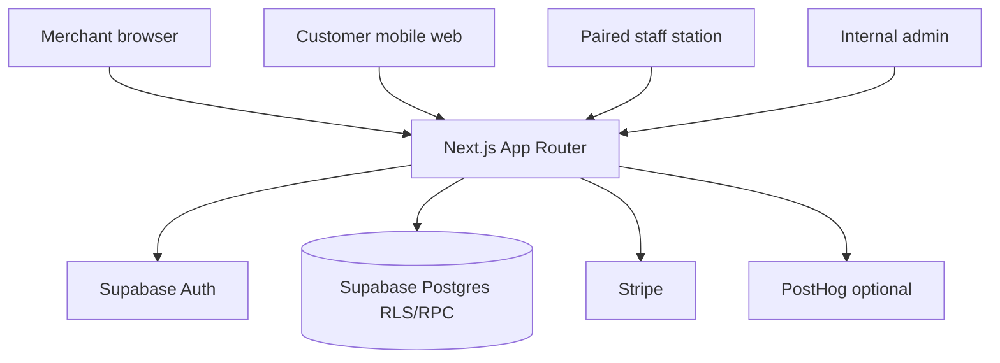
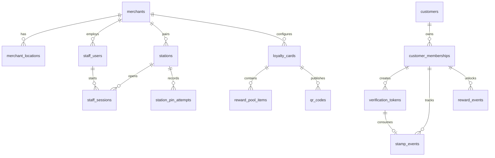
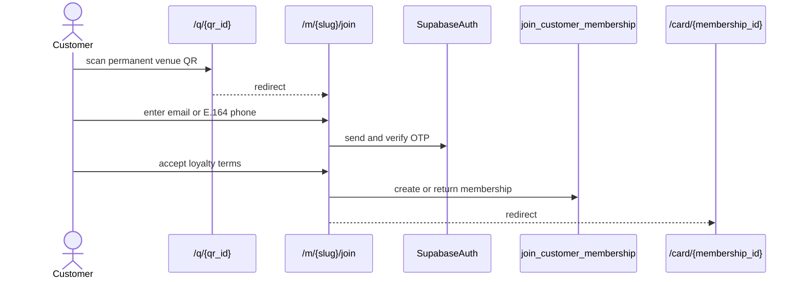
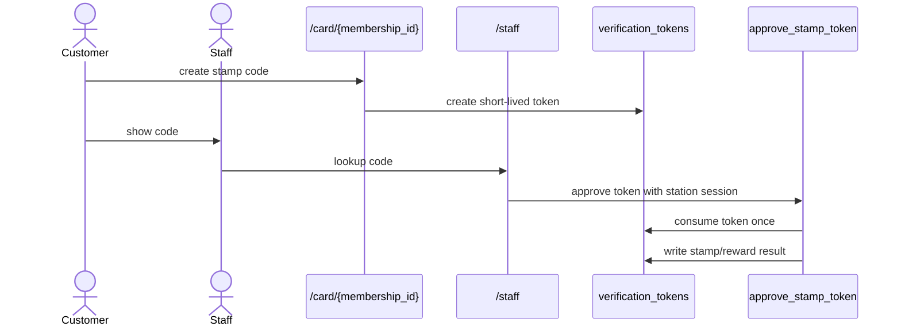
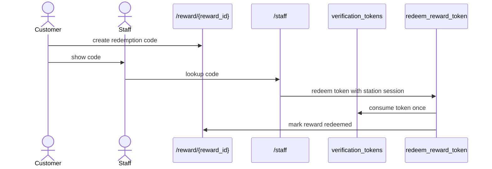

# Nabaperks Architecture

Last reviewed: 2026-06-13

This map reflects the current v3 station-handshake implementation. The binding
spec remains `nabaperks-micro-specs-final.md`.

## 1. System Summary

Nabaperks is a UK no-app QR loyalty MVP. Merchants configure one active mystery
visit card, one reward pool, and one permanent venue QR. Customers join through
mobile web. Staff approve loyalty actions from a paired counter station with a
named staff session.

The core trust boundary is the station handshake:

1. Customer keeps the phone and creates a short-lived code.
2. Staff signs into a paired station with an individual PIN.
3. Staff looks up the code on `/staff`.
4. Postgres consumes the token atomically and records station/session
   attribution on the ledger.

## 2. Actors And Access

| Actor ID | Actor | Primary routes | Auth | Authorization |
| --- | --- | --- | --- | --- |
| `Actor.Merchant` | Merchant owner | `/login`, `/signup`, `/app/*`, `/pricing` | Supabase session | Merchant layout and server modules read owned merchant state; mutation RPCs enforce ownership. |
| `Actor.Customer` | Loyalty customer | `/q/[qrId]`, `/m/[merchantSlug]/join`, `/card/[membershipId]`, `/reward/[rewardId]` | Supabase OTP/session | Customer modules use explicit ownership checks before returning card, reward, and token state. |
| `Actor.Staff` | Counter staff | `/staff` | Station credential plus named staff PIN session | Station RPCs enforce active station, active staff user, rate limits, and open session. |
| `Actor.Admin` | Internal admin | `/admin/*` | Supabase session plus `internal_admins` | Admin layout validates access; admin actions use support RPCs and audit logs. |
| `Actor.System` | Webhooks and trusted server code | `/api/stripe/webhook`, server modules | Stripe signature or server runtime | Service-role writes billing state, product events, and audit records. |

## 3. Route Catalog

| Route ID | Path | Gate | Primary module/actions | Notes |
| --- | --- | --- | --- | --- |
| `Route.Home` | `/` | Public | `app/page.tsx` | Marketing entry. |
| `Route.Pricing` | `/pricing` | Public page, checkout needs merchant | `startCheckoutAction` | Starts Stripe Checkout. |
| `Route.AuthLogin` | `/login` | Public | `signInAction` | Merchant password login. |
| `Route.AuthSignup` | `/signup` | Public | `signUpAction` | Merchant signup. |
| `Route.AuthConfirm` | `/auth/confirm` | Public callback | Supabase code exchange | Redirects to `next`. |
| `Route.MerchantDashboard` | `/app` | Merchant | `lib/merchant/dashboard.ts` | Dashboard and pilot metrics. |
| `Route.MerchantOnboarding` | `/app/onboarding` | User | `create_merchant_onboarding` | Creates merchant and first location. |
| `Route.MerchantCard` | `/app/card` | Merchant | `save_loyalty_card`, reward pool RPCs | One active mystery card plus reward pool. |
| `Route.MerchantQR` | `/app/qr` | Merchant | `generateQrCodeAction`, `setQrActiveAction` | Requires active card, reward pool, staff member, and station before launch. |
| `Route.MerchantStaff` | `/app/staff` | Merchant | `addStaffMemberAction`, `createStationAction`, `revokeStationAction` | Named staff and station pairing setup. |
| `Route.MerchantCustomers` | `/app/customers` | Merchant | `getMerchantCustomers` | Customer readback. |
| `Route.MerchantActivity` | `/app/activity` | Merchant | `getMerchantActivity` | Product event activity feed. |
| `Route.MerchantSettings` | `/app/settings` | Merchant | `saveRoiSettingsAction` | ROI estimate settings. |
| `Route.MerchantBilling` | `/app/billing` | Merchant | Stripe billing actions | Checkout and Customer Portal. |
| `Route.QRResolver` | `/q/[qrId]` | Public | `resolveQrForJoin` | Records scan and redirects to join. |
| `Route.CustomerJoin` | `/m/[merchantSlug]/join` | Public then OTP session | Customer identity and join actions | Loyalty terms and marketing consent. |
| `Route.CustomerCard` | `/card/[membershipId]` | Customer owner | `getCustomerCardState`, `createStampCodeAction` | Card state and stamp-code creation. |
| `Route.CustomerReward` | `/reward/[rewardId]` | Customer owner | `getCustomerRewardState`, `createRewardCodeAction` | Reward state and redemption-code creation. |
| `Route.StaffStation` | `/staff` | Paired station | `pairStationAction`, `startStaffSessionAction`, station console actions | Staff session, code lookup, stamp approval, undo, and redemption. |
| `Route.AdminHome` | `/admin` | Internal admin | `getAdminOverview` | Support overview. |
| `Route.AdminFraud` | `/admin/fraud` | Internal admin | `getAdminFraudSignals` | Fraud flags and station PIN attempts. |
| `Route.StripeWebhook` | `/api/stripe/webhook` | Stripe signature | `lib/stripe/billing.ts` | Billing sync. |

## 4. Server Module Map

| Module ID | Files | Supabase client | Responsibility |
| --- | --- | --- | --- |
| `Module.Auth` | `lib/auth/session.ts`, `app/(auth)/actions.ts` | Server client | Current user, merchant session, signup, login, logout. |
| `Module.Customer` | `lib/customer/join.ts`, `lib/customer/card.ts`, `lib/customer/reward.ts`, customer route actions | Service role plus explicit ownership checks | QR resolution, OTP join, card state, reward state, verification-code creation. |
| `Module.Staff` | `lib/staff/station.ts`, `app/staff/actions.ts`, `components/staff/*` | RPC and station cookies | Station pairing, station authentication, staff sessions, code lookup, approvals. |
| `Module.Merchant` | `lib/merchant/dashboard.ts`, `lib/merchant/loyalty-card.ts`, `lib/merchant/qr-code.ts`, `lib/merchant/staff-members.ts`, `lib/merchant/stations.ts` | Server client and service role | Dashboard, card, reward pool, QR, staff/station setup, activity, ROI settings. |
| `Module.Admin` | `lib/admin/auth.ts`, `lib/admin/data.ts`, `app/admin/actions.ts` | Server client for RPC writes; service role for readbacks | Internal access check, support reads, support mutations. |
| `Module.Stripe` | `lib/stripe/**`, billing actions, Stripe webhook route | Service role | Checkout, portal, webhook verification, subscription sync. |
| `Module.Analytics` | `lib/analytics/events.ts`, `lib/analytics/funnels.ts` | Service role | `product_events` source of truth plus PostHog mirror. |
| `Module.Security` | `lib/security/rate-limit.ts`, `scripts/verify-security.mjs`, `enforce_rate_limit` | Service-role RPC | Durable hashed-key rate limiting and static security checks. |
| `Module.Env` | `config/env-contract.json`, `lib/env/**`, env scripts | None | Runtime environment contract and setup helpers. |
| `Module.QRAssets` | `lib/qr/assets.ts`, QR image/download route handlers | Server client plus RPC | QR PNG/PDF asset rendering and download event recording. |

## 5. Data Architecture

| Table ID | Table | Purpose |
| --- | --- | --- |
| `Table.staff_users` | `staff_users` | Named staff display metadata and station-bound PIN hashes. |
| `Table.stations` | `stations` | Paired station lifecycle, device credential hash, and status. |
| `Table.staff_sessions` | `staff_sessions` | Open and closed staff sessions per station. |
| `Table.station_pin_attempts` | `station_pin_attempts` | Station-side staff PIN attempt telemetry. |
| `Table.verification_tokens` | `verification_tokens` | Short-lived stamp/redemption codes consumed once. |
| `Table.stamp_events` | `stamp_events` | Auditable stamp ledger with station/session/token attribution. |
| `Table.reward_events` | `reward_events` | Assigned reward snapshots and redemption state. |
| `Table.product_events` | `product_events` | Product analytics source of truth. |
| `Table.audit_logs` | `audit_logs` | Admin, support, and security-sensitive mutation audit trail. |

## 6. Mutation Boundary

| Layer | Boundary | Examples | Notes |
| --- | --- | --- | --- |
| RLS reads and constrained writes | Supabase server client with current cookies | Merchant reads, card setup reads, admin RPC calls | RLS applies to authenticated server clients. |
| Security-definer RPC writes | Postgres validates ownership, billing, session, rate limits, and ledger invariants | `create_merchant_onboarding`, `join_customer_membership`, `approve_stamp_token`, `redeem_reward_token` | Primary boundary for high-risk business mutations. |
| Service-role server writes | Trusted server-only modules | Product events, admin readbacks, billing webhook sync, QR resolution | Must stay out of client bundles. |

Key RPCs:

| RPC ID | Function | Purpose |
| --- | --- | --- |
| `RPC.create_merchant_onboarding` | `create_merchant_onboarding` | Creates merchant and first location for a signed-in owner. |
| `RPC.create_or_get_join_qr` | `create_or_get_join_qr` | Creates/reuses the permanent join QR. |
| `RPC.set_qr_active` | `set_qr_active` | Toggles owned QR status. |
| `RPC.add_staff_member` | `add_staff_member` | Creates a named active staff user. |
| `RPC.create_station_pairing` | `create_station_pairing` | Creates a short-lived station pairing code. |
| `RPC.pair_station` | `pair_station` | Converts a pairing code into a station device credential. |
| `RPC.start_staff_session` | `start_staff_session` | Starts a named staff session on a paired station. |
| `RPC.lookup_verification_code` | `lookup_verification_code` | Reads a live customer verification token for the station's merchant. |
| `RPC.approve_stamp_token` | `approve_stamp_token` | Atomically consumes a stamp token and writes the ledger event. |
| `RPC.redeem_reward_token` | `redeem_reward_token` | Atomically consumes a redemption token and marks a reward redeemed. |
| `RPC.undo_recent_stamp` | `undo_recent_stamp` | Reverses the most recent eligible station stamp. |
| `RPC.enforce_rate_limit` | `enforce_rate_limit` | Atomically enforces durable server-side rate limits. |

## 7. Core Flows

### Customer Join

### Stamp Approval

### Reward Redemption

## 8. Observability And Compliance

Source of truth:

- `product_events` for product and funnel activity.
- `audit_logs` for admin/support/security-sensitive mutations.
- `station_pin_attempts` and `fraud_flags` for abuse review.
- `billing_customers` for Stripe-derived access state.
- `consent_records` for loyalty terms and marketing consent evidence.

Product events include `qr_scanned`, `customer_joined`, `stamp_claim_started`,
`staff_session_started`, `stamp_issued`, `reward_unlocked`, `reward_redeemed`,
`reward_redemption_failed`, `merchant_signed_up`, `loyalty_card_created`,
`qr_created`, `qr_downloaded`, `subscription_started`, and
`subscription_cancelled`.

Compliance surfaces:

- Loyalty participation and marketing consent are separate.
- Legal pages exist at `/privacy`, `/terms`, and
  `/merchant/[merchantSlug]/terms`.
- Admin support can record consent opt-outs and data requests from
  `/admin/privacy`.
- Customer phone numbers stay masked from merchants by default.

## 9. Verification

Primary commands:

| Command | Purpose |
| --- | --- |
| `pnpm test` | Run Vitest micro-spec checks. |
| `pnpm db:verify` | Run static Supabase schema/RLS/audit checks. |
| `pnpm security:verify` | Run static security checks. |
| `pnpm db:test:rls` | Run SQL tenant-isolation checks against a database. |
| `pnpm lint` | Run ESLint. |
| `pnpm typecheck` | Run TypeScript checks. |
| `pnpm build` | Build the Next.js app. |

## 10. Traceability

| Spec area | Routes | Modules | Test targets | Status |
| --- | --- | --- | --- | --- |
| Foundation, env, RLS, audit | App shell, migrations | `config/env-contract.json`, `scripts/verify-*`, `supabase/**` | `foundation.test.ts`, SQL tests | Implemented |
| Merchant setup and QR | `/app/onboarding`, `/app/card`, `/app/qr`, `/app/staff` | `lib/merchant/**` | `merchant-qr.test.ts`, `staff-billing-admin.test.ts` | Implemented |
| Customer join/card/reward | `/q`, `/m`, `/card`, `/reward` | `lib/customer/**` | `customer.test.ts`, `counter-handshake.test.ts` | Implemented |
| Staff station handshake | `/staff` | `lib/staff/station.ts`, station RPCs | `counter-handshake.test.ts`, `staff-billing-admin.test.ts` | Implemented |
| Admin, billing, analytics | `/admin/**`, `/pricing`, `/app/billing`, `/api/stripe/webhook` | `lib/admin/**`, `lib/stripe/**`, `lib/analytics/**` | `staff-billing-admin.test.ts`, `analytics-dashboard-pilot.test.ts` | Implemented |

## 11. Known Gaps

- Resend is in the environment contract, but transactional email sending is not
  wired in app code yet.
- Phone OTP relies on Supabase Auth provider configuration, not direct Twilio
  app code.
- Multi-location schema support exists, but merchant UX remains single-location
  for MVP.
- No customer wallet/profile dashboard exists beyond card and reward pages.
- Legal/compliance wording still requires review before public launch.
