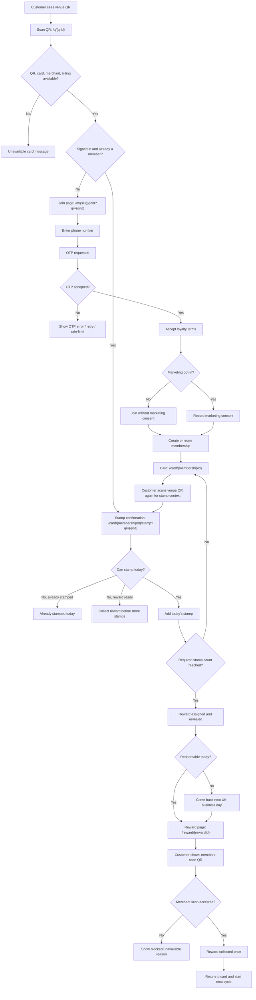

# Customer Flow Consolidation

Customer-only journey map for Nabaperks, starting from a brand-new customer who
has never used the product before.

## Purpose

This document consolidates all known customer-facing flows from first scan to
repeat use, reward redemption, wallet recovery, and error states. It uses the
attached prototype reference, `Nabaperks v2 Full Flow.html`, for journey shape
and screen sequencing, then reconciles that with the current repo routes,
server actions, and database behavior.

The focus is customer experience only. Merchant, staff, admin, billing, and
fraud surfaces are mentioned only when they change what the customer sees.

> Naming note: the signed-in customer account surface ("wallet" in prose) is
> served under `/home/*` and backed by `lib/customer/home.ts`. The `/wallet`
> route naming used in earlier drafts no longer exists; see `docs/ROUTES.md` for
> the authoritative route contract.

## Sources Used

- HTML reference: `Nabaperks v2 Full Flow.html`
  - Unpacked customer lane: `scan -> landing -> firstStamp -> save -> otp -> card -> sealed -> revealed -> ready -> redeemed`
  - Extra customer branch: `alreadyStamped`
  - Journey-map customer cards: scan the till card, first stamp waiting, first
    stamp, keep the card, card, seal at three, reveal, ready next day, redeemed,
    one a day.
- Current app routes:
  - `/q/[qrId]`
  - `/m/[merchantSlug]`
  - `/m/[merchantSlug]/join`
  - `/card/[membershipId]`
  - `/card/[membershipId]/stamp`
  - `/reward/[rewardId]`
  - `/home/login`
  - `/home`
  - `/home/rewards`
  - `/home/activity`
  - `/home/profile`
- Current server/customer modules:
  - `lib/customer/join.ts`
  - `lib/customer/card.ts`
  - `lib/customer/stamp.ts`
  - `lib/customer/reward.ts`
  - `lib/customer/home.ts`
  - `lib/customer/rewards.ts`
  - `lib/customer/activity.ts`
  - `lib/customer/profile.ts`

## Current Source Of Truth

The implemented app uses the self-service QR model:

- Customers keep their own phone.
- The permanent venue QR supplies stamp context.
- The customer taps to add a stamp. Reward pages show a merchant-scan QR for
  venue-assisted collection.
- Server-side RPCs enforce ownership, one stamp per UK business day, reward
  state, rate limits, and optional location review signals.

This document maps the current implemented customer routes as the source of
truth. Do not reintroduce legacy approval-code, device-sharing, or venue-secret
language into customer-facing copy unless the product owner explicitly reverses
that decision.

## Customer State Model

The customer can be in one of these states:

| State                           | Meaning                                                                                          | Primary route or surface                                     |
| ------------------------------- | ------------------------------------------------------------------------------------------------ | ------------------------------------------------------------ |
| New visitor                     | Has not joined this venue and may not have a signed customer session.                            | `/q/[qrId]`, `/m/[merchantSlug]/join`                        |
| Identity pending                | Has entered a phone number and is waiting for OTP verification.                                  | `/m/[merchantSlug]/join`                                     |
| Joined, unstamped               | Has a membership, but today's stamp has not been issued.                                         | `/card/[membershipId]`                                       |
| Stamp-confirm ready             | Reached card through a valid fresh venue QR context.                                             | `/card/[membershipId]/stamp?qr=...`                          |
| Stamped today                   | Already received a stamp for the current UK business day.                                        | `/card/[membershipId]` or stamp action error                 |
| Reward locked                   | Has fewer than the required stamps.                                                              | `/card/[membershipId]`                                       |
| Reward unlocked, not redeemable | Required stamps reached, reward assigned, but redeemable date is in the future.                  | `/card/[membershipId]`, `/home/rewards`                      |
| Reward ready                    | Reward is unlocked and redeemable from today.                                                    | `/reward/[rewardId]`, `/home/rewards`                        |
| Reward redeemed                 | Reward was collected once by the merchant scan flow and the active card starts the next cycle.   | `/reward/[rewardId]?redeemed=1`, then `/card/[membershipId]` |
| Wallet user                     | Has joined at least one venue and can sign back in to see cards, rewards, activity, and profile. | `/home/*`                                                    |

## North-Star Customer Journey

## Reference HTML Flow Mapped To Current App

| HTML customer step | Prototype intent                                                           | Current implemented equivalent                                                                                                                                                              | Analysis                                                                                                           |
| ------------------ | -------------------------------------------------------------------------- | ------------------------------------------------------------------------------------------------------------------------------------------------------------------------------------------- | ------------------------------------------------------------------------------------------------------------------ |
| `scan`             | Customer points camera at till card.                                       | Customer scans a printed QR to `/q/[qrId]`.                                                                                                                                                 | Matches current entry point.                                                                                       |
| `landing`          | "Your first stamp is waiting." Card value is shown before asking anything. | New customer goes to `/m/[merchantSlug]/join?qr=...`; existing member goes to stamp confirmation.                                                                                           | Partially matches. Current join is identity-first; the first-stamp promise is not completed automatically.         |
| `firstStamp`       | First stamp lands immediately in the first-visit flow.                     | Customer must reach `/card/[membershipId]/stamp?qr=...` and tap "Add today's stamp".                                                                                                        | Gap. Join redirects to `/card/[membershipId]`, which loses stamp context unless customer scans again.              |
| `save`             | Customer saves the card with a phone number after first stamp.             | Customer verifies phone before joining; wallet login exists later at `/home/login`.                                                                                                         | Order differs. Current app protects ownership earlier, but may feel slower than the prototype.                     |
| `otp`              | One text, no password; code saves the card.                                | Twilio Verify checks the customer phone code and the app sets a signed customer session cookie. Wallet login uses the same phone-only OTP flow for existing members.                        | Concept matches. National numbers are parsed from IP country with GB fallback.                                     |
| `card`             | Customer sees progress, dates, and sealed mystery reward.                  | `/card/[membershipId]` shows progress, reward teaser, reward state, and wallet link.                                                                                                        | Matches.                                                                                                           |
| `alreadyStamped`   | Calm one-per-day message.                                                  | `issue_self_service_stamp` blocks repeat stamp for same UK business day.                                                                                                                    | Backend matches. The visible branch currently appears as a form error or card status, not a dedicated rich screen. |
| `sealed`           | Three visits earned; reward is sealed.                                     | At required stamp count, `issue_self_service_stamp` creates an unlocked `reward_event`.                                                                                                     | Concept matches, though implementation reveals assigned reward details from the event.                             |
| `revealed`         | Customer opens/reveals the mystery reward.                                 | Card/reward page shows assigned reward from `reward_events`.                                                                                                                                | Matches reward-snapshot principle.                                                                                 |
| `ready`            | Reward becomes ready next day.                                             | `redeemable_from` is set to next UK business day.                                                                                                                                           | Matches.                                                                                                           |
| `redeemed`         | Reward collected once; card starts again.                                  | `/reward/[rewardId]` shows a merchant-scan QR. The logged-in merchant scan route collects the reward and the membership's `active_cycle_number` advances so the card starts the next cycle. | Matches the merchant-assisted collection model; customer proof copy should stay explicit.                          |

## Primary Use Case 1: New Customer Joins From Venue QR

### Happy Path

1. Customer sees a printed venue QR on a counter poster, till card, sticker, or
   table material.
2. Customer scans the QR with their phone camera.
3. Browser opens `/q/[qrId]`.
4. Server resolves the QR:
   - QR exists.
   - QR destination type is `join`.
   - QR is active.
   - Merchant is active or trialing.
   - Loyalty card is active.
   - Merchant billing is not suspended.
5. System records `qr_scanned`.
6. Customer is not signed in or is not a member of this merchant yet.
7. System redirects to `/m/[merchantSlug]/join?qr=[qrId]`.
8. Join page explains the card value:
   - merchant name,
   - card name,
   - required stamp count,
   - reward teaser/terms,
   - no app download.
9. Customer enters their phone number.
10. System requests a Twilio Verify OTP and rate-limits verification requests.
11. Customer enters OTP.
12. System verifies OTP and establishes a signed first-party customer session.
13. Customer accepts loyalty terms.
14. Customer optionally chooses marketing opt-in.
15. `join_customer_membership` creates or reuses:

- `customers`,
- `customer_memberships`,
- optional `consent_records`,
- `customer_joined` product event for a new membership.

16. Customer lands on `/card/[membershipId]`.

### Customer Expectation

The customer expects the scan to produce a usable loyalty card and a clear next
action. The HTML reference goes further: it promises the first stamp is already
waiting and can be collected in the same counter moment.

### Current Gap

The current join path does not automatically continue into the first-stamp
action. After joining, the customer lands on the plain card page. The plain card
page says to scan the venue code to add a stamp. That means the customer may
need to scan the same QR again during the same visit.

This is the highest-friction gap in the new customer flow.

### Edge Cases

| Case                       | Current behavior                          | Customer risk                                                                      |
| -------------------------- | ----------------------------------------- | ---------------------------------------------------------------------------------- |
| Unknown QR                 | Shows "This loyalty card is unavailable." | Customer may think the venue has stopped using Nabaperks.                          |
| Inactive QR                | Shows unavailable state.                  | Correct, but should tell customer to ask venue team for current QR.                |
| Suspended merchant billing | QR/card unavailable.                      | Customer sees generic loyalty unavailable copy.                                    |
| Inactive card              | Customer cannot join.                     | Correct, but venue poster may still be displayed.                                  |
| QR scan rate limit hit     | QR unavailable fallback.                  | Busy venues could look broken if copy is too generic.                              |
| Invalid contact            | Form asks for a valid phone number.       | National numbers are parsed from the request country header, with GB fallback.     |
| OTP request rate limit     | Shows "Too many verification requests."   | Needs recovery copy.                                                               |
| OTP rejected               | Shows "That code was not accepted."       | Needs resend/back path clarity.                                                    |
| Terms not accepted         | Blocks join.                              | Correct.                                                                           |
| Marketing not opted in     | Customer can still join.                  | Correct.                                                                           |
| Existing membership        | Duplicate membership is prevented.        | Correct; should route to card or stamp without confusing "already joined" message. |

## Primary Use Case 2: First Stamp On First Visit

### Ideal Flow From HTML

1. Customer scans QR.
2. Customer sees "Your first stamp is waiting."
3. Customer taps to collect first stamp.
4. Stamp lands.
5. Customer is prompted to keep/save the card.

### Current Implemented Flow

1. Customer joins and lands on `/card/[membershipId]`.
2. Card says: "Scan the venue code to add your stamp."
3. Customer scans the printed venue QR again.
4. `/q/[qrId]` detects the signed-in existing membership.
5. It redirects to `/card/[membershipId]/stamp?qr=[qrId]`.
6. Customer taps "Add today's stamp."
7. `selfStampAction` validates the QR context and calls
   `issue_self_service_stamp`.
8. Server enforces:
   - signed-in customer,
   - membership ownership,
   - active merchant/card/billing,
   - one stamp per UK business day,
   - no more stamps while a reward is ready,
   - optional geofence review flag.
9. On success, customer returns to `/card/[membershipId]?stamp=issued`.

### Pitfall

The new customer might believe joining equals collecting a stamp. In the current
flow, joining creates the card but does not issue the first stamp. If the venue
team says "scan to get a stamp", the customer may leave with a zero-stamp card
unless the interface clearly pushes them into the stamp-confirm step.

### Missing Flow To Decide

Choose one:

1. After successful join with a valid `qrId`, redirect directly to
   `/card/[membershipId]/stamp?qr=[qrId]`.
2. Issue the first stamp as part of join when a valid QR context exists.
3. Keep join and stamp separate, but make the post-join card CTA explicit:
   "Scan again now to add today's stamp."

Option 1 is closest to the current architecture and the HTML reference without
merging identity/consent and loyalty mutation into one action.

## Primary Use Case 3: Returning Customer Adds A Daily Stamp

### Happy Path

1. Customer returns to the venue on a later UK business day.
2. Customer scans the same permanent QR.
3. `/q/[qrId]` resolves the active QR.
4. Customer has an auth session and existing merchant membership.
5. System redirects to `/card/[membershipId]/stamp?qr=[qrId]`.
6. Customer taps "Add today's stamp."
7. Optional location check runs if the venue has geofence review enabled.
8. Stamp is issued server-side.
9. Customer lands on the updated card.

### Edge Cases

| Case                                      | Current behavior                                                         | Customer impact                                                                 |
| ----------------------------------------- | ------------------------------------------------------------------------ | ------------------------------------------------------------------------------- |
| Same-day second scan                      | Stamp action returns "You're already stamped today. Come back tomorrow." | Matches one-per-day rule. Could be more polished as a dedicated screen.         |
| Customer opens card without QR            | Card tells them to scan venue code.                                      | Correct. Plain card cannot stamp.                                               |
| Customer opens stamp route without `qr`   | Shows "Scan the venue code to add your stamp."                           | Correct.                                                                        |
| QR does not belong to membership merchant | Stamp context rejected.                                                  | Correct anti-abuse behavior.                                                    |
| Location allowed                          | Coordinates submitted with action.                                       | Fine.                                                                           |
| Location denied/unavailable               | Action continues and can be reviewed.                                    | Customer is not blocked, but trust model should be clear.                       |
| Reward already ready                      | More stamps blocked until reward is collected.                           | Good rule, but customer needs a clear collection CTA.                           |
| Billing cancelled/suspended               | Stamp unavailable.                                                       | Customer may blame venue/Nabaperks; copy should avoid exposing billing details. |

## Primary Use Case 4: Customer Unlocks A Mystery Reward

### Happy Path

1. Customer collects stamps over multiple UK business days.
2. On the stamp that reaches `stamps_required`, the server:
   - selects a reward from active reward pool items,
   - snapshots reward name, terms, minimum spend, and redeemable date,
   - creates a `reward_events` row with status `unlocked`,
   - records `reward_unlocked`.
3. Card shows the assigned reward, not a mutable card-level teaser.
4. If `redeemable_from` is in the future, customer sees a come-back message.
5. Wallet rewards page lists it under "Coming soon."

### Customer Expectation

The mystery should feel revealed at the moment they earn it, but redemption is
delayed until the next UK business day. Copy must separate:

- "You earned/revealed this reward."
- "You can redeem it from tomorrow."

If those are blended, the customer may try to collect too early and feel
blocked.

### Edge Cases

| Case                                           | Current behavior                                  | Customer impact                                                        |
| ---------------------------------------------- | ------------------------------------------------- | ---------------------------------------------------------------------- |
| Merchant edits reward pool after unlock        | Assigned reward still uses reward event snapshot. | Correct.                                                               |
| Reward pool empty/inactive at unlock           | Needs server behavior review.                     | Customer could hit a missing assignment path if merchant setup drifts. |
| Required count changed after customer progress | Current card reads current active card settings.  | Need product decision on grandfathering old progress.                  |
| Reward unlocked but not redeemable             | Card and wallet show come-back/upcoming state.    | Correct.                                                               |
| Reward ready but customer scans QR to stamp    | Stamping blocked until redemption.                | Correct, but should route customer to reward.                          |

## Primary Use Case 5: Customer Redeems A Reward

### Happy Path

1. Customer opens `/reward/[rewardId]` from the card or wallet.
2. Server verifies:
   - signed-in customer,
   - reward ownership,
   - reward status is `unlocked`,
   - reward is on or after `redeemable_from`,
   - membership still has enough stamps,
   - merchant/card/billing still available.
3. Customer sees assigned reward name, terms, and minimum spend.
4. Customer shows the merchant-scan QR while at the venue.
5. The logged-in merchant scans `/app/rewards/scan/[rewardId]`.
6. `redeem_self_service_reward` marks the reward redeemed once and advances the membership's `active_cycle_number`.
7. Customer can return to the card to see the new cycle — only stamps from the active cycle count, so the card reads `0 of N` while the redeemed reward stays in reward/activity history.

### Edge Cases

| Case                              | Current behavior                                         | Customer impact                                                   |
| --------------------------------- | -------------------------------------------------------- | ----------------------------------------------------------------- |
| Too early                         | Blocks with next-business-day message.                   | Correct.                                                          |
| Already redeemed                  | Duplicate attempt is safely handled as already redeemed. | Correct.                                                          |
| Reward cancelled/expired          | Shows unavailable.                                       | Correct.                                                          |
| Merchant/card/billing unavailable | Shows reward unavailable.                                | Customer may need venue support.                                  |
| Location denied/unavailable       | Action continues and may be flagged.                     | Good customer continuity, but potential fraud-review load.        |
| Venue asks for redemption proof   | Customer shows the merchant-scan QR.                     | Collection proof copy should stay clear after the merchant scans. |

### Missing Flow

There is no explicit customer-facing proof screen with timestamp, venue, reward
id, and anti-replay cues. The reward page now uses a merchant-scan QR, but the
post-collection proof moment could be more explicit.

## Primary Use Case 6: Customer Opens Wallet Later

### Existing Member Login

1. Customer visits `/home/login`.
2. Customer enters the same phone used to join.
3. System keeps the response neutral: known numbers receive an OTP, while
   unknown numbers see the same code-entry shape without an account-existence
   disclosure.
4. If the number has no cards, the recovery copy points the customer back to a
   venue QR without saying whether an account exists.
5. Customer enters OTP.
6. System redirects to `/home`.

### Wallet Dashboard

`/home` shows all cards for the signed-in customer:

- business name,
- card name,
- progress,
- unavailable state,
- "Reward ready" or "Reward soon" tag.

Tapping a card opens `/card/[membershipId]`.

### Rewards Hub

`/home/rewards` groups rewards into:

- ready for merchant scan,
- coming soon,
- redeemed history.

Ready rewards link to `/reward/[rewardId]`.

### Activity

`/home/activity` shows customer-relevant events newest first:

- joined,
- stamp issued,
- reward unlocked,
- reward redeemed.

### Profile

`/home/profile` is a low-cognitive-load settings surface — two cards and a quiet
meta line, no page-level logout (the header owns logout):

- **About you** card with three modes: a read-only summary (phone + name + date of
  birth + email), an edit form, and a dedicated email-verify step. It opens in edit
  when name/DOB are missing, in verify when an entered email is unconfirmed, else in
  view. A top status banner prompts completion when name/DOB are missing.
- **Marketing** card with editable per-channel toggles (Email / SMS / WhatsApp).
  Each toggle is global across every venue and posts on change (no Save button).
- a mono receipt line: member since + venue count.

### Wallet Pitfalls

| Pitfall                                                                                    | Why it matters                                                                                                                                                                                          |
| ------------------------------------------------------------------------------------------ | ------------------------------------------------------------------------------------------------------------------------------------------------------------------------------------------------------- |
| Wallet exists, but the original micro-spec text previously treated wallet as out of scope. | Docs and product scope should be reconciled so agents do not remove or ignore wallet routes.                                                                                                            |
| Wallet login accepts existing members only.                                                | New customers must understand they cannot create a wallet from `/home/login`; they must scan a venue QR.                                                                                                |
| Wallet card page cannot add a stamp without fresh QR context.                              | Customer may tap an old saved card at home and expect to stamp. Copy must keep "scan at venue" clear.                                                                                                   |
| Profile marketing toggles write global per-channel consent.                                | Each toggle appends one `consent_records` row per membership via `record_customer_marketing_consent`, so every merchant's audit trail stays complete while the customer manages one switch per channel. |
| No self-service data export/delete flow.                                                   | Privacy requests depend on admin/support paths.                                                                                                                                                         |

## Direct URL And Recovery Use Cases

| Customer action                               | Expected result                                              | Notes                                                         |
| --------------------------------------------- | ------------------------------------------------------------ | ------------------------------------------------------------- |
| Opens `/card/[membershipId]` while signed out | Card unavailable with verify-from-QR copy.                   | Consider linking to `/home/login` for existing members.       |
| Opens another customer's card                 | Unauthorized message.                                        | Correct.                                                      |
| Opens unknown card id                         | Not found message.                                           | Correct.                                                      |
| Opens `/reward/[rewardId]` while signed out   | Reward unavailable with verify-from-QR copy.                 | Consider wallet login link.                                   |
| Opens another customer's reward               | Unauthorized message.                                        | Correct.                                                      |
| Opens `/m/[merchantSlug]/join` without QR     | Can join active merchant/card by slug.                       | Useful for shared links, but cannot stamp without QR context. |
| Scans QR after logging in on a new device     | Existing membership should route to stamp confirmation.      | Good recovery path.                                           |
| Loses access to original phone/email          | No customer self-service recovery flow.                      | Needs support/admin process.                                  |
| Clears browser storage                        | Server auth/session determines ownership, not local storage. | Good.                                                         |

## Full Customer Use-Case Inventory

### Acquisition And Join

- Customer scans a valid active QR as a brand-new visitor.
- Customer scans an inactive, disabled, unknown, or old QR.
- Customer scans while merchant/card/billing is unavailable.
- Customer enters valid email.
- Customer enters valid phone.
- Customer enters UK local `07...` phone format.
- Customer enters invalid contact.
- Customer requests too many OTPs.
- Customer receives OTP but enters it wrong.
- Customer phone OTP expires.
- Customer abandons after OTP request and returns later.
- Customer accepts loyalty terms.
- Customer refuses loyalty terms.
- Customer opts into marketing.
- Customer does not opt into marketing.
- Customer tries to join the same merchant twice.
- Customer joins through a direct merchant join URL without QR.

### Stamping

- Customer tries to add first stamp immediately after joining.
- Customer scans QR again after joining and adds first stamp.
- Returning customer scans QR on a later day and stamps.
- Customer tries to stamp from a saved card without QR.
- Customer tries to stamp twice in one UK business day.
- Customer tries to stamp when a reward is already ready.
- Customer tries to stamp when merchant/card/billing is unavailable.
- Customer allows browser location.
- Customer denies browser location.
- Customer has no browser location support.
- Customer is outside geofence if venue checks location.
- Customer is rate-limited on stamp action.

### Reward

- Customer reaches required stamp count.
- Customer sees reward revealed.
- Customer tries to collect same day before `redeemable_from`.
- Customer returns next UK business day and redeems.
- Customer sees minimum spend and terms before collection.
- Customer tries duplicate redemption.
- Customer tries to collect a cancelled/expired reward.
- Customer tries to collect when merchant/card/billing is unavailable.
- Customer needs proof after merchant collection.
- Customer starts next stamp cycle after redemption.

### Wallet And Account

- Existing customer signs into wallet with email OTP.
- Existing customer signs into wallet with phone OTP.
- Unknown contact tries wallet login.
- Customer opens wallet with no cards.
- Customer sees multiple venue cards.
- Customer opens a card from wallet.
- Customer sees ready rewards in wallet.
- Customer sees upcoming rewards in wallet.
- Customer sees redeemed reward history.
- Customer views activity timeline.
- Customer views profile/contact details.
- Customer sees marketing consent state.
- Customer logs out.
- Customer wants to update marketing consent.
- Customer wants data export/delete.

## Pitfalls And Missing Flows

### Critical

1. **First stamp continuity is incomplete.**
   The HTML flow promises the first stamp in the initial visit moment. Current
   code joins the customer and redirects to the card, but the stamp action still
   needs a fresh QR context. This can leave a new customer with a zero-stamp card
   after the first visit.

2. **Trust model is self-service QR stamping plus merchant-scanned rewards.**
   Current app behavior is self-service QR stamping and merchant-scanned reward
   collection. Copy, flows, tests, and docs should stay aligned to that model.

3. **Phone input contract now matches UK customer expectations.**
   Customer and wallet actions parse national numbers using the request country
   header with GB fallback, store only protected phone lookup/display fields for
   new customers, and keep raw phone numbers out of new customer writes.

4. **Reward collection lacks an explicit proof moment.**
   Current collection is merchant-scanned. The customer needs a clear
   post-collection proof screen with timestamp, reward id, venue, and collected
   state.

### High

5. **Direct join without QR creates a card but not a stamp path.**
   `/m/[merchantSlug]/join` can work without `qr`. That is useful for links, but
   a new customer will still need the venue QR to collect a stamp.

6. **Already-stamped branch is not as polished as the prototype.**
   The backend blocks repeat same-day stamps. The HTML has a dedicated calm
   "One stamp a day" screen. Current UI can surface this as a warning/error
   state. A richer branch would reduce perceived failure.

7. **Wallet scope and docs are not fully reconciled.**
   Wallet routes now exist, but some spec wording may still describe wallet as
   deferred. Agents may make wrong assumptions unless docs are aligned.

8. **Profile consent is self-service.**
   Customers manage global per-channel marketing toggles from `/home/profile`. Each
   change appends one `consent_records` row per membership (source
   `customer_profile`), so the per-merchant audit trail stays intact. Per-venue
   consent breakdown remains an admin/support concern.

9. **Reward-ready blocks future stamps.**
   This is a correct rule, but customers scanning the QR again should be guided
   directly to the reward QR instead of simply seeing a blocked stamp action.

### Medium

10. **Location review copy can feel contradictory.**
    The UI says the venue checks location, but action continues if location is
    denied or unavailable. Copy should make clear that location is a review
    signal, not a hard blocker.

11. **Unavailable states are generic.**
    Generic copy protects internal details, but customers may not know whether
    to retry, ask staff, or abandon.

12. **No customer self-service account recovery.**
    A customer who loses phone/email access has no visible recovery path.

13. **No add-to-home-screen or pass save flow.**
    HTML says "Keep your card." Current wallet covers account recovery, but
    there is no PWA/install/pass prompt.

14. **Timezone boundary needs customer-safe copy.**
    One stamp per UK business day can surprise customers around midnight,
    daylight saving changes, or late-night venues.

15. **Direct unauthenticated deep links do not point to wallet login.**
    Card/reward unauthenticated states say verify from venue QR. Existing
    members on a new device may need `/home/login` instead.

## Recommended Customer Flow Decisions

1. **Keep the stamping trust model fixed.**
   Use self-service QR stamping with soft geofence review for MVP.

2. **Fix first-stamp continuity.**
   Recommended current-architecture path:
   - after successful join with `qrId`, redirect to
     `/card/[membershipId]/stamp?qr=[qrId]`;
   - keep the customer tap as the loyalty-affecting action;
   - then return to `/card/[membershipId]?stamp=issued`.

3. **Keep global phone parsing covered.**
   Accept national numbers from the request country header, normalize to E.164
   before Twilio Verify, and keep protected server-side phone storage as the
   source of truth.

4. **Add a clear redeemed-proof screen.**
   After reward redemption, show a customer-friendly proof state:
   - reward name,
   - venue,
   - redeemed timestamp,
   - reward id,
   - "already redeemed" state on refresh.

5. **Add wallet recovery links to unauthenticated card/reward states.**
   Existing customers should have a visible "Open wallet" or "Sign in" path.

6. **Make the one-per-day branch a real screen.**
   Match the prototype's calm `alreadyStamped` branch instead of making the user
   feel like the action failed.

## Acceptance Checklist For A Complete Customer Flow

- New customer can scan QR and understand the reward proposition before doing
  heavy work.
- New customer can verify identity with email or UK phone input.
- Loyalty terms and marketing opt-in are visibly separate.
- New customer can collect the first stamp during the same venue visit without
  rescanning unnecessarily.
- Existing customer can scan the same QR and add one stamp per UK business day.
- Customer can see a helpful already-stamped state.
- Customer can see card progress and sealed/revealed reward state.
- Customer can understand why a reward is not redeemable until the next UK
  business day.
- Customer can redeem once and see proof.
- Customer can sign back in from a new device and see all cards/rewards.
- Customer can understand unavailable states without internal billing/security
  details leaking.
- No customer-facing flow uses venue secrets, customer-device sharing, or raw
  phone exposure to merchants.
