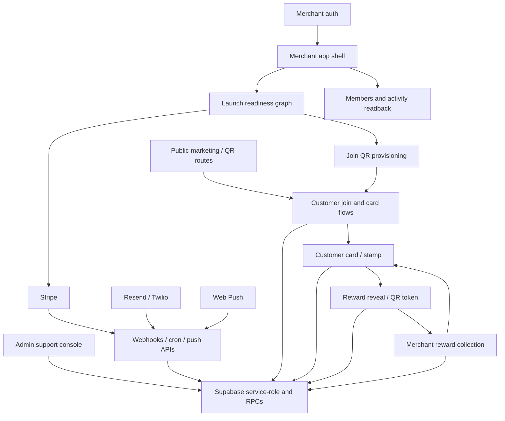

# Executive Summary

Nabaperks is organized around a small number of strong architectural patterns:

- Next.js App Router route groups separate public, merchant, customer, admin,
  API, and dev/QA surfaces.
- Server state is authoritative. Loyalty, billing, reward, membership, QR, and
  admin mutations flow through server actions, route handlers, Supabase RPCs,
  or Stripe webhooks.
- The browser mostly carries UI state: selected tabs, transient query params,
  scanner results, local camera state, service-worker push state, and form
  drafts.
- Supabase is the main domain boundary. Security-definer RPCs own high-impact
  writes such as onboarding, card saves, reward pool updates, QR activation,
  stamp issuance, reward collection, and admin interventions.
- Stripe, Resend, Twilio, Web Push, and Vercel cron sit at the external-service
  boundary and need strong idempotency, retry, and observability.

## Architecture Map

## Cross-Cutting Strengths

- The important financial and loyalty-affecting changes are not client-owned.
- Route grouping makes the product boundary readable: public, merchant,
  customer, admin, API, and dev surfaces are easy to locate.
- The launch setup flow is intentionally server-first and derives readiness
  from actual merchant, venue, card, reward, QR, and billing state.
- The customer journey uses thin route pages plus server loaders and a shared
  experience derivation layer, which keeps UI rendering mostly downstream from
  server facts.
- Admin mutations have a better spine than many early products: admin action
  gate, reason capture, SQL-side internal-admin checks, and audit writes.

## Cross-Cutting Pitfalls

- Some important trust rules live in more than one place: app readiness helpers,
  SQL guards, route handlers, server actions, and UI continuation rules.
- Several flows rely on service-role clients plus caller discipline. That is
  acceptable when tightly scoped, but unsafe if helpers are later reused from
  untrusted request input.
- Query-string protocols are useful but not all are typed yet. Account tabs,
  Stripe return flags, and launch setup params now have typed helpers; customer
  join action redirects and public QR route redirects encode QR state before
  returning it to URLs. `collected`, `highlight`, `step`, and similar params
  should continue moving behind typed parsers as their flows change.
- There is a broad coverage gap around high-value server actions, route
  handlers, and SQL/RPC integration behavior.
- Some files are central decision hubs and are large enough to carry regression
  risk, especially customer experience derivation and shared admin/readback
  modules.

## Highest Priority Findings

| Priority | Finding | Main Flows | 2026-06-30 Status |
| --- | --- | --- | --- |
| P0 | Reward collection route expects a scan token, but member readback appears to link a reward event id into that route. | 26, 29 | Remediated in source; route renamed to `[scanToken]` and readback no longer links reward event ids into the scan route. |
| P1 | App launch readiness requires three active reward items, while SQL QR creation policy may only require one. | 16, 19, 21, 30, 32 | Remediated in source and SQL migration with a shared three-reward threshold. |
| P1 | Stripe duplicate-event handling can prevent recovery after an inserted-but-failed event. | 50 | Remediated in source; still needs Stripe replay smoke proof after deploy. |
| P1 | Notification cron worker should atomically claim work before delivery. | 49 | Remediated in SQL/source with locked claims, retry/backoff, checked updates, and preference-driven quiet hours. |
| P1 | Push marketing consent filtering is split and can diverge between enqueue and delivery. | 42, 46, 48, 49 | Remediated with a shared push-marketing consent helper used by enqueue, delivery, and venue-announcement audience filtering. |
| P1 | Merchant OTP alias rows and Supabase tokens need cleanup/retention hardening. | 9-13 | Remediated in source and SQL migration with purge and token scrubbing. |
| P1 | Admin service-role read helpers should self-guard, not rely only on route layout convention. | 52-60 | Remediated with guarded admin service-role client. |
| P1 | Dev design-system route needs a production guard or a single parent/proxy block. | 61 | Remediated with parent `/dev` production `notFound()` guard, route-inventory coverage, and production 404 smoke proof. |

## System-Wide Improvement Themes

1. Create typed route/query contracts for recurring URL protocols.
2. Centralize launch and availability policy so UI, actions, public routes, and
   SQL agree.
3. Add tenant-scoped service-role helper patterns for admin, merchant, and
   customer readbacks.
4. Add idempotency and retry semantics to Stripe and notification workers.
5. Add route/action/RPC integration tests for QR, join, stamp, reward, billing,
   admin intervention, notification, and webhook flows.
6. Keep the existing Wet Ink design system, but separate presentational harness
   coverage from server-data and auth coverage.
