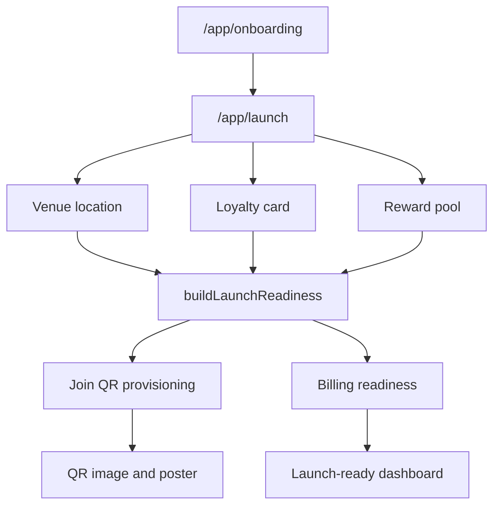

# Merchant Setup And Launch Flows

Flows covered: 16-25.

## Axis Architecture

Merchant setup is a server-first readiness graph. Onboarding creates the
merchant and first location, then `/app/launch` derives readiness from venue,
card, reward pool, QR, and billing state. Server actions mutate Supabase or
Stripe and redirect back to the setup hub. QR provisioning is idempotent and
runs through explicit QR actions or post-save reward mutations after earlier
readiness conditions are met.

## Flow Analysis

| ID  | Flow                           | Architecture                                                                                                                                                  | Pitfalls                                                                                                                                                                                                                                                                         | Improvements                                                                                                                                                             |
| --- | ------------------------------ | ------------------------------------------------------------------------------------------------------------------------------------------------------------- | -------------------------------------------------------------------------------------------------------------------------------------------------------------------------------------------------------------------------------------------------------------------------------- | ------------------------------------------------------------------------------------------------------------------------------------------------------------------------ |
| 16  | Launch checklist `/app/launch` | Dynamic server page loads setup and billing in parallel, builds readiness, resolves active tab and continuation URLs without mutating QR state during render. | Readiness policy is spread between page, helpers, SQL, and panels.                                                                                                                                                                                                               | Keep `getLaunchPageModel()` and the central launch policy contract covered by source and route tests.                                                                    |
| 17  | Venue setup                    | Server action saves primary venue/location fields used by readiness and public availability.                                                                  | Single-location assumptions are embedded in readiness; partial onboarding can leave weak venue state.                                                                                                                                                                            | Make primary-location policy explicit and prepare keyed location model before multi-location support.                                                                    |
| 18  | Loyalty card setup             | Server action validates card name, stamps required, reward terms, calls card RPC, seeds default reward pool on create.                                        | Card save, reward seed, and redirect behavior are now locked by a source-contract test; live RPC execution still belongs in the DB/staging tier.                                                                                                                                 | Keep the contract covering validation, RPC params, seeded rewards, analytics event split, and redirect target.                                                           |
| 19  | Reward pool setup              | Server actions upsert, toggle, delete/archive reward pool items and can trigger QR provisioning after enough active rewards.                                  | App and SQL QR guards now share the three-active-reward minimum.                                                                                                                                                                                                                 | Add broader action/RPC tests for upsert, toggle, delete/archive, and QR provisioning after threshold.                                                                    |
| 20  | Billing activation             | Billing panel starts Stripe checkout or opens customer portal; launch readiness treats active/trialing as ready when required.                                | Billing status is external and asynchronous; checkout return query params are UI state, not proof of active billing.                                                                                                                                                             | Keep webhook-derived billing as source of truth and preserve unit coverage for `requires_billing`, trial/trialing, active, past_due, cancelled, and missing status.      |
| 21  | QR provisioning                | QR form actions and post-save reward mutations create or activate join QR through Supabase RPCs after venue/card/reward readiness.                            | App/SQL readiness drift and GET-render mutation are remediated; QR state still affects public customer acquisition immediately.                                                                                                                                                  | Preserve unit/source coverage for missing card, too few rewards, missing venue, inactive QR, existing active QR, explicit QR actions, and post-save reward provisioning. |
| 22  | QR image rendering             | Route handler renders merchant-owned QR images from QR code id/context.                                                                                       | Owned image/poster context now requires the authenticated merchant, primary location, active card, join destination type, and active QR before image bytes can render; local live-DB Playwright covers valid, wrong-merchant, inactive, non-join, and missing image paths.        | Re-run the authenticated QR image fixture on target/staging after migrations and seed/session parity are available.                                                       |
| 23  | Poster/print templates         | Poster pages render live QR assets through merchant shell with print-friendly chrome.                                                                         | Poster copy/tests can drift from current templates; mobile shell hiding must stay route-specific.                                                                                                                                                                                | Add template inventory tests and screenshot coverage for all poster variants.                                                                                            |
| 24  | Merchant dashboard `/app`      | Authenticated dashboard loads metrics, series, customers, compact activity, and readiness/billing notices.                                                    | Dashboard can imply live readiness if launch/billing policy changes but notices lag.                                                                                                                                                                                             | Reuse the same launch-readiness contract and add dashboard state tests for not-live, billing-gated, live.                                                                |
| 25  | Merchant account/profile       | Account hub switches profile/billing tabs; old `/app/profile`, `/app/settings`, `/app/billing` redirect into it.                                              | Redirect-only compatibility routes now have source-contract coverage and anonymous route-gate browser smoke; authenticated post-login redirect smoke still needs a merchant session fixture. Venue profile and billing profile are separate concepts that can confuse operators. | Keep route redirects tested and label account versus venue setup clearly.                                                                                                |

## Trust Boundaries

- Merchant browser controls forms and tab params only.
- Supabase RPCs own card, reward, QR, and onboarding writes.
- Stripe webhook-derived billing state owns billing readiness.
- QR image/poster routes must derive ownership from authenticated merchant
  context.

## Verification Gaps

- Launch page model and continuation rules.
- Venue/reward server actions beyond the card and QR provisioning contracts.
- App versus SQL readiness parity.
- Stripe checkout/portal return behavior.
- Poster template screenshot and print checks.

## Priority

P1 source drift is remediated for the QR reward threshold, and QR provisioning
has been moved out of GET render. Before treating launch as pilot-ready, apply
the migration and run target/provider proof for the QR, billing, and customer
entry paths.
