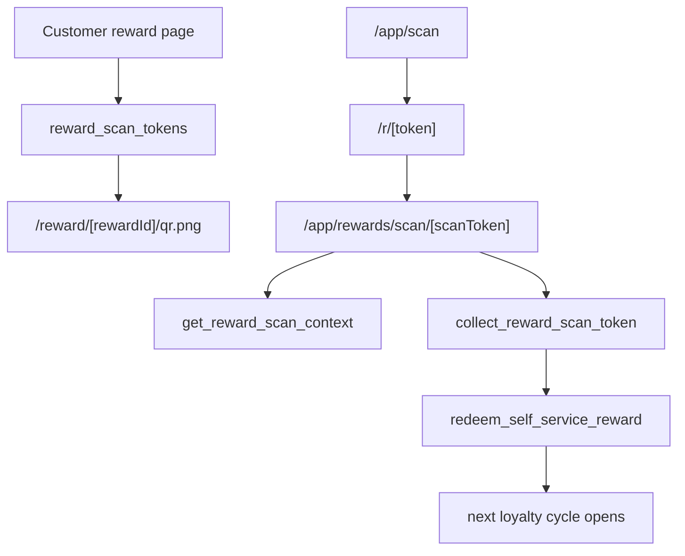

# Merchant Member And Reward Operations

Flows covered: 26-29.

## Axis Architecture

Merchant operations split readback and mutation. Customers and activity are
read-only merchant surfaces. Reward collection is a cross-device trust flow:
the customer reward page mints a short-lived scan token, the merchant camera
normalizes `/r/<token>`, and the merchant scan route reads and collects that
token through server-side RPCs.

## Flow Analysis

| ID | Flow | Architecture | Pitfalls | Improvements |
| --- | --- | --- | --- | --- |
| 26 | Customer/member readback `/app/customers` | Session merchant loads masked member rows and total count; client table owns search/filter over masked DTOs. | The scan-token CTA mismatch has been removed; readback now sends merchants to the scanner instead of linking reward event ids. DTO unit coverage proves raw email/phone and server-only reward/customer internals stay out of client rows. | Add DB/browser route coverage for customer readback and real scan-token collection. |
| 27 | Merchant activity `/app/activity` | Session merchant scopes service-role product-event reads, summaries, filters, and feed rows. Client search text includes only masked labels and an explicit allow-list of non-PII metadata keys. | Activity service-role reads now verify the requested merchant id against `getCurrentMerchant()` before querying; broad metadata indexing has been removed. | Keep the metadata allow-list in sync with rendered fields and add wider DB/browser PII readback proof. |
| 28 | Merchant reward scanner `/app/scan` | Client camera scanner validates same-origin reward destinations and routes decoded tokens to merchant scan page. | Browser camera state remains device/browser-sensitive, but denied-camera and no-camera states now have deterministic Playwright harness coverage; same-origin `/r/<token>` parsing and invalid/repeated decode normalization have unit coverage. | Add live-device/manual QA for busy camera, physical valid QR scan, and scanner cleanup after navigation. |
| 29 | Reward collection `/r/[token]` to `/app/rewards/scan/[scanToken]` | `/r` validates UUID shape and redirects; merchant scan page gates auth, loads RPC context, and action collects token server-side. | Previously the route segment was named `[rewardId]` even though it represented a scan token; this has been renamed to `[scanToken]` and the member-table CTA no longer links reward event ids into the scan route. DB edge coverage now covers mint refusal/replay/expired/unauthorized/already-redeemed states, and local live-DB Playwright proves a minted `/r` token can be collected through the real merchant browser route/action with server redeemed state authoritative. | Re-run the collection proof against target/staging and add failed-reason monitoring. |

## Trust Boundaries

- Reward event id is not the same as scan token.
- Merchant collection must require current merchant auth and token ownership.
- `?collected=1` can improve post-action copy but must never replace server
  redeemed state.
- Product-event metadata sent to clients should be masked or allow-listed.

## Verification Gaps

- Target/staging reward-collection replay for the live hosted stack.
- Live member table route proof for masked readback, capped rows, highlight, and empty state.
- Merchant camera scanner live-device QA for physical camera, busy-camera, and cleanup behaviour.
- Wider DB/browser PII proof for activity and member readback.

## Priority

Flow 29's route/link mismatch has been remediated in source: the merchant scan
route now uses `[scanToken]`, and member readback no longer links reward event
ids into the scan route. Local DB/browser proof now covers token mint, readback,
collection, replay, expiry, unauthorized merchant, and already-redeemed states.
Remaining priority is target/staging replay, failed-reason monitoring, and
browser-level member-table proof.
