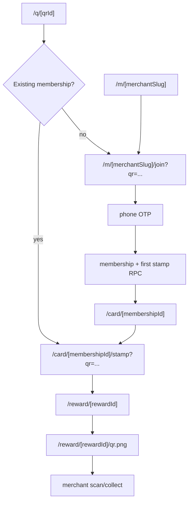

# Customer Loyalty Journey

Flows covered: 30-39.

## Axis Architecture

The customer loyalty journey is server-authoritative and route-thin. Public QR
or merchant preview routes feed the join experience. Server loaders assemble
context, pure experience derivation chooses the UI state, and server actions/RPCs
perform mutations for OTP, membership, stamping, reward profile gates, reward QR
token minting, and merchant collection.

## Flow Analysis

| ID | Flow | Architecture | Pitfalls | Improvements |
| --- | --- | --- | --- | --- |
| 30 | Public merchant page `/m/[merchantSlug]` | Supabase-backed preview of merchant card and terms, with CTA to join. | No-QR preview CTA now says "Join rewards"; same-day stamp remains QR-qualified. | Add QR-aware CTA behavior only when a real QR context exists. |
| 31 | Merchant terms `/merchant/[merchantSlug]/terms` | Public terms page reads merchant/card context and renders loyalty terms or unavailable state. | Terms include operational/legal claims that need human legal review before public launch; route-local metadata now keeps them `noindex,nofollow` until that decision changes. | Keep the legal-review checklist current before public launch. |
| 32 | Public QR router `/q/[qrId]` | Resolves QR, rate-limits scans, records scan event, redirects existing members to stamp or new customers to join. | Source-contract coverage now pins server-side QR resolution, `force-dynamic` request-time handling, rate-limited and unavailable states, existing/new member branching, and encoded QR redirect values. Playwright coverage pins invalid-QR unavailable rendering on mobile/desktop, plus local live-DB browser proof for disposable QR new-customer join, existing-member stamp, inactive QR, paused merchant, cancelled billing, and seeded rate-limit bucket cases. QR scan events can still become noisy under bot/scanner traffic. | Keep launch QR readiness aligned with availability/billing gates; add staging/device proof with a physical printed QR before pilot. |
| 33 | Customer join/OTP/membership | Join wizard uses phone OTP, signed customer session cookies, terms acceptance, and membership/first-stamp RPCs. | OTP anti-enumeration and first-stamp qualification depend on QR context and session state being handled precisely. Join redirects and OTP fallback links now encode QR form state before writing it back into URLs. Local live-DB browser proof covers disposable unknown-phone QR join, wrong-code feedback without membership creation, missing-terms refusal without membership creation, direct no-QR joining without first-stamp issue, existing-member QR redirect without duplicate membership creation, terms acceptance, card redirect, membership creation, first-stamp issue, and join event recording. Unit coverage pins app-side pending-phone cookie expiry. | Add provider-backed browser proof for Twilio Verify expired OTP behavior before pilot sign-off. |
| 34 | Customer scanner `/scan` | Public or customer-shell camera scanner for venue QR payloads. | Camera/browser failures remain runtime-specific, but camera-denied retry copy now has Playwright coverage and same-origin `/q/<qrId>` normalization has unit coverage. | Add live-device/manual QA for physical valid venue QR scans, busy camera, cleanup after navigation, and logged-in versus anonymous shells. |
| 35 | Customer card `/card/[membershipId]` | Server loader reads card context and pure derivation renders `CustomerCardExperience`. | Loader coverage now proves membership ownership is checked before card/reward/billing detail loads; derivation coverage pins unavailable, no-active-reward, reward-ready, and full-card recovery states. Query params remain UI-only hints. | Keep ownership/state regression coverage current; type card query params if the UI protocol expands. |
| 36 | Self-service stamp | Stamp page/action loads stamp context and calls server-side stamp RPC when eligible. | Source-contract, pure derivation, and live-DB coverage now pin QR proof before stamping, missing/invalid/inactive/wrong-membership QR states, duplicate-day refusal, soft geofence flags, billing fail-close, full-card refusal, reward-pool guard, organic reward unlock, and cycle reset. | Keep QR/date/geofence/billing coverage current; add live-device/manual QR scan proof before pilot. |
| 37 | Reward detail/profile gate | Reward page loads reward context, handles profile/email gate, ready/waiting/redeemed/blocked states. | Reward loader coverage now pins server-derived ownership, availability, redeemability, redeemed proof, and profile-gate timing; reward derivation coverage pins waiting, ready, redeemed, blocked/expired, and access states. | Add profile action tests for save, verify, resend, clear, invalid email, and already-verified flows. |
| 38 | Reward QR image | Route mints or renders short-lived reward scan token QR only when reward/customer/availability gates pass. | Expired scan-token cleanup, safe token reuse, route-level ready/redeemable/private-cache guards, and live-DB mint-time guards for wrong customer, redeemed, cancelled, under-stamped, next-day, billing-blocked, and incomplete-profile rewards are now covered locally. | Apply migration in target Supabase and re-run the reward-token DB tier against that target before provider sign-off. |
| 39 | Reward status polling | Read-only no-store status route lets customer page detect merchant collection. | Route and client contracts now pin current-customer authorization, 404 collapse for unauthorized/not-found rewards, no-store responses, single-flight polling, and hidden-tab pause. High live volume may still justify push/SSE later. | Keep the source-contract coverage current; consider push/SSE only if reward collection volume makes visible-tab polling too costly. |

## Trust Boundaries

- Customer identity is signed-cookie and server-session based.
- Phone OTP proves contact control, not merchant presence.
- QR context and server RPCs decide stamp eligibility.
- Reward QR scan tokens are short-lived bearer tokens and must not be confused
  with reward ids.
- Merchant collection is the redeem step; the next cycle opens only after
  confirmed server redemption.

## Verification Gaps

- End-to-end QR scan to join to first stamp.
- Returning member stamp.
- Reward unlock/wait/ready/redeemed/blocked states.
- Reward QR token mint, expiry, replay, and merchant collection.
- Customer scanner camera states.

## Priority

P1 before pilot expansion. This is the core customer/merchant value loop.
