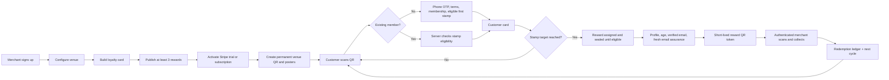

# Nabaperks Comprehensive Product Dossier

**Document purpose:** Code-derived product, architecture, operations, and audit brief for human or language-model review  
**Evidence date:** 18 July 2026  
**Evidence basis:** Current application code, database migrations, automated tests, machine-readable configuration, and package scripts in the checked-out Nabaperks repository  
**Product operator:** Lapen Inns

> This dossier intentionally does not use README files, product narratives, architecture notes, audit reports, support packs, runbooks, or other prose documents as product evidence. A statement is included only when it can be traced to active TypeScript/TSX/JavaScript, SQL migrations, tests, JSON configuration, service-worker code, or package scripts. Source comments and customer-facing constants are treated as evidence of intended behaviour, while runtime paths and database rules are treated as stronger evidence of implemented behaviour. This is not a declaration that every provider, deployment, or migration has been verified in a live environment.

## 1. Executive summary

Nabaperks is a browser-based, QR-led loyalty product for UK hospitality and other local counter-service businesses. It is designed primarily for pubs, cafes, bars, takeaways, gastropubs, food-led pubs, ale and cask-led locals, wine bars, and pub restaurants. Lapen Inns, described in the approved public facts as a hospitality operator running nine pubs across England, operates the product.

The product replaces a conventional paper stamp card with a venue-specific digital card that opens in a customer's mobile browser. Customers do not need to download a native app, add a wallet pass, create a password, or connect to a venue's POS/EPOS system. A venue displays a permanent QR code at the counter. A customer scans it, verifies a mobile number by one-time code, accepts the applicable terms, and saves a membership. A qualifying QR join can issue the first stamp. Returning customers scan the venue QR to add one normal visit stamp per Europe/London calendar date.

When a customer completes the venue's stamp target, Nabaperks assigns a reward. The first completed cycle receives the first active configured reward; later cycles use the venue's configured reward weightings. Cycle rewards are not immediately redeemable: the current legal and database rules make them redeemable from the next Europe/London weekday, skipping Saturday and Sunday. Before generating a redemption QR, the customer must complete required identity and eligibility gates. The venue scans a short-lived, single-use reward token, and the database records redemption and opens the next stamp cycle.

For merchants, Nabaperks provides guided venue launch, loyalty-card configuration, a weighted mystery reward pool, permanent venue QR creation, print-ready A4 counter posters, visit and return reporting, member and activity readback, a reward scanner, direct reward sending, birthday rewards, referral operations, browser-push announcements, a weekly digest, billing management, and account settings. The current commercial plan is the **Growth Plan** at **£49 per month per venue** or **£490 per year** where annual checkout is configured. A new Stripe subscription starts with a **30-day free trial** and requires a payment card.

The product's central design rule is that server state is authoritative. Loyalty balances, stamp eligibility, rewards, billing entitlement, consent, identity, referral settlement, and administrative interventions are controlled by server actions, route handlers, Supabase/Postgres functions, Row Level Security, Stripe webhooks, or trusted background workers. Browser storage is used only for sessions, flow continuity, security, preferences, cached static assets, and optional notification state.

The codebase is substantially more developed than a simple prototype. It contains extensive contract, unit, live-database, and browser-test coverage; auditable administration; privacy workflows; durable notification and billing ledgers; fraud controls; liveness/readiness handlers; Sentry instrumentation; and scheduled-job configuration. However, source maturity is not production acceptance. Twilio, Resend, Stripe live mode, Web Push, Vercel cron execution, physical QR/device behaviour, target Supabase migration parity, and the exact deployed configuration require evidence outside the codebase.

## 2. Product definition

### 2.1 What Nabaperks is

Nabaperks is all of the following:

- A multi-tenant loyalty service, with merchant and venue boundaries enforced in the application and database.
- A browser-based digital stamp card for customers.
- A QR acquisition and repeat-visit mechanism.
- A reward issuance and counter-redemption ledger.
- A merchant launch, operations, reporting, messaging, and billing console.
- A customer wallet containing cards, rewards, activity, profile, consent, and notification controls.
- An administrative support, audit, fraud, privacy, billing, and referral-operations console.
- A managed service operated by Lapen Inns, with external providers for hosting, authentication/data, billing, email, SMS verification, push delivery, mapping, analytics, and error reporting.

### 2.2 What Nabaperks is not

The current approved product facts make several deliberate exclusions:

- It is not a native iOS or Android app.
- It is not an Apple Wallet or Google Wallet pass.
- It does not require a POS or EPOS integration.
- It does not require extra venue hardware beyond an ordinary device capable of displaying/scanning QR codes and a printed or displayed venue QR.
- It does not make browser storage authoritative for balances, rewards, consent, identity, or billing.
- It does not promise complete fraud prevention. It records evidence, rate-limits activity, applies eligibility rules, and supports review.
- It does not automatically prove legal compliance merely because privacy and security mechanisms exist.
- It is currently modelled primarily as one Growth Plan subscription per venue, not as an estate-wide or multi-location subscription bundle.

### 2.3 Primary problem solved

For venue operators, Nabaperks aims to make repeat-visit loyalty easier to launch and operate than native-app, paper-card, CRM-heavy, or POS-integrated alternatives. It reduces setup to a venue, a stamp card, at least three rewards, billing activation, and a permanent QR. It gives the venue evidence of joins, visits, returning customers, reward issuance, and redemption without requiring staff to maintain a separate paper ledger.

For customers, it removes app-download and password friction while preserving a durable, recoverable server-side card. The card is linked to a verified phone identity and can be reopened through customer login. The reward remains a server record rather than a screenshot or browser-only token.

## 3. Users, roles, and access surfaces

| Role                               | Primary need                                                                            | Main surfaces                              | Identity model                                                         |
| ---------------------------------- | --------------------------------------------------------------------------------------- | ------------------------------------------ | ---------------------------------------------------------------------- |
| Prospective merchant               | Understand the product, price, evidence, and terms                                      | Public marketing, pricing, guides, signup  | Anonymous until signup                                                 |
| Merchant owner/user                | Configure and operate one venue's programme                                             | `/app/*` merchant console                  | Supabase Auth session                                                  |
| New customer                       | Join a venue card and receive an eligible first stamp                                   | `/q/*`, `/m/*/join`, merchant terms        | Phone OTP followed by signed customer session                          |
| Returning customer                 | Stamp a card, view rewards, redeem, refer friends, manage profile                       | `/card/*`, `/reward/*`, `/home/*`, `/scan` | Signed HttpOnly customer cookie backed by revocable DB session         |
| Venue staff using merchant account | Scan a customer's reward and operate counter workflows                                  | `/app/scan`, `/app/rewards/scan/*`         | Merchant Supabase Auth session                                         |
| Internal administrator/support     | Investigate merchants, customers, billing, fraud, privacy, referrals, and audit history | `/admin/*`                                 | Supabase Auth, internal-admin record, active status, and MFA assurance |
| Scheduled/system worker            | Deliver notifications, issue birthday rewards, settle referral bonuses, apply retention | `/api/cron/*`, Stripe webhook              | Bearer secret, signed provider event, or service role as appropriate   |

There is no active general staff-PIN subsystem in the current product surface. Historical migrations contain earlier staff/PIN structures, but later work explicitly removed shared-PIN surfaces and excised the staff subsystem. The operative counter-redemption flow uses an authenticated merchant session and a short-lived reward scan token.

## 4. Commercial offer

### 4.1 Plan and price

The current approved facts define one public plan:

- **Plan:** Growth Plan.
- **Monthly:** £49 per venue per month.
- **Annual:** £490 per venue per year, described as two months free, when the annual Stripe price is configured and shown.
- **Trial:** 30 days.
- **Payment requirement:** A card is required at checkout.
- **Cancellation:** Self-service through the Stripe customer portal; cancellation takes effect at the end of the current subscription period.
- **Contract framing:** Cancel anytime, with no separate notice period represented in the current product copy.

The annual option is intentionally fail-closed: the UI should not offer it when `STRIPE_GROWTH_ANNUAL_PRICE_ID` is absent. Stripe webhook-derived database state, not a checkout return query parameter, determines whether loyalty is active.

### 4.2 Included capabilities

The approved plan list contains:

- Unlimited stamps and members.
- Simple reward setup.
- A permanent venue QR.
- A weekly digest of visits, regulars, and redemptions.
- Optional location checks at the venue.

The wider implemented product also contains poster templates, mystery reward presets, birthday rewards, direct rewards and invitations, referrals, merchant announcements, customer push preferences, customer and activity readback, an administrative support console, privacy workflows, and first-party analytics.

### 4.3 Named offer and service commitments

The public offer is named **The 30-Day First-Regular Launch**. It includes a manually operated **First-Regular Guarantee**: if a live card has not brought back a first regular by the end of the 30-day pilot, support extends the pilot until it does. Current merchant terms define a returning member as a customer who receives another normal visit stamp on a later Europe/London date. The guarantee is a manual Stripe trial extension, not an automatic refund or cash payment.

The repository also supports a time-limited first-poster promotion. The current promotion logic is separately configured and must be checked before repeating a deadline or capacity claim. A build check is intended to prevent a stale promotion from remaining published.

### 4.4 Public proof and its boundary

Approved marketing facts include a named snapshot, the **Nabaperks Counter-Loyalty Index, June 2026**:

- 1,842 loyalty members.
- 812 members returned.
- 2,934 rewards earned.
- 1,180 rewards redeemed.
- 46.8% repeat rate.

The claim registry states that the methodology is first-party loyalty data from UK food-and-drink venues from March 2024 to June 2026, with a June 2026 snapshot. The codebase contains the fixed figures and display strings, but the dossier did not find an executable query or checked-in dataset that independently regenerates them. They should therefore be treated as centrally governed marketing claims, not as figures proven by the application code or attributable to any one venue.

## 5. End-to-end product model

## 6. Merchant journey

### 6.1 Acquisition and signup

Public acquisition includes the homepage, pricing, about page, hospitality vertical pages, how-it-works content, and three practical pub-loyalty guides. Marketing facts and routes are centralised to reduce copy and sitemap drift. Public pages use canonical metadata, structured data, `robots.ts`, `sitemap.ts`, and `llms.txt` discovery controls.

Merchant signup creates a Supabase Auth identity using name, email, password, and an emailed verification code. Merchant email-code aliases are stored with retention, attempt limits, consumed-token scrubbing, and encryption support. Login and auth confirmation sanitise continuation paths to prevent open redirects. Password recovery uses the corresponding controlled verification flow.

The `/start` route is a convenience dispatcher, not an authority boundary. It sends merchant, admin, or customer sessions towards their relevant destination, but every destination independently re-checks its own session and role requirements.

### 6.2 Onboarding and venue creation

Onboarding creates or reuses a merchant and primary location through transactional database functions. Venue data includes a customer-facing name, address, optional coordinates, and a configurable geofence radius/requirement. The current readiness model assumes a primary location. This is a meaningful limitation for future multi-location support.

Optional address assistance can use Google Places and OpenStreetMap Nominatim geocoding. If location checks are required, launch readiness requires latitude and longitude. The venue may still be prepared before billing activation.

### 6.3 Launch checklist

The current launch order and gates are:

1. **Your venue:** Add a venue name and customer-facing address. Required coordinates must exist when geofencing is enabled.
2. **Your card:** Set the visit target and card/reward terms.
3. **Your rewards:** Publish at least three active mystery rewards.
4. **Billing:** Start the trial/subscription. `active` and `trialing` count as ready; missing, unknown, past-due, unpaid, incomplete, suspended, or cancelled states fail closed.
5. **Venue QR:** Create or reactivate the permanent join QR only after the preceding gates pass.

Launch readiness is derived from database state rather than a completed-onboarding browser flag. The QR can be paused after launch. A paused QR prevents new joins but does not erase existing cards or automatically make the venue a first-run setup again. A venue with all non-QR gates complete and an existing paused QR remains operational for existing-member counter actions.

### 6.4 Loyalty-card setup

The merchant defines a card name, the number of stamps required, and customer-facing reward terms. Current cadence presets are:

- Three stamps for a quick lunch-trade cycle.
- Five stamps for a food-led card.
- Six stamps for a wet-led card.

These are presets, not a statement that arbitrary allowed values are impossible. The database owns final validation. Lowering a card threshold requires reconciliation so existing membership and reward state does not become inconsistent.

### 6.5 Mystery reward pool

The core card reward is a mystery reward drawn from an active pool. A venue needs at least three active reward items to activate a join QR. Each item has a name, customer-facing terms, weight, display order, and active/archive state. The database protects the live-QR minimum when reward items are changed.

The product provides pub-specific presets such as a regulars' drink, free starter, dessert, coffee after lunch, a kids' meal, a Sunday roast upgrade, or a percentage discount. Generic presets exist for other business types. Presets are editable; the merchant is responsible for accurate terms and fulfilment.

The first completed card cycle receives the first active configured reward. Later cycles use the configured weights. The assigned reward name and terms are snapshotted onto the reward event, so later edits do not silently rewrite an already-issued customer's entitlement.

### 6.6 Billing activation and account management

Stripe Checkout creates the subscription and free trial. A durable checkout-attempt ledger prevents ambiguous retries and binds the Stripe customer/subscription to the merchant. Stripe webhooks are signature-verified and processed through an event ledger with claiming, completion, failure, and retry semantics. Provider subscription snapshots are mapped into durable billing fields, including price, interval, currency, current period end, cancellation timing, and entitlement status.

The merchant billing page can open Stripe's customer portal for payment-method management, invoices, and cancellation. The product must reconcile against the exact known subscription; broad email searches are not accepted as ownership proof.

### 6.7 QR and poster assets

An eligible merchant can create or reactivate a permanent venue join QR. The public `/q/[qrId]` route resolves the QR on each request, applies availability and rate-limit rules, records a scan event, and chooses the correct journey for a new or existing customer.

Merchant-owned QR image routes require the authenticated merchant, the correct primary location, an active card, a join-type destination, and an active QR. Poster pages combine the live QR with the Wet Ink design system. The active claim registry and poster configuration represent **four** print-ready A4 counter posters.

### 6.8 Dashboard and reporting

The merchant dashboard provides setup/billing notices, key metrics, trend series, customer summaries, recent activity, and next actions. The intended operational metrics include joins, visits/stamps, returning members, rewards earned, rewards redeemed, and conversion/funnel signals. The weekly merchant digest summarises visits, regulars, and redemptions.

Dashboard readiness must remain aligned with the launch and billing contracts. A checkout-success banner or query string is not evidence that the subscription is active.

### 6.9 Customer and activity readback

The merchant can view venue-scoped member records and activity. Customer contact is masked before it reaches client components, and search indexes only masked labels and an allowlist of safe metadata. Raw email, full phone, internal reward identifiers, and arbitrary event payload fields are excluded from merchant client DTOs.

This readback supports counter service and investigation; it is not an unrestricted CRM export. Tenant-scoped reads and server-side masking are important trust boundaries.

### 6.10 Reward collection

The merchant opens the scanner, scans a customer's `/r/{token}` QR, and is routed to an authenticated collection screen. The token is a short-lived bearer credential, distinct from a reward ID. The scan context verifies token expiry, merchant ownership, reward status, customer eligibility, billing availability, and replay state. Collection is a server-side database mutation. Successful collection marks the reward redeemed and, for a completed stamp-cycle reward, advances the membership into a clean next cycle.

### 6.11 Direct rewards and invitations

A merchant can issue a reward directly to an existing eligible customer. The same reward ledger can represent stamp-cycle, birthday-month, and merchant-direct sources. If the recipient is not yet matched by a verified customer email, the product can create a pending invitation and send a claim email. Invitation matching uses a keyed digest rather than retaining raw matching email as the durable lookup key. Invitations support deduplication, suppression, cancellation, expiry, matching after account verification, and privacy erasure.

Pending invitations expire after 90 days; matching details are scrubbed, and terminal invitation rows become eligible for deletion after 365 days.

### 6.12 Birthday rewards

Merchants may configure an optional birthday reward with a name and terms. A daily scheduled job issues at most one birthday reward per merchant/customer/calendar year during the customer's birthday month. The reward expires at the first instant of the next Europe/London month. Birthday rewards use the same display, token, collection, notification, and audit machinery as other issued rewards but do not consume a completed stamp cycle.

### 6.13 Announcements

Merchants can compose a venue announcement for eligible members. The server normalises and moderates content, rate-limits the request, filters the audience by stored marketing consent, push preference, and active browser subscription, and queues deduplicated notification events. The route returns recipient counts but live delivery success still depends on Web Push and the notification worker. Operator-facing provider failure visibility remains an improvement area.

## 7. Customer journey

### 7.1 Discovery and QR routing

A customer can reach a venue through a public merchant preview or, preferably, the physical venue QR. The preview allows a customer to join rewards but does not manufacture counter presence. The QR router checks that the merchant, card, QR, reward setup, and billing state are available. It rate-limits scans and records first-party scan telemetry.

For an existing member, a valid venue QR routes toward the stamp journey. For a new customer, it routes to the join journey while preserving an encoded QR context. Invalid, inactive, paused, rate-limited, or billing-blocked QRs render safe unavailable states rather than exposing raw database errors.

### 7.2 Phone OTP and joining

Customer identity is phone-first. The customer submits a mobile number, receives a Twilio Verify code, and enters it in the browser. The application uses anti-enumeration behaviour so an unknown number is not disclosed before verification. OTP starts and checks are rate-limited. A short-lived signed pending-phone cookie carries the verification flow; verified identity is then attached to a 30-day, revocable server-side customer session.

The customer must be shown the privacy notice and accept current platform and venue loyalty terms. The application retains a versioned snapshot/evidence record of the accepted terms. Marketing consent is separate, optional, off by default, and not required to join, stamp, or redeem.

Joining creates or reuses a customer identity and a unique membership for the venue. A valid QR join normally performs membership creation and the first eligible stamp atomically. A direct, no-QR join may create the membership but does not receive a venue-qualified first stamp. Rejoining does not create duplicate membership state.

### 7.3 Customer session and wallet

The signed HttpOnly customer cookie identifies a server-side session row. Session revocation takes precedence over possession of an old cookie. Customer identity is always derived from the current server session, not a customer ID supplied in the URL or request body.

The `/home` area acts as a loyalty wallet:

- Dashboard of the customer's venue cards and top reward state.
- Rewards grouped as redeemable, upcoming, redeemed, or expired.
- Recent loyalty activity.
- Profile, date of birth, email verification, marketing consent, and push settings.
- Login by phone OTP and session reset/sign-out.

### 7.4 Stamping rules

The core normal-stamp rules are:

- A normal stamp requires valid venue QR context.
- Only one normal visit stamp can be earned for the venue location on each Europe/London calendar date.
- Duplicate-day attempts are refused without double-counting.
- A full card refuses further normal stamps until its cycle reward is collected and the next cycle opens.
- Merchant billing must be active or trialling when billing is required.
- The merchant and card must be active.
- The live reward pool must remain valid when a final stamp would unlock a reward.
- Concurrency is handled in the database so simultaneous attempts cannot create duplicate stamps or rewards.

The stamp ledger records business date, membership, cycle, actor/source, location evidence buckets where relevant, and associated audit/product events.

### 7.5 Soft location checks

A venue may enable optional location checks. These are explicitly soft checks:

- The browser can provide approximate coordinates and accuracy.
- The server compares evidence with the configured venue radius and records a coarse status/bucket.
- Refusing location, a timeout, low accuracy, or an out-of-range result does not by itself block a valid stamp.
- Suspicious results may produce a fraud signal for later review.
- Raw coordinates are treated as sensitive and should not leak into merchant DTOs, notification metadata, or external analytics.

This design chooses counter flow and auditability over hard GPS enforcement.

### 7.6 Completing a card and receiving a reward

When the final eligible stamp is issued, the server creates a reward event. For the first completed cycle, selection is deterministic: the first active reward. Later cycles use weighted selection. A reward records its source, assigned name, assigned terms, issue time, redeemable date, expiry snapshot where applicable, and status.

The reward experience can be sealed/waiting, ready, profile-blocked, redeemed, expired, cancelled, or unavailable. The UI derives these states from server facts. Query parameters may highlight a state but cannot grant eligibility.

### 7.7 Redemption eligibility

For a stamp-cycle reward, the current terms require:

- The next eligible Europe/London weekday has arrived.
- The reward is active and not expired, cancelled, or already redeemed.
- The customer owns the reward and its membership.
- The venue and billing entitlement remain available.
- The customer's full name and date of birth are present.
- The customer is at least 18.
- The customer has a verified email address.
- A fresh email assurance/check has been completed for that reward.

Birthday or merchant-direct rewards can bypass the completed-stamp threshold because they were issued independently, but they retain ownership, profile, age, email, availability, expiry, token, and single-use collection controls.

### 7.8 Reward QR and counter collection

When eligible, the server creates or safely reuses a short-lived reward scan token and renders it as a QR. The image response is private/no-store. A token cannot be treated as a reusable customer credential. The merchant scanner accepts only safe same-origin reward destinations.

Collection consumes the token and reward exactly once. Expired tokens, wrong-merchant tokens, replayed tokens, already-redeemed rewards, under-stamped cycle rewards, and unavailable billing states fail closed. The customer's reward page polls a no-store status endpoint while visible so it can detect counter collection without treating client polling as the authority.

### 7.9 Referrals: Bring a Regular

Each membership has an opaque, shareable referral code. A member may pause/resume the link or rotate it, which invalidates the old code for new attribution. The first valid referrer for a referred customer at a venue wins; duplicate, self, malformed, inactive, and suspicious attribution is controlled.

The referral lifecycle is explicit and auditable:

`attributed → qualified → settling → awarded | held`

Terminal outcomes include `rejected`, `cancelled`, and `expired`.

Joining through a referral link records attribution but does not immediately earn a bonus. Qualification occurs only when the genuinely new referred member receives their first normal, non-bonus, non-imported venue stamp. Settlement then revalidates the relationship, membership, card capacity, reward availability, fraud/velocity rules, and daily limits.

A successful referral can add one bonus stamp to the referrer's card. Current venue terms cap referral bonus stamps at two per Europe/London date. If the card is full, membership inactive, the daily limit reached, reward state unavailable, or processing temporarily fails, the referral is placed on a durable hold with a reason and retry time rather than silently lost. A scheduled drain retries due bonuses.

### 7.10 Notifications

Customers can opt into browser push and control preferences. Event types cover operational subscription state, stamp progress, next-stamp availability, reward waiting/ready/expiring/expired/collected states, profile requirements, dormant progress, venue announcements, birthday rewards, merchant-direct rewards, and referral milestones.

Notification categories are separated:

- **Transactional:** Directly related to loyalty progress or an action.
- **Reminder:** Time-sensitive stamp or reward reminders.
- **Marketing:** Dormant-progress prompts, announcements, birthday reward messages, and merchant-direct reward messages.
- **Operational:** Push permission/subscription lifecycle.

Marketing-category events require stored marketing consent. Delivery also considers channel preferences, subscription state, frequency caps, quiet hours, event due time, idempotency keys, and retry/backoff state. Browser permission alone is not marketing consent.

## 8. Administrative and support capabilities

The admin console is protected by authentication, an internal-admin record, active status, and MFA assurance. Read helpers self-gate before using privileged service-role access. Current areas include:

- Overview and pilot funnel/reporting.
- Merchant and QR readback and intervention.
- Customer identity, memberships, rewards, and support actions.
- Stamp adjustment and reward cancellation with reason/audit records.
- Billing readback with masked support DTOs.
- Fraud flags and redemption failures.
- Referral operations, review, rejection/hold handling, and visibility.
- Consent history and opt-out support.
- Privacy/access/export/erasure request workflows.
- Unaffiliated or abandoned customer-identity review.
- Audit log and pilot/support notes.

Privileged actions are expected to capture actor, action, target, reason, and metadata. High-impact changes are made through database functions that re-check internal-admin status and append audit evidence. Existing ledger events should be corrected with additional records rather than silently rewritten.

Known admin limitations include limited investigation filters on some pages, latest/summary readbacks that may not expose all historical detail, and a need for stronger reason taxonomies and double-submit/idempotency protection on some interventions.

## 9. Data and domain model

### 9.1 Core entities

| Domain                    | Principal records                                                                                  | Purpose                                                                                  |
| ------------------------- | -------------------------------------------------------------------------------------------------- | ---------------------------------------------------------------------------------------- |
| Merchant tenancy          | `merchants`, `merchant_locations`, `internal_admins`                                               | Operator identity, venue state, address/geofence, privileged access                      |
| Loyalty configuration     | `loyalty_cards`, `reward_pool_items`, `qr_codes`                                                   | Card threshold/terms, mystery reward catalogue, permanent QR state                       |
| Customer identity         | `customers`, `customer_sessions`                                                                   | Encrypted/hashed identity, profile, verification, revocable sessions                     |
| Membership and ledger     | `customer_memberships`, `stamp_events`, `reward_events`, `reward_scan_tokens`                      | Card balance/cycle, immutable visit evidence, reward lifecycle, redemption bearer tokens |
| Legal and consent         | `customer_loyalty_terms_acceptances`, `consent_records`                                            | Versioned terms evidence and separate marketing choices                                  |
| Referrals                 | `referrals`                                                                                        | Attribution, qualification, settlement, holds, retries, fraud review                     |
| Direct reward invitations | `pending_reward_invites`, `reward_invite_email_suppressions`, `customer_reward_email_assurances`   | Email matching/claim, suppression, expiry, fresh redemption assurance                    |
| Notifications             | `notification_preferences`, `push_subscriptions`, `notification_events`, `notification_deliveries` | Consent-aware event queue, browser endpoints, delivery attempts and outcomes             |
| Billing                   | `billing_customers`, `billing_checkout_attempts`, `stripe_webhook_events`                          | Durable Stripe ownership, checkout claims, subscription state, webhook idempotency       |
| Safety and operations     | `rate_limit_buckets`, `fraud_flags`, `audit_logs`, `product_events`                                | Abuse controls, investigations, privileged evidence, first-party analytics               |
| Recovery/legacy support   | `customer_join_stamp_recoveries`, OTP alias tables, `qr_asset_jobs`                                | Recovery ledgers and transitional/legacy operational state                               |

Some schema objects remain from earlier product designs even when their user-facing subsystem has been removed. An auditor should distinguish an existing table from an active capability by tracing current routes, actions, grants, and tests.

### 9.2 Code-only source-of-truth hierarchy

For audit decisions, use this order:

1. Latest database migrations and current runtime code paths.
2. Current tests that execute or structurally lock those paths.
3. Machine-readable configuration and package scripts.
4. Customer-facing legal and marketing constants stored in TypeScript.

Prose documents are deliberately outside the evidence hierarchy for this dossier. A TypeScript marketing or legal constant proves that the application is configured to present a claim; it does not by itself prove that the underlying service, historical statistic, manual guarantee, or provider behaviour is true. Runtime and SQL enforcement receive more weight than presentation copy.

## 10. Architecture and technology

### 10.1 Application stack

- Next.js 16 App Router.
- React 19 and TypeScript in strict mode.
- Tailwind CSS 4 and shadcn-compatible primitives.
- Supabase Auth, Postgres, Row Level Security, database RPCs, and service-role server jobs.
- Stripe Checkout, Billing, Customer Portal, and signed webhooks.
- Twilio Verify for customer phone OTP.
- Resend for transactional and merchant/admin authentication email.
- Web Push with VAPID keys and a service worker.
- Vercel hosting and scheduled jobs in the London region.
- Optional Google Places, OpenStreetMap Nominatim, server-side pseudonymous PostHog, and Sentry.
- PDF generation for branded poster assets.

### 10.2 Route architecture

The main route families are intentionally separated:

- Public marketing/legal: `/`, `/pricing`, `/about`, vertical pages, guides, legal pages.
- Merchant auth: `/signup`, `/login`, `/reset-password`, `/auth/confirm`.
- Merchant console: `/app/*`.
- Public merchant/QR: `/m/*`, `/merchant/*/terms`, `/q/*`.
- Customer card/reward: `/card/*`, `/reward/*`, `/claim/*`, `/scan`.
- Customer wallet: `/home/*`.
- Reward handoff: `/r/*` to authenticated merchant collection.
- Administration: `/admin/*`.
- APIs/workers: `/api/*`.
- Development harnesses: `/dev/*`, forced to 404 in production.

### 10.3 Scheduled work

Vercel configuration schedules:

- Notification delivery every 15 minutes.
- Referral bonus drain every 15 minutes.
- Privacy retention daily at 03:00.
- Birthday reward issuance daily at 07:00.
- Merchant digest weekly on Monday at 08:00.

These schedules are configuration evidence. They do not prove the production cron secret, provider credentials, or successful live invocation.

### 10.4 HTTP/API boundary

The active route tree exposes two operational probe handlers:

- `GET /api/health`: dependency-free liveness.
- `GET /api/readiness`: authenticated dependency/database readiness.

Other route handlers implement browser-session operations, Supabase auth hooks, Stripe webhooks, notification management, announcement queueing, reward status, and protected scheduled workers. No general third-party developer API can be inferred from the active route code.

## 11. Security and trust boundaries

### 11.1 Core security model

- Supabase RLS scopes ordinary authenticated reads and writes.
- High-impact mutations use database functions with explicit actor and tenant checks.
- Service-role credentials exist only in trusted server code and jobs.
- Customer IDs are derived from signed, revocable sessions rather than request input.
- Merchant ownership is rechecked in loaders, actions, image routes, and database functions.
- Admin service-role helpers self-gate on admin/MFA state.
- Stripe webhooks require signature verification and durable event ownership/idempotency.
- OTP, QR scans, announcements, and other sensitive operations use durable rate limits.
- Reward redemption uses short-lived, single-use, merchant-scoped tokens.
- External analytics applies pseudonyms and property allowlists; contact details, tokens, secrets, provider IDs, URLs, IPs, and precise location are rejected.
- Sentry is optional and configured to minimise personal information.
- Security headers and nonce-backed scripts are configured at the Next.js boundary.

### 11.2 Identity and PII handling

Customer phone identity is normalised, encrypted for storage, and represented by a keyed digest for deterministic lookup. Merchant DTOs receive masked phone/email labels rather than raw contact. Email matching for invitations uses a separate HMAC secret. Customer sessions and pending verification cookies are HttpOnly and signed. Verified contact fields are protected against ordinary mutation.

An emergency `CUSTOMER_OTP_BYPASS_MODE` exists for controlled incidents/testing. It is a high-risk configuration and must remain unset in normal production; when enabled it approves exactly four-digit customer OTP checks without Twilio Verify.

### 11.3 Fraud and abuse controls

The repository contains controls for:

- QR scan rate limiting and noisy/bot traffic.
- Duplicate same-day stamps.
- Concurrent stamp and redemption attempts.
- Full-card over-stamping.
- Reward token expiry and replay.
- Cross-merchant collection attempts.
- Soft-geofence evidence and suspicious-distance flags.
- Referral self-reference, duplicate attribution, concentration, velocity, daily limits, and manual review.
- OTP alias attempts and cleanup.
- Admin audit evidence.

These controls reduce abuse but should not be represented as fraud-proofing. Some evidence is intentionally soft and reviewed after the fact.

## 12. Privacy, consent, and retention

### 12.1 Consent posture

Loyalty participation and marketing consent are separate. Marketing is optional and off by default. Consent records are auditable and membership/venue scoped. Push permission, push subscription, notification preference, and marketing consent are distinct states; delivery must satisfy the applicable combination.

### 12.2 Customer data handled

The application may handle:

- Encrypted phone identity, country code, and last four digits.
- Full name, date of birth, email, and verification/assurance state.
- Venue memberships, accepted terms, stamps, rewards, referrals, and activity.
- Marketing consent, notification preferences, push endpoints/keys, and delivery history.
- Coarse location evidence and fraud signals.
- Customer sessions and privacy/support history.

Merchant data includes authentication, business/venue/address details, coordinates, card/reward configuration, QR records, billing references, product events, and audit records.

### 12.3 Browser storage

- Pending phone/email cookies: up to 10 minutes.
- Join-journey cookie: up to two hours.
- Customer session: normally 30 days.
- Signed device/rate-limit cookie: up to one year.
- Merchant/admin session cookies: controlled by Supabase Auth configuration.
- Local storage: onboarding draft, location-prompt refusal, install/birthday prompt dismissals, and similar convenience state.
- Session storage: first-party funnel continuity and rotating proof selections.
- Service worker: offline page, icons, and static assets only; authenticated/API data is network-only.

None of these browser stores is the authoritative loyalty ledger.

### 12.4 Retention and erasure

- Abandoned verified identities with no protected history can be anonymised after seven days.
- Other stale customer identifiers can be anonymised after 365 days without recent customer, membership, stamp, or reward activity.
- Pending invitations expire after 90 days; terminal invitation records can be deleted after 365 days.
- Erasure revokes customer sessions, disables push subscriptions, cancels queued notifications, scrubs linked invitations, and anonymises direct identifiers where ledger records must remain.
- Loyalty, consent, fraud, billing, product-event, and audit ledgers have no general automatic deletion period encoded and may remain in anonymised form.

The application includes audited access, export, consent, and erasure workflows. This is implementation evidence, not independent legal advice or a compliance certification.

## 13. Analytics and reporting

Nabaperks records first-party product and funnel events in Supabase. These support marketing acquisition, merchant activation, QR scans, joins, stamps, reward issuance/redemption, referrals, billing events, and operational diagnostics. Funnel continuity uses a session-only first-party token rather than a persistent browser advertising identity.

Optional PostHog processing is server-side and disabled unless explicitly set to pseudonymous mode with the required secret and project configuration. The application uses an allowlist and generated pseudonyms rather than forwarding contact details. Sentry provides optional technical error and release context; it is controlled by a typed feature flag and environment configuration.

Metrics should be interpreted carefully:

- QR scans can include bots, previews, tests, or repeat scans.
- A reward earned is not the same as a reward redeemed.
- A programme-level repeat rate is not a single-venue result.
- Dashboard figures are product records, not proof of incremental revenue or causal uplift.
- Provider delivery acceptance must be reconciled with provider receipts, not inferred from a queued event.

## 14. Notifications and external communications

### 14.1 Email

Resend supports merchant/admin authentication email, reward invitations, poster email, and the weekly merchant digest. Email delivery requires a verified sender and live provider credentials. A queued database event or local render does not prove inbox delivery.

### 14.2 SMS/OTP

Twilio Verify is the customer phone-identity provider. Legacy Supabase SMS-hook support remains represented in configuration but is not the primary customer OTP path. Provider tests must cover successful delivery, wrong code, expired code, throttling, and failure recovery.

### 14.3 Web Push

Web Push uses VAPID keys, a browser service worker, stored subscription endpoints/encryption keys, preference records, consent gates, an event queue, delivery leases, retry/backoff, quiet hours, and delivery readback. Physical browser permission and subscription lifecycle must be tested on supported devices.

## 15. Design, UX, accessibility, and offline behaviour

### 15.1 Wet Ink design system

The retained visual system is **Wet Ink (Honey & Ink v2)**: warm paper, ink borders, hard unblurred offset shadows, vermillion action/stamp ink, cobalt information, leaf-green success, sun-yellow mystery seals, Bricolage Grotesque for human copy, and Space Mono for receipt-like facts. The central visual metaphor is a physical rubber stamp.

The voice is plain British English, warm, short, and counter-service oriented. Customer copy avoids account-registration language where possible: “Keep your card”, “Save my card”, and “one text, no password”. The system avoids emoji and excessive exclamation marks.

### 15.2 Interaction and motion

The stamp animation is server-led. It must not show a successful mark, reward, or count before the server returns an authoritative issued result. Unknown transport outcomes trigger readback rather than a false failure or optimistic retry. Reduced-motion handling and stable hit targets are part of the design contract.

### 15.3 Responsive and accessibility posture

The customer column is designed around a roughly 410px mobile thumb zone; merchant and marketing surfaces extend to approximately 1152px. Primary tap targets are at least 44px on touch pointers. Focus treatment, colour contrast, minimum text sizes, motion reduction, and route-level accessibility sweeps are enforced by design checks and Playwright/axe tests.

### 15.4 PWA/offline behaviour

The app has a manifest, installable icons, a service worker, and an offline page. Static shell assets can be cached. Authenticated customer/merchant state and API requests are network-only. Offline mode is therefore a graceful explanation/retry experience, not an offline loyalty ledger or offline stamping system.

## 16. Reliability, observability, and code-visible operations

### 16.1 Reliability patterns

- Database transactions/RPCs for atomic loyalty and onboarding mutations.
- Idempotency/claim ledgers for Stripe checkout/webhooks, notification events, referrals, and reward tokens.
- `FOR UPDATE`/locking and skip-locked worker claims where concurrency matters.
- Retry/backoff and durable failure state for asynchronous work.
- Safe no-store responses for identity-sensitive status/readback routes.
- Separate liveness and authenticated readiness probes.
- Structured logging, request IDs, Sentry hooks, and first-party product/audit events.

### 16.2 Build and deployment controls visible in code

The package scripts expose environment validation, linting, typechecking, contracts, unit tests, live database tests, browser tests, accessibility tests, visual tests, production build, dependency audit, migration checks, provider-readiness checks, bundle budgets, design-token checks, banned-claim checks, structured-data checks, dead-code analysis, duplication analysis, technical-debt checks, feature-flag validation, and API-document generation. GitHub workflow files and Vercel configuration provide additional machine-readable deployment and scheduled-probe controls.

The codebase contains health/readiness endpoints and production-monitoring instrumentation, but source inspection cannot establish that a particular revision is deployed, that provider credentials are correct, that deployment protection rules are enabled, or that a rollback has been rehearsed successfully.

### 16.3 Recovery boundary visible from code

The repository contains migration, seed, reset, and bounded database-helper scripts. It does not contain machine-verifiable evidence of the live Supabase backup schedule, point-in-time recovery status, retained backup inventory, or a successful restore drill. This dossier therefore makes no claim about recovery-point or recovery-time capability.

## 17. Verification posture

At the evidence date, the repository contains approximately:

- 105 contract-test files.
- 111 unit-test files.
- 62 live database/RLS test files.
- 129 Playwright/E2E TypeScript files, including helpers and flow modules.

The exact count is less important than the proof layers:

| Layer                         | What it can prove                                                          | What it cannot prove alone                                              |
| ----------------------------- | -------------------------------------------------------------------------- | ----------------------------------------------------------------------- |
| Lint/typecheck/contracts/unit | Source consistency, pure logic, static trust contracts, expected mappings  | Live database policy, browser/device behaviour, provider acceptance     |
| Build                         | Next.js compilation, route generation, production bundling                 | Correct live secrets, data, or provider setup                           |
| Live DB tests                 | Postgres functions, RLS, transactions, races, ledger state                 | Browser UX and third-party provider delivery                            |
| Playwright                    | Rendered journeys, route gates, accessibility, responsive/visual behaviour | Provider delivery or production data parity unless explicitly connected |
| Provider smoke                | Stripe/Twilio/Resend/Web Push acceptance                                   | Full system behaviour outside the exercised case                        |
| Production smoke              | Deployed revision, live routes, controlled end-to-end acceptance           | Long-term reliability, all edge cases, restore capability               |

The normal repository gates are `pnpm quality:fast`, `pnpm quality:check`, and `pnpm build`. Database, E2E, accessibility, visual, and provider tests remain separate because they require services or browsers.

## 18. Known limitations, risks, and open questions

### 18.1 Product limitations

- Primary-location assumptions are embedded in launch readiness; true multi-location account management needs a deliberate data and billing model.
- There is no native app, wallet pass, POS integration, or offline stamping.
- Normal stamps are limited to one per venue location per Europe/London date; businesses needing spend-based or multiple-daily-visit accrual would need a different mechanic.
- Location enforcement is soft and evidentiary, not a hard anti-fraud boundary.
- Redemption relies on the merchant having an authenticated scanning device and network access.
- Customer identity is phone-first but reward collection also requires verified email and fresh reward assurance, which adds security at the cost of friction.
- The product currently requires adults (18+) for redemption, regardless of whether an individual reward is non-alcoholic.
- A lapsed subscription pauses joins, stamps, reward issue, and redemption. The customer impact of billing failure should be reviewed commercially and legally.

### 18.2 Operational limitations

- Live Stripe acceptance cannot be inferred from test mode or source code.
- Twilio expired-code and real-device SMS behaviour needs provider proof.
- Resend inbox delivery and domain reputation need live receipts.
- Web Push varies by browser/OS and needs service-worker/device proof.
- Physical printed QR scanning needs manual device testing.
- Vercel cron configuration does not prove scheduled execution or alerting.
- Target Supabase migration parity must be checked before relying on new database controls.
- Backup availability, point-in-time recovery, and restoration success cannot be determined from the codebase alone.
- Some admin investigation surfaces need better filters, reason taxonomies, and delivery/provider visibility.

### 18.3 Legal and commercial questions

- Human legal review is still required for customer terms, merchant-specific terms, privacy notice, data-processing wording, age gate, reward terms, and the effect of billing lapse on earned rewards.
- The repository intentionally avoids assigning controller/processor/joint-controller roles that have not been legally established.
- The First-Regular Guarantee and poster promotion require real operational fulfilment and support capacity.
- Public proof requires a reproducible source and approval; programme-level figures must not be presented as individual venue performance.
- Reward names, exclusions, alcohol-related fulfilment, and consumer-law obligations remain partly merchant responsibilities.

### 18.4 Architecture risks

- Some policy is necessarily duplicated between UI derivation, route/action guards, SQL functions, and legal copy. Contract tests reduce but do not eliminate drift.
- Service-role use is safe only while every helper derives and verifies tenant/customer/admin scope before querying.
- Central derivation and readback modules can become regression hotspots as product states grow.
- Historical schema and documentation can be mistaken for active functionality unless routes, grants, and current code are traced.
- Query-string protocols are UI hints and must not become authority shortcuts.

## 19. Code-derived ambiguity and excluded evidence

This dossier excludes all narrative-document claims. The following ambiguities remain inside executable or machine-readable repository evidence:

1. The marketing claim registry contains fixed programme-level proof figures but no executable source query or checked-in dataset that regenerates them.
2. The guarantee and print-promotion constants describe manual service commitments. The code can render and govern the wording, but it cannot prove that an operator fulfilled an individual claim.
3. Earlier SQL migrations contain staff/PIN structures, while later migrations remove or revoke that subsystem and current routes use authenticated merchant reward scanning. Latest migrations and active runtime routes take precedence over historical schema definitions.
4. Some optional features are represented by code but are inert without environment configuration, including annual Stripe pricing, Web Push, external analytics, error reporting, mapping assistance, and some email flows.
5. Vercel cron schedules prove intended invocation frequency, not actual execution or provider delivery.

An LM audit should classify every claim as presentation-only, runtime-implemented, SQL-enforced, test-covered, configuration-dependent, or externally unverifiable.

## 20. Recommended LM audit protocol

An auditing LM should evaluate Nabaperks in the following passes.

### Pass 1: Claim-to-evidence traceability

- Map each public claim in `lib/marketing/facts.ts` to an implemented route, database rule, configuration gate, or documented manual operation.
- Reject claims that cannot be traced to executable code, migrations, tests, or machine-readable configuration.
- Check price, trial, cancellation, annual saving, poster count, reward mechanics, and guarantee wording for drift.

### Pass 2: Journey completeness

- Trace merchant signup → onboarding → venue/card/rewards → billing → QR → dashboard.
- Trace new customer QR → OTP → terms → membership/first stamp → card.
- Trace returning QR → stamp → full card → next-day reward → profile/email assurance → reward QR → merchant collection → next cycle.
- Trace birthday, direct reward/invite, referral, announcement, and privacy-request variants.

### Pass 3: Authority and tenancy

- For every mutation, identify the authoritative server action/route/RPC.
- Verify merchant/customer/admin identity is derived or rechecked server-side.
- Look for service-role queries that accept untrusted IDs without ownership checks.
- Confirm client/query/cookie state cannot directly grant stamps, rewards, billing, consent, or admin access.

### Pass 4: Database invariants

- Verify one membership per customer/merchant, one normal stamp per location/date, cycle consistency, full-card blocking, reward uniqueness, and redemption single use.
- Verify active QR requires venue, card, three rewards, and billing readiness.
- Verify billing lapse fails closed for loyalty mutations.
- Verify referral attribution/qualification/settlement idempotency and hold recovery.
- Verify notification and Stripe workers claim work atomically and recover from partial failure.

### Pass 5: Privacy and security

- Trace phone/email encryption and HMAC lookup boundaries.
- Verify consent separation and marketing filters at enqueue and delivery.
- Check raw PII exclusion from merchant DTOs, analytics, notifications, logs, and Sentry.
- Review OTP bypass, service-role use, cron secrets, webhook verification, rate limits, open redirects, QR/token exposure, and admin MFA.
- Compare retention copy with executable retention functions and cron schedule.

### Pass 6: Production readiness

- Separate source proof from target-database, browser/device, provider, and production proof.
- Require evidence for Stripe live price/portal/webhook reconciliation.
- Require Twilio, Resend, Web Push, cron, physical QR, and restore-drill evidence.
- Confirm current deployment revision and migration ledger before declaring readiness.

### Pass 7: Commercial and UX coherence

- Assess whether the five-step launch is understandable and whether billing-before-QR matches public expectations.
- Assess customer friction from phone OTP plus later email/age assurance.
- Review consequences of subscription lapse for customers holding earned rewards.
- Test accessibility, slow networks, camera denial, location refusal, expired tokens, and ambiguous network outcomes.
- Verify every reward and guarantee claim is fulfilable by the venue/operator.

## 21. Audit questions that should receive explicit answers

1. Does every public benefit have current implementation or a clearly labelled manual-operation owner?
2. Is the Growth Plan truly per venue across checkout, database ownership, portal, invoice, and cancellation?
3. Can any missing or stale billing state accidentally allow joins, stamps, issuance, or redemption?
4. Can a customer receive two normal stamps for the same venue location and London date under concurrency?
5. Can any reward be redeemed twice, by the wrong merchant, by the wrong customer, before its eligible day, or after expiry?
6. Does changing card threshold or reward pool preserve already-earned customer entitlements?
7. Can a referral be self-awarded, duplicated after rejoin, qualified by a bonus/import/manual stamp, or lost while held?
8. Can marketing notifications be queued or delivered without consent?
9. Can merchant or admin client components receive raw contact data or arbitrary event metadata?
10. Do export and erasure results match the privacy notice and preserve required audit/loyalty evidence safely?
11. Is the 18+ and fresh-email redemption gate intentional for every reward category?
12. What happens to an earned reward when the merchant is past due, cancelled, or permanently closed?
13. Are all live provider credentials, signing secrets, restricted public keys, and cron secrets present and correctly scoped?
14. Are production Supabase migrations current, and has a non-production restore actually succeeded?
15. Are the June 2026 proof figures reproducible from an approved, durable query and evidence snapshot?

## 22. Key evidence index

| Topic                                   | Primary repository evidence                                                                              |
| --------------------------------------- | -------------------------------------------------------------------------------------------------------- |
| Approved claims, price, operator, proof | `lib/marketing/facts.ts`, `lib/marketing/promo.ts`                                                       |
| Product/legal rules                     | `lib/legal/content.ts`                                                                                   |
| Launch gates and ordering               | `lib/merchant/launch-readiness-contract.ts`, `lib/merchant/launch-readiness-core.ts`                     |
| Merchant routes/actions                 | `app/app/**`, `components/merchant/**`, `lib/merchant/**`                                                |
| Customer join/card/reward               | `app/m/**`, `app/card/**`, `app/reward/**`, `app/home/**`, `lib/customer/**`                             |
| Reward configuration                    | `lib/merchant/reward-presets.ts`, reward-pool migrations                                                 |
| Referrals                               | `lib/customer/referral-share.ts`, `20260708*`–`20260712*` referral migrations                            |
| Notifications                           | `lib/notifications/**`, push/notification migrations, `app/api/notifications/**`                         |
| Billing                                 | `lib/stripe/**`, `lib/merchant/billing*`, Stripe route and billing migrations                            |
| Data model and RLS                      | `supabase/migrations/**`, `tests/db/**`                                                                  |
| Admin/support                           | `app/admin/**`, `lib/admin/**`                                                                           |
| Design and UX                           | `app/globals.css`, `components/brand/**`, `components/customer/**`, `components/loyalty/**`, token tests |
| HTTP handlers                           | `app/api/**`, `app/reward/**/status/route.ts`, route contract tests                                      |
| Architecture boundaries                 | Active route tree, `proxy.ts`, `lib/**`, Supabase migrations, architecture contract tests                |
| Code-visible operations                 | `package.json`, `vercel.json`, workflow files, instrumentation and readiness handlers                    |
| Verification                            | `tests/contracts/**`, `tests/unit/**`, `tests/db/**`, `tests/e2e/**`, `package.json`                     |
| Environment/provider contract           | `.env.example`, `config/env-contract.json`, `vercel.json`                                                |

## 23. Glossary

| Term                           | Meaning in Nabaperks                                                                    |
| ------------------------------ | --------------------------------------------------------------------------------------- |
| Business date                  | Europe/London calendar date used for normal stamp eligibility                           |
| Card cycle                     | The stamps accumulated toward one cycle reward; advances after collection               |
| Join QR                        | Permanent venue QR used for new membership acquisition and returning stamps             |
| Mystery reward pool            | Weighted active catalogue from which completed-cycle rewards are assigned               |
| Issued reward                  | Common reward-event model covering stamp-cycle, birthday, and merchant-direct sources   |
| Reward scan token              | Short-lived, single-use bearer token displayed as a QR for merchant collection          |
| Fresh email assurance          | Reward-specific recent email verification required before redemption QR generation      |
| Soft geofence                  | Location evidence that can flag suspicion but does not independently block stamping     |
| Returning member/first regular | A customer receiving another normal stamp on a later London date                        |
| Billing entitlement            | Stored webhook-derived state that must be active/trialling for normal loyalty operation |
| RLS                            | Postgres Row Level Security used to constrain data access by identity/tenant            |
| Service role                   | Privileged Supabase server credential used only behind trusted scoped code              |
| Product event                  | First-party analytics/operational event, distinct from immutable loyalty ledgers        |
| Audit log                      | Privileged-action evidence recording actor, target, reason, and context                 |

## 24. Final assessment

Nabaperks is a no-native-app, QR-first loyalty platform whose differentiator is not merely the visual stamp card. Its substantive product is a complete server-authoritative loop: venue setup and billing, QR acquisition, verified customer identity, date-limited stamps, weighted and issued rewards, strong redemption proof, repeat cycles, merchant reporting, consent-aware communication, referrals, privacy operations, and auditable support.

The repository demonstrates serious attention to tenancy, race conditions, billing entitlement, identity protection, consent, asynchronous reliability, and evidence-backed product claims. The most important audit stance is to preserve the distinction between **implemented controls**, **locally tested behaviour**, **target-environment database proof**, **provider acceptance**, and **production operational proof**. A credible approval should require all five at the level appropriate to the risk.
