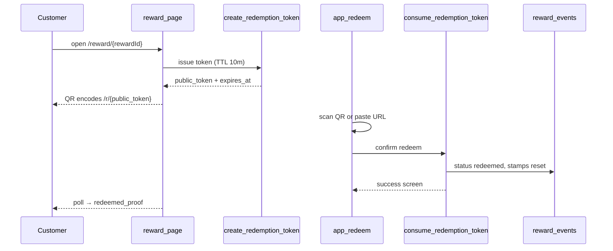

# Merchant-scan one-time redeem QR

## Goal

When a reward is redeemable, the customer **shows a one-time QR at the counter**. A logged-in merchant scans it in the console, confirms, and the reward is redeemed server-side. **No customer tap-to-redeem.** Stamps remain self-service via the permanent venue QR.

This reverses the current flow in [micro-specs/04-staff-rewards/02-reward-unlock-and-redemption.md](micro-specs/04-staff-rewards/02-reward-unlock-and-redemption.md) and [nabaperks-micro-specs-final.md](nabaperks-micro-specs-final.md) (v3 self-redeem). Spec updates are in scope.

---

## Target flow



---

## Architecture decisions

| Decision | Choice | Rationale |
|----------|--------|-----------|
| Redeem authority | Merchant-scan only | User confirmed; removes honour-system self-redeem |
| Merchant surface | `/app/redeem` in merchant console | No paired-station hardware; owner already auth-gated in [app/app/layout.tsx](app/app/layout.tsx) |
| Token transport | URL `/r/{public_token}` in QR | Mirrors permanent venue pattern `/q/{qrId}`; opaque public id, not reward UUID |
| Token TTL | 10 minutes | Short enough to limit abuse; refresh by revisiting reward page |
| Customer sync | Poll token status every 3s on reward page | No Realtime dependency (per AD-09); `prefers-reduced-motion` respected |
| Scanner | `html5-qrcode` (new dep) + manual paste fallback | No scanner exists today; paste covers camera-denied tills |
| Retire | `selfRedeemAction`, `SelfServiceRedeemForm`, customer calls to `redeem_self_service_reward` | RPC can remain for idempotent replay/tests or be wrapped internally by consume RPC |

---

## 1. Spec and docs (first)

Update binding requirements before code:

- [micro-specs/04-staff-rewards/02-reward-unlock-and-redemption.md](micro-specs/04-staff-rewards/02-reward-unlock-and-redemption.md) — replace self-redeem EARS with token + merchant-scan EARS
- [micro-specs/03-customer/02-digital-stamp-card.md](micro-specs/03-customer/02-digital-stamp-card.md) — card CTA becomes "Show QR at counter" not "Redeem reward"
- [docs/ARCHITECTURE.md](docs/ARCHITECTURE.md) — reward redemption sequence diagram
- Add focused spec slice: `micro-specs/04-staff-rewards/03-merchant-scan-redemption.md` (merchant console scan, token TTL, idempotency)

**New EARS (summary):**
- WHEN reward is redeemable, customer app SHALL issue/display a single active redemption token QR
- WHEN merchant scans valid token, system SHALL redeem exactly once
- WHEN token expires or is superseded, scan SHALL fail with clear reason
- WHEN redemption succeeds, customer view SHALL transition to redeemed proof without manual refresh
- WHEN duplicate scan within replay window, system SHALL return same success (idempotent)

---

## 2. Database (new migration)

New table `redemption_tokens` (idempotent migration in [supabase/migrations/](supabase/migrations/)):

```sql
redemption_tokens (
  id uuid PK,
  public_token text NOT NULL UNIQUE,  -- URL-safe, ~12 chars (like qr_id)
  reward_event_id uuid NOT NULL REFERENCES reward_events,
  merchant_id uuid NOT NULL,
  customer_id uuid NOT NULL,
  membership_id uuid NOT NULL,
  expires_at timestamptz NOT NULL,
  consumed_at timestamptz,
  consumed_by_user_id uuid,           -- auth.users id (merchant owner)
  cancelled_at timestamptz,
  created_at timestamptz NOT NULL DEFAULT now()
)
```

Indexes:
- Partial unique: one active token per `reward_event_id` where `consumed_at IS NULL AND cancelled_at IS NULL`
- Lookup: `(merchant_id, public_token)` where active

Optional column restore on `reward_events`:
- `redeemed_by_user_id uuid` (merchant auth user) — dropped in self-service migration; re-add for audit

RLS: service-role only (same as prior `verification_tokens` pattern).

**RPCs (security definer):**

1. **`create_redemption_token(p_reward_event_id uuid, p_customer_id uuid)`**
   - Validates: customer owns reward, status `unlocked`, `redeemable_from` passed, merchant/card/billing active
   - Cancels any prior unconsumed token for same reward
   - Returns `(token_id, public_token, expires_at)`
   - Idempotent: if active unexpired token exists, return it (no spam)

2. **`get_redemption_token_status(p_reward_event_id uuid, p_customer_id uuid)`**
   - Returns: `pending | consumed | expired | none`, plus `consumed_at`, `reward_name`

3. **`consume_redemption_token(p_public_token text, p_merchant_id uuid)`**
   - Validates: `is_merchant_owner(p_merchant_id)`, token belongs to merchant, not expired/consumed
   - Reuses redeem ledger logic from current [`redeem_self_service_reward`](supabase/migrations/20260613220000_fix_service_role_request_detection.sql) (status update, stamp decrement, `product_events`, `audit_logs`)
   - Sets `metadata.redeemed_by = 'merchant_scan'`, `consumed_by_user_id`
   - Idempotent replay if same merchant rescans consumed token within session

4. **`lookup_redemption_token_for_merchant(p_public_token text, p_merchant_id uuid)`** (preview before confirm)
   - Returns masked customer label, reward name, terms, redeemable status — no mutation

**Deprecate customer path:** remove grants/callers for direct `redeem_self_service_reward` from customer actions; keep function temporarily or inline into consume RPC.

Add SQL invariant tests in [supabase/tests/](supabase/tests/) for: create, consume, expire, duplicate, wrong-merchant, already-redeemed reward.

---

## 3. Domain layer (`lib/`)

| Module | Responsibility |
|--------|----------------|
| [lib/customer/redemption-token.ts](lib/customer/redemption-token.ts) (new) | `createRedemptionToken`, `getRedemptionTokenStatus` via service-role client |
| [lib/merchant/redeem.ts](lib/merchant/redeem.ts) (new) | `lookupRedemptionToken`, `consumeRedemptionToken` via server client + `p_merchant_id` |
| [lib/customer/stamp.ts](lib/customer/stamp.ts) | Remove or stop exporting `redeemSelfServiceReward` from customer path |
| [lib/merchant/activity.ts](lib/merchant/activity.ts) | Update `reward_redeemed` copy: "Merchant scan at counter" instead of "Customer self-service redemption"; populate actor as merchant |

---

## 4. Customer UI changes

**Experience deriver** — [lib/customer/experience/load-reward.ts](lib/customer/experience/load-reward.ts), [derive.ts](lib/customer/experience/derive.ts), [types.ts](lib/customer/experience/types.ts):

- New experience kinds: `reward_qr_pending` (show QR + countdown), keep `redeemed_proof`, retire `reward_ready` redeem form path
- Remove `redeemedProof` via `?redeemed=1` redirect; proof comes from token `consumed` status

**Panels** — [components/customer/customer-card-experience.tsx](components/customer/customer-card-experience.tsx):

- Replace `RewardReadyPanel` + `SelfServiceRedeemForm` with `RewardQrPanel`:
  - `RewardTicket` state `ready`
  - QR via [lib/qr/assets.ts](lib/qr/assets.ts) `renderQrCodePng` or client `` from API route
  - Countdown to `expires_at`
  - Client poll hook calling server action / route handler for status
- Card collecting CTA: **"Show QR at counter"** (link to `/reward/{id}`) — [customer-card-experience.tsx](components/customer/customer-card-experience.tsx) line ~239

**New API route** (optional): `app/reward/[rewardId]/qr/route.ts` — returns PNG of `{APP_URL}/r/{public_token}` for crisp display

**Remove:** [app/reward/[rewardId]/actions.ts](app/reward/[rewardId]/actions.ts) `selfRedeemAction`; [components/customer/self-service-forms.tsx](components/customer/self-service-forms.tsx) `SelfServiceRedeemForm` (keep stamp form)

**Copy** — [lib/customer/experience/copy.ts](lib/customer/experience/copy.ts): "Show this QR to staff" / "Waiting for staff to scan"

**Dev harness** — mirror in [app/dev/customer-flow/preview/](app/dev/customer-flow/preview/) and update [tests/e2e/customer-flow-screenshots.spec.ts](tests/e2e/customer-flow-screenshots.spec.ts)

---

## 5. Merchant UI (new)

**Route:** [app/app/redeem/page.tsx](app/app/redeem/page.tsx)

- Server page: `getCurrentMerchant()`, onboarding gate (same as dashboard)
- Client child: `components/merchant/redeem/scanner-panel.tsx`
  - Camera scan via `html5-qrcode`
  - Manual paste field for `/r/{token}` URL
  - On decode → `lookupRedemptionToken` → confirm card (reward name, masked customer)
  - Confirm button → `consumeRedemptionToken` → success/error state

**Public resolver:** [app/r/[token]/page.tsx](app/r/[token]/page.tsx)

- If merchant session: redirect to `/app/redeem?token={token}` (prefill confirm)
- If customer session (token owner): redirect to `/reward/{rewardId}` (waiting view)
- Else: `/login?next=/app/redeem?token={token}` with copy "Staff login required"

**Nav:** add **Redeem** item to [components/layout/merchant-app-shell.tsx](components/layout/merchant-app-shell.tsx) `merchantNavItems` (counter tool, not Launch)

---

## 6. Tests (TDD order)

**Vitest** ([tests/micro-specs/](tests/micro-specs/)):

- `merchant-scan-redemption.test.ts` (new) — RPC mocks: create token, consume, idempotency, wrong merchant, expired
- Update [tests/micro-specs/self-service-stamping.test.ts](tests/micro-specs/self-service-stamping.test.ts) — remove self-redeem action tests; add consume path
- Update [tests/micro-specs/customer.test.ts](tests/micro-specs/customer.test.ts) — reward experience kinds, no `SelfServiceRedeemForm` on reward page
- Update [tests/micro-specs/customer-flow-redesign.test.ts](tests/micro-specs/customer-flow-redesign.test.ts) if reward panel assertions change

**Postgres** ([supabase/tests/](supabase/tests/)):

- `redemption-token-invariants.sql` — atomic consume, one-time use, merchant isolation

**Playwright** ([tests/e2e/](tests/e2e/)):

- Customer shows QR → merchant consume (two contexts or scripted RPC) → customer sees redeemed

---

## 7. Out of scope (this slice)

- Paired till stations / staff PIN flows (legacy, dropped)
- Changing stamp flow (stays self-service)
- Realtime/WebSocket updates
- Reward `destination_type` permanent QR (still join-only venue QR)
- Native app scanner SDK

---

## 8. Rollout / migration notes

- Existing unlocked rewards: customer opens reward page → token auto-created on load
- No data backfill needed for in-flight rewards
- `customer-flow:make-redeemable` script should create redeemable reward; add companion to simulate merchant scan for local demo

---

## Key files to touch

| Area | Files |
|------|-------|
| Spec | `micro-specs/04-staff-rewards/02-*`, new `03-*`, `docs/ARCHITECTURE.md` |
| DB | new `supabase/migrations/20260615*_redemption_tokens.sql`, `supabase/tests/` |
| Customer | `load-reward.ts`, `derive.ts`, `customer-card-experience.tsx`, `copy.ts`, remove `reward/actions.ts` redeem |
| Merchant | `app/app/redeem/*`, `components/merchant/redeem/*`, `merchant-app-shell.tsx`, `lib/merchant/redeem.ts` |
| Public | `app/r/[token]/page.tsx` |
| Deps | `package.json` — `html5-qrcode` |
