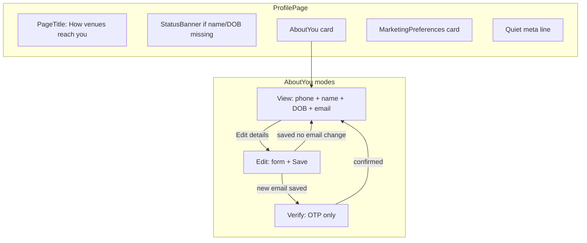

# Profile UX/UI redesign

## Problem (recap)

[`app/home/(authed)/profile/page.tsx`](app/home/(authed)/profile/page.tsx) reuses the **redeem blocking form** ([`components/customer/profile-edit-form.tsx`](components/customer/profile-edit-form.tsx) mirrors [`components/customer/profile-gate-forms.tsx`](components/customer/profile-gate-forms.tsx)) and stacks 5–6 same-weight cards. Result: always-on edit form, split identity (phone vs details), dead-end marketing display, dashboard `MetricTile`s, nested forms during email verify, and duplicate logout (header + page).

## Target information architecture



**One primary card** for identity. **One card** for marketing. No metric tiles. No page-level logout (keep header only in [`components/layout/customer-app-shell.tsx`](components/layout/customer-app-shell.tsx)).

---

## 1. Page shell and copy

**File:** [`app/home/(authed)/profile/page.tsx`](app/home/(authed)/profile/page.tsx)

- Change `PageTitle` to Wet Ink voice (no "account"):
  - Title: **"Your details"**
  - Description: **"How venues can reach you — phone, name, and optional email."**
- Remove `MetricTile` grid and bottom logout form.
- Add quiet footer meta (mono receipt line, not cards):
  - `Member since {formatMonthYear}` · `{n} venue(s)` using existing [`lib/customer/format.ts`](lib/customer/format.ts) helpers.
- If `profileCompletionFrom()` reports incomplete (`!fullName || !dateOfBirth`), render a top `StatusBanner`: **"Add your name and date of birth so you're ready to redeem."** — same framing as redeem gate, but profile-appropriate.
- Compose two child components (new/refactored):
  - `CustomerProfileAboutYou`
  - `CustomerProfileMarketing`

---

## 2. About you — view / edit / verify modes

**Refactor:** [`components/customer/profile-edit-form.tsx`](components/customer/profile-edit-form.tsx) → split into:

| Component | Responsibility |
|-----------|----------------|
| `CustomerProfileAboutYou` | Mode orchestration (`view` \| `edit` \| `verify`) |
| `CustomerProfileView` | Read-only summary + "Edit details" |
| `CustomerProfileEditForm` | Existing save action (trimmed) |
| `CustomerProfileEmailVerify` | OTP step only (no nested form under edit) |

### View mode (default)

Single `surface-card` with `SectionHeader` eyebrow **"About you"**:

| Row | Display |
|-----|---------|
| Phone | Value + `MonoTag tone="leaf"` "Verified" |
| Full name | Value or em dash |
| Date of birth | `formatDate(dob)` via new `formatDateOfBirth(iso)` in [`lib/customer/format.ts`](lib/customer/format.ts) — human date, not raw `1990-01-01` |
| Email | Value, "Not added", or "Awaiting confirmation" + tag |

Footer helper (plain, not alarming): **"To change your phone number, scan a venue QR with your new phone."**

Primary action: **"Edit details"** (`Button variant="secondary"`).

**Default mode rules:**
- Incomplete profile → start in `edit` (banner already explains why).
- `needsEmailVerification` → `verify` mode (email step takes over the card).
- Otherwise → `view`.

### Edit mode

Reuse existing [`saveHomeProfileAction`](app/home/(authed)/profile/actions.ts) and field validation. Changes:
- Do **not** show phone field (read-only in view).
- Remove duplicate `Eyebrow` section header inside form (parent card owns hierarchy).
- CTA: **"Save changes"**; secondary **"Cancel"** returns to view without submit.
- On save with new email → transition to `verify` (server revalidates; client can also flip mode on success message matching `/code/i`).

### Verify mode

Extract current `ProfileEmailVerify` block into its own card state — **only** `StatusBanner` + OTP input + confirm + link actions. No name/DOB fields visible.

Align copy with redeem gate:
- Change **"Remove email"** → **"Continue without email"** (same intent as [`profile-gate-forms.tsx`](components/customer/profile-gate-forms.tsx) line 159).

Keep server actions unchanged ([`actions.ts`](app/home/(authed)/profile/actions.ts)) — behaviour is already tested in [`tests/micro-specs/home-profile.test.ts`](tests/micro-specs/home-profile.test.ts).

---

## 3. Marketing preferences — editable global toggles

User chose **editable toggles**. Consent is **merchant-scoped** in DB ([`consent_records`](supabase/migrations/20260606142000_initial_schema_rls.sql)); join only records one channel at opt-in. Profile will expose **global channel toggles** (Email / SMS / WhatsApp) that apply across all memberships — lowest cognitive load, auditable via append-only inserts per merchant.

### Backend (TDD: SQL + Vitest)

**New migration** `supabase/migrations/20260615140000_customer_marketing_consent.sql` (idempotent):

```sql
create or replace function public.record_customer_marketing_consent(
  p_customer_id uuid,
  p_channel text,
  p_consent_status text,  -- opted_in | opted_out
  p_policy_version text
) returns void ...
```

RPC behaviour:
- `security definer`; validate `p_customer_id`, channel, status, policy version (mirror [`admin_record_consent_opt_out`](supabase/migrations/20260606142000_initial_schema_rls.sql) guards).
- For **each** `customer_memberships` row for that customer, `insert into consent_records` with `source = 'customer_profile'`, `metadata = '{"scope":"all_memberships"}'`.
- Grant execute to `service_role` (server actions call via service-role client, same pattern as [`updateCustomerProfile`](lib/customer/profile.ts)).

**New domain module** [`lib/customer/consent.ts`](lib/customer/consent.ts):
- `MARKETING_POLICY_VERSION = "2026-06-06"` (shared constant; extract from [`app/m/[merchantSlug]/join/actions.ts`](app/m/[merchantSlug]/join/actions.ts) duplicate later if desired).
- `updateCustomerMarketingConsent({ channel, optedIn })` — resolves customer from session, calls RPC.
- Keep read logic in [`getCustomerProfile`](lib/customer/profile.ts) but document: global toggle state = latest `consent_records` row per channel (existing reduce logic is fine for read).

**New server action** in [`app/home/(authed)/profile/actions.ts`](app/home/(authed)/profile/actions.ts):
- `updateHomeMarketingConsentAction(channel, optedIn)` → revalidate `/home/profile`.

**SQL test** `supabase/tests/customer_marketing_consent.sql`: customer with 2 memberships toggles SMS off → 2 new `opted_out` rows, latest read returns opted out.

**Vitest** extend [`tests/micro-specs/home-profile.test.ts`](tests/micro-specs/home-profile.test.ts): action calls RPC with correct args; rejects invalid channel.

### UI component

**New:** [`components/customer/profile-marketing-consent.tsx`](components/customer/profile-marketing-consent.tsx)

- `SectionHeader` eyebrow **"Marketing"**, title **"Updates from your venues"**.
- One row per channel (`email`, `sms`, `whatsapp`) with label + short helper + **toggle** (native checkbox styled like join form in [`components/customer/join-forms.tsx`](components/customer/join-forms.tsx) — `size-5 accent-primary`, not a new primitive).
- Helper copy: **"Optional. Turning this off won't affect stamps or rewards."**
- Empty state (no prior consent rows): show all three toggles defaulting **off**, with note **"You choose this when you join a venue — change it here any time."**
- Each toggle submits via `useActionState` / optimistic pending on that row (one channel at a time — avoids a Save button).

---

## 4. Visual consistency

- Replace per-section `Eyebrow` + `surface-card` stacking with `SectionHeader` from [`components/brand/typography.tsx`](components/brand/typography.tsx) (same pattern as [`app/home/(authed)/rewards/page.tsx`](app/home/(authed)/rewards/page.tsx)).
- Keep Wet Ink tokens; no edits to `components/ui/*`.
- Optional small extract: shared `profileFieldInputClass` + `ProfileField` into [`components/customer/profile-field.tsx`](components/customer/profile-field.tsx) — dedupe between edit form and gate form (Rule of Three: edit form, gate form, dev preview). **Only if** touching gate form is zero-risk; otherwise keep duplication for this slice.

---

## 5. Dev preview

Add profile screen states to [`app/dev/customer-flow/preview/screens.tsx`](app/dev/customer-flow/preview/screens.tsx) + mock in [`mock-forms.tsx`](app/dev/customer-flow/preview/mock-forms.tsx):

- `profile-complete` (view mode)
- `profile-incomplete` (edit mode with banner)
- `profile-email-verify` (verify mode)

Register in [`lib/dev/customer-flow-preview.ts`](lib/dev/customer-flow-preview.ts) step list so UX can be reviewed alongside join/redeem.

---

## 6. Docs

Update [`docs/CUSTOMER_FLOW.md`](docs/CUSTOMER_FLOW.md) Profile section and remove pitfall "Profile marketing consent is read-only" — replace with note that global channel toggles write append-only per-merchant records.

---

## 7. Tab bar — Scan in the centre

**File:** [`components/layout/customer-tab-bar.tsx`](components/layout/customer-tab-bar.tsx)

Current order (5-column grid): **Home · Scan · Rewards · Activity · Profile** — Scan is 2nd (left of centre).

**Target order:** **Home · Rewards · Scan · Activity · Profile** — swap Scan and Rewards so Scan sits in the **centre slot** (3rd of 5), matching the product’s core verb (scan at the counter).

```text
[ Home ] [ Rewards ] [ Scan ] [ Activity ] [ Profile ]
                      ^^^^^
                      centre
```

Implementation:
- Reorder the `tabs` array only — no layout/CSS change (`grid-cols-5` stays).
- `isActive` logic for `/scan` is already isolated; no behaviour change beyond position.
- Optional (nice-to-have, same slice): slightly emphasise the centre Scan tab — e.g. `size-10` icon circle or vermillion accent on the icon when inactive — **only if** it stays within Wet Ink (no floating FAB). Default: position swap alone unless it reads too flat in manual check.

No new routes or tests required; smoke-check tab order on mobile viewport after change.

---

## Out of scope (explicit)

- Per-venue consent breakdown UI (correct but heavy; defer unless compliance asks).
- Phone number change flow (still QR re-join; copy softened only).
- Moving member-since / venue count to Home dashboard (footer line is enough for this pass).
- E2E Playwright specs (none exist for profile today).

---

## Verification

```bash
pnpm vitest run tests/micro-specs/home-profile.test.ts
pnpm vitest run tests/micro-specs/customer-experience.test.ts  # ensure gate unchanged
pnpm db:test:rls  # includes new SQL consent test
pnpm typecheck && pnpm lint
```

Manual on `http://localhost:3000/home/profile`:
1. Complete profile → lands in **view** mode, no always-on form.
2. Edit → save → returns to view; new email → **verify-only** card.
3. Marketing toggles persist across refresh.
4. Single logout (header only).
5. Compare scroll depth vs before — target ≤2 cards + 1 meta line.

Manual tab bar:
6. Bottom nav reads **Home · Rewards · Scan · Activity · Profile** with Scan visually centred.
