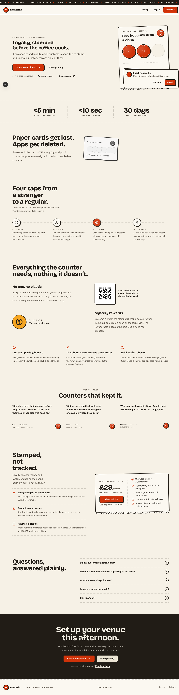
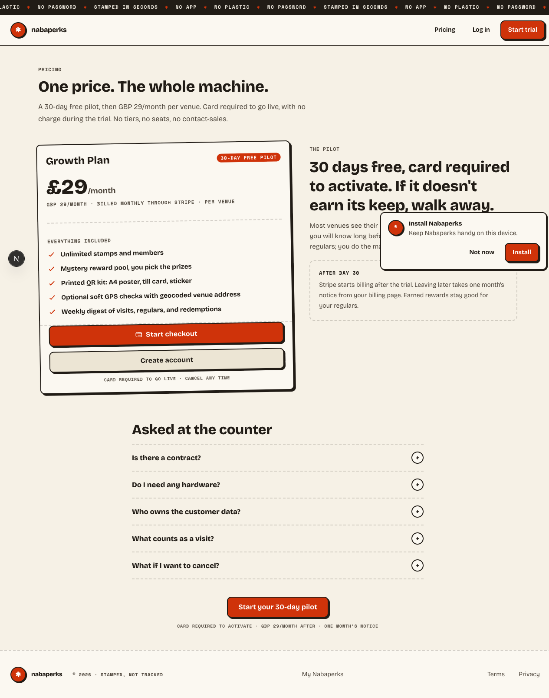
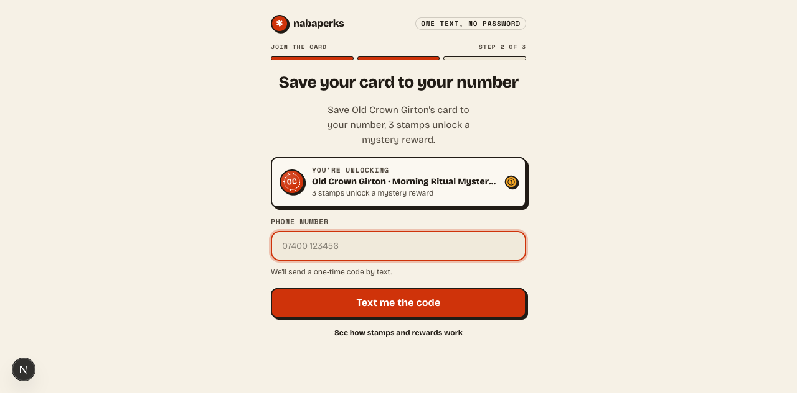
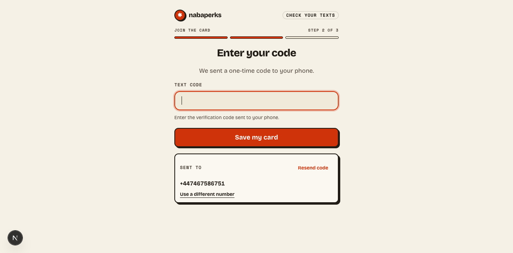
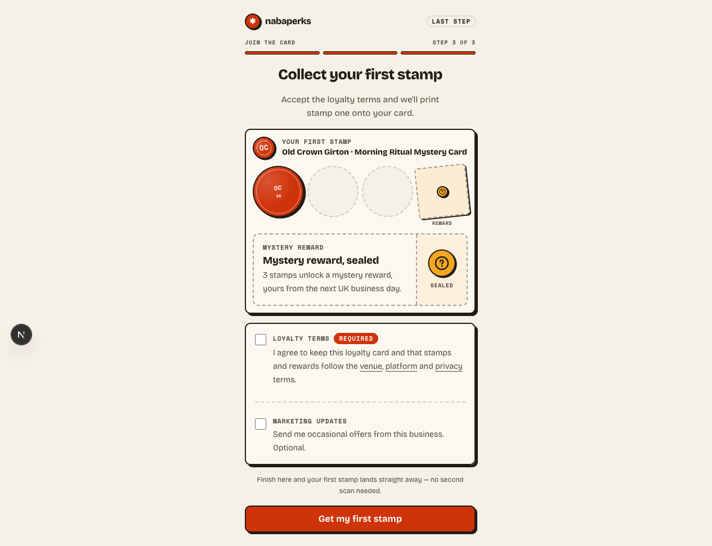
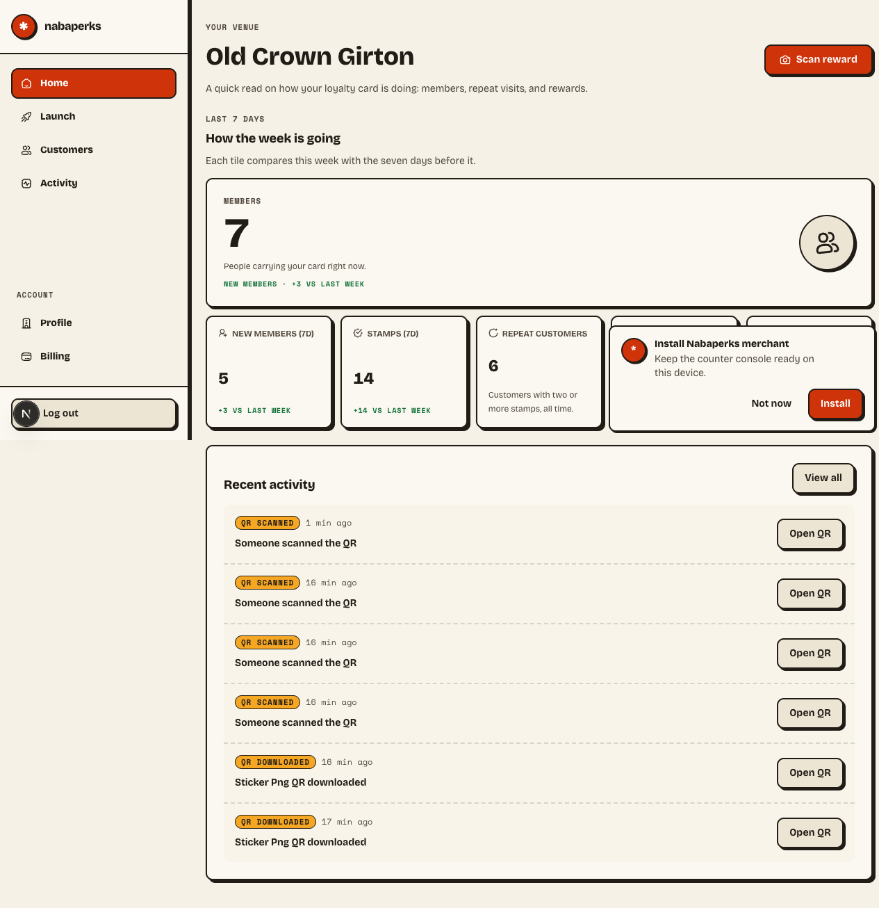
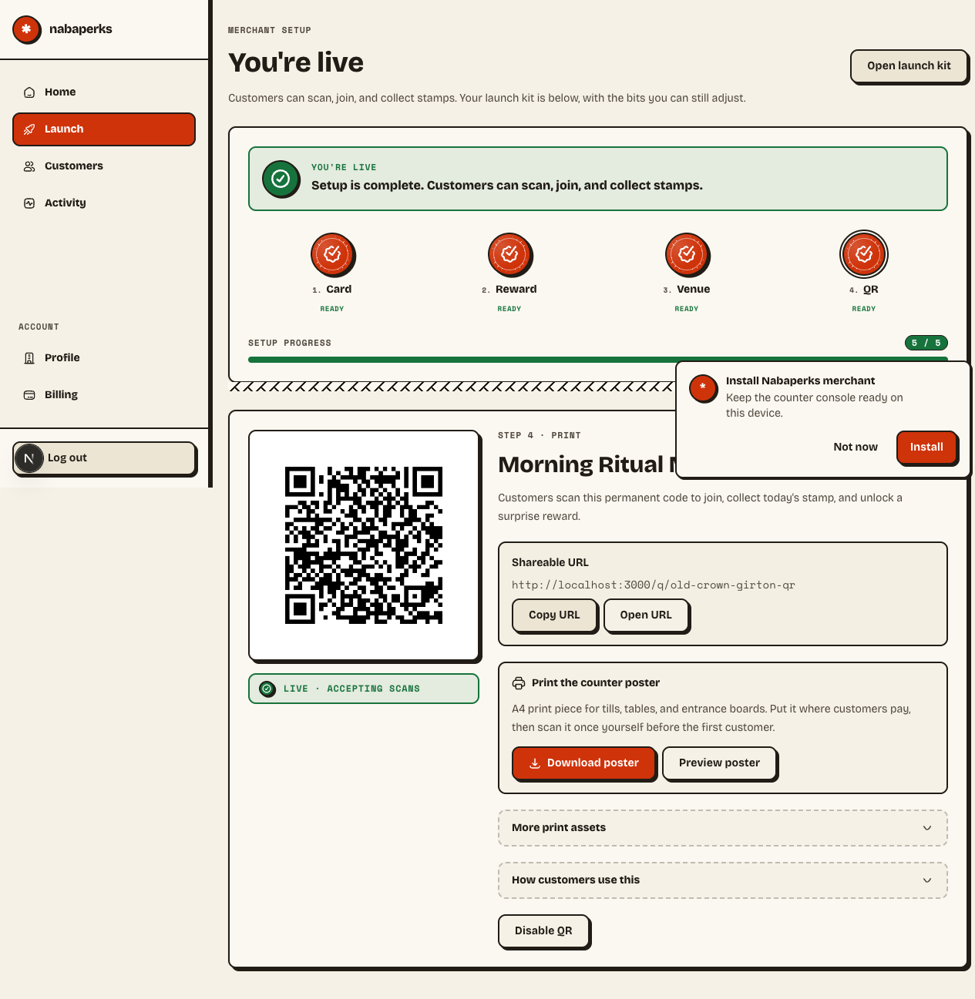
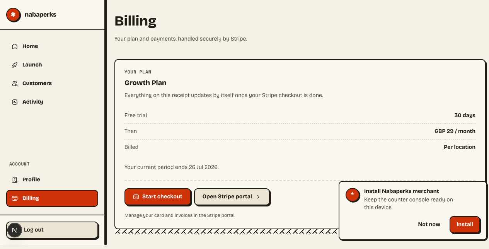
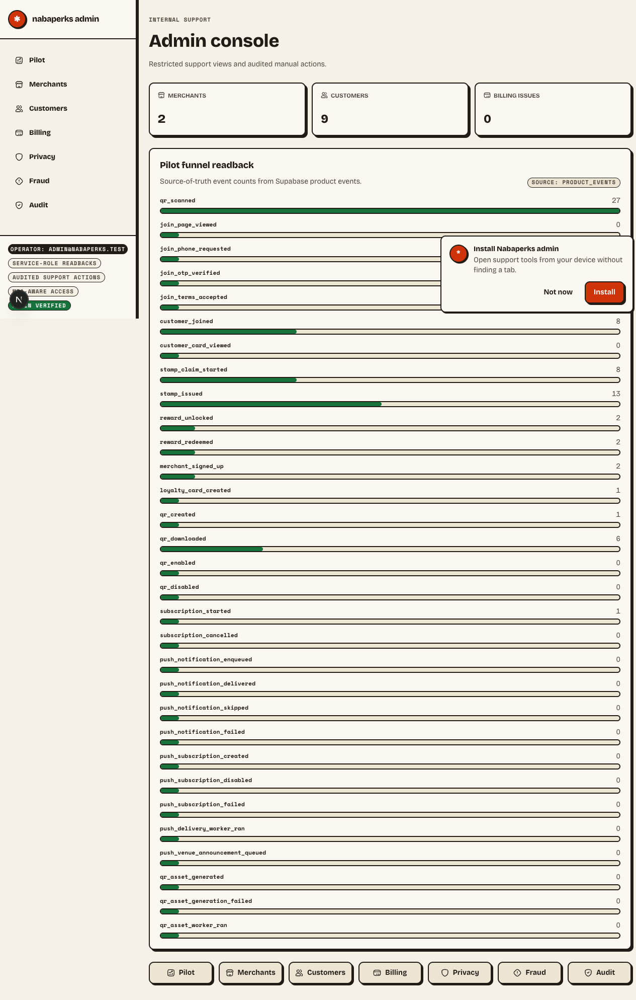
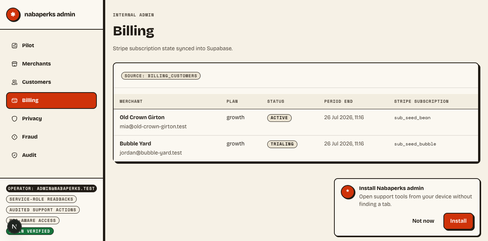

# Nabaperks Full Local QA Report

**Date:** 2026-06-26  
**Target:** Local app, `http://localhost:3000`  
**Database:** Local Supabase, reset and reseeded before the exhaustive run  
**Result:** PASS

## Executive Summary

The local QA pass completed successfully across static checks, unit coverage, security checks, SQL/RLS, production build, performance guards, browser E2E, visual screenshots, accessibility checks, major capability scenarios, flaky repeat runs, route timing, and representative manual browser QA.

One quality-gate blocker was fixed during the run: two JSX comments were removed from `app/pricing/page.tsx`, bringing the quality warning count from `30` down to the configured `29` warning budget.

## Gate Results

| Gate | Command | Result | Evidence |
| --- | --- | --- | --- |
| Full repository QA | `pnpm qa:full` | PASS | Static, unit, security, DB/RLS, build, perf, E2E, visual, and a11y all completed. |
| Major capability scenarios | `pnpm qa:scenarios` | PASS | `14/14` scenarios passed. Evidence: `.omo/evidence/major-capability-scenarios/2026-06-26T10-22-21Z/` |
| Flaky repeat suite | `pnpm test:flaky` | PASS | `3/3` shuffled runs passed, `887` tests per run. |
| Route timing smoke | `pnpm perf:routes -- --base-url http://127.0.0.1:3000` | PASS | Key routes returned expected statuses within timeout. |
| Functional browser QA | Local `qa` skill flow | PASS | `8/8` representative browser checks passed. |

## Coverage Map

| Area | Coverage Performed | Result |
| --- | --- | --- |
| Governance and traceability | Micro-spec governance, route contract, traceability, handoff policy | PASS |
| Static quality | Typecheck, ESLint, quality ratchets, naming, debt scan, N+1 scan, dead code, duplication | PASS |
| Unit and coverage | Vitest micro-spec suite with coverage thresholds | PASS |
| Security | Static security verifier plus focused auth/session/webhook/PII tests | PASS |
| Database | Migration verification, seed, tenant isolation, RLS, SQL invariants | PASS |
| Build and perf | Next production build, bundle budget, dependency footprint, read-path performance | PASS |
| Browser E2E | Customer journey, merchant/admin surfaces, QR/reward flows, PWA, Google Places fallback | PASS |
| Visual | Customer flow, launch, design system, merchant/admin screenshots | PASS |
| Accessibility | Axe WCAG A/AA checks across 13 surfaces | PASS |
| Flakiness | Three shuffled repeat Vitest runs | PASS |

## Route Timing Snapshot

| Route | Status | Median TTFB |
| --- | --- | --- |
| `/` | `200` | `46.9ms` |
| `/pricing` | `200` | `23.8ms` |
| `/start` | `200` | `17ms` |
| `/app` | `307 -> /login?next=%2Fapp` | `20.4ms` |
| `/q/demo` | `200` | `37.3ms` |
| `/m/demo` | `200` | `23.5ms` |

## Visual Evidence

### Animated Customer Flow

Screen recording via `agent-browser record` could not be produced because `ffmpeg` is not installed locally. Since ImageMagick is installed, the customer QR → phone → OTP → stamped-card path was captured as an animated GIF instead.

### Public Surfaces

### Customer QR and Stamp Flow

### Merchant Console

### Admin Console

## Notes and Follow-ups

- Local Supabase was reset and reseeded before the full run.
- Screenshot and visual test artifacts updated existing `docs/screenshots/**` files as part of the project’s visual QA workflow.
- Real screen recording can be added later by installing `ffmpeg`; current report includes an animated GIF walkthrough instead.
