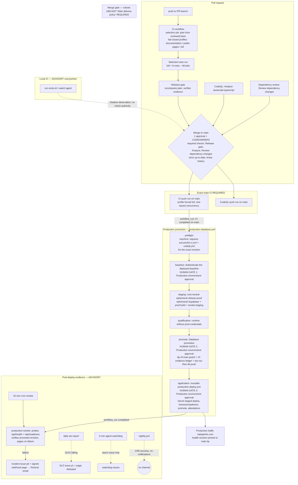

# Delivery system audit — lapeninns/nabaperks

- Audit date: 2026-09-21. Read-only: no code, branch, PR, workflow, ruleset, or environment was modified.
- Ground truth: `origin/main` @ `17c3094bec70eb563260326b4198ce1e1651923a` ("feat(console): counter-first venue console rebuild, lanes L2–L8 (#354)", 2026-09-21T16:46:47Z). The local checkout (`codex/console-l8-sweep`) is byte-identical to `origin/main` in tree content, so all `path:line` citations are valid for both.
- Live evidence window: 2026-08-22..2026-09-21 (3,182 workflow runs, complete census).
- Evidence files (same directory): `01-workflow-inventory.md`, `02-hosted-ci-design.md`, `03-selection-bypass.md`, `04-local-runner-parity.md`, `05-release-monitoring.md`, `06-run-stats.md`, `07-reliability.md`, `08-governance-prs-promotions.md`, `09-security-supply-chain.md`, `10-doc-drift.md`, plus raw API data under `data/`.
- Anything not verifiable is marked **UNVERIFIED** rather than assumed.

## Summary

Nabaperks ships through a 17-workflow GitHub Actions pipeline: a change-aware CI (three profiles, fail-closed to full) whose `Release gate` — plus CodeQL and dependency review — are the only required merge checks, followed by a six-stage production promotion (`preflight → baseline → staging → qualification → promote → application`) protected by a one-hour evidence ledger, tip-of-main guards, and human approvals on the `Production` environment. The change-aware selection model survived adversarial review: no constructed bypass lets a behaviour-changing PR reach main on a targeted profile, with one bounded exception (a docs-only PR can merge while the unit tier is red). Thirty days of telemetry (3,182 runs, ≈71,600 billed job-minutes, all on free public-repo `ubuntu-latest` runners) show a healthy merge path but three reliability debts: `nightly.yml` succeeds only 2/36 times with zero notifications, `slo-report.yml` has failed 31/31 runs, and a handful of approval-gated promotion jobs have held runners for days — one for 6.9 days despite a 15-minute job timeout. The `Production` environment has exactly one eligible reviewer with `prevent_self_review: true`, so a self-merge by that reviewer deadlocks promotion. Security posture is strong — every action is full-SHA pinned, there are no injection surfaces, and secrets are confined to environments — while the main documentation debt is drift between the ops docs and the installed selection policy.

## 1. Architecture: pushed commit to production traffic

Required versus advisory, verified against the live ruleset (`gh api repos/lapeninns/nabaperks/rulesets`, id `19613437`, evidence `08-governance-prs-promotions.md` §1):

- **Required to merge:** `Release gate` (ci.yml), `Analyze (javascript-typescript)` (codeql.yml), `Review dependency changes` (dependency-review.yml); 1 approving review with `require_code_owner_review` (CODEOWNERS = `@lapeninns @amanshresthaa` for all paths); strict up-to-date; linear history; force-push and deletion blocked; no bypass actors; `current_user_can_bypass: never`.
- **Required to promote:** exact-revision successful `ci.yml` push run + `codeql.yml` run (preflight, `production-database.yml:47-76`), then three human approvals on the `Production` environment (baseline, promote, deploy; sole configured reviewer `amanshresthaa`, `prevent_self_review: true`), plus the machine gates: stage-ledger chain with 1-hour expiry (`scripts/release/manifest.mjs:110-112`), tip-of-main equality at staging/baseline/promote/deploy (`production-database.yml:109,253,374-377`; `production-deploy.yml:113`), and Vercel staged-deploy verification before promotion (`production-deploy.yml`).
- **Advisory (gate nothing):** local CI (shadow observation, trusted observer, nightly proof), `nightly.yml`, `slo-report.yml`, `agent-watchdog.yml`, `factory-status.yml`, `production-smoke.yml` (post-hoc), `release-notes.yml`, `recovery-drill.yml`.

## 2. Correctness of the selection model

Full mechanism: `02-hosted-ci-design.md`; adversarial analysis: `03-selection-bypass.md`.

**Model in brief.** For PRs, the `selection` job checks out the _reviewed base_ and runs `scripts/ci/plan-checks.mjs` from it (`ci.yml:78-89`); the merge candidate is read only as Git objects. The change inventory is `git diff --raw -z --no-renames base..candidate` via hardened Git (`scripts/ci/impact-git.mjs:139-174`). Classification (`scripts/ci/change-impact.mjs:39-104`) is a strict allowlist: `docs/operations/` + `docs/decisions/` + `README.md` Markdown → `documentation`; `app/{about,faq,how-it-works}/page.tsx` with modified-only, masked-equal TypeScript ASTs (text/presentation props only) and no other source consumers → `public-pages`; paired canonical visual baseline PNGs may ride with a qualified page change; **everything else — deletions, mode changes, unsafe paths, empty or failed inventory, pushes, forks — fails closed to `full`** (`plan-checks.mjs:91-101`). Root `AGENTS.md` changes are outside the allowlist. The release gate recomputes the plan from reviewed code and requires success for selected jobs, explicit `skipped` for unselected ones, plan deep-equality, and the comparison iff required (`scripts/ci/verify-impact-evidence.mjs:12-100`).

**Can a behaviour change reach main without a full run? No working bypass found** (empirically tested where the planner is pure):

1. _Test-helper move to a non-classified path_ → full. There is no test selection to defeat; transitive import analysis exists only to _reject_ the public-pages profile (`impact-presentation.mjs:121-176`) and to trigger the comparison (`impact-dependencies.mjs:7-80`, 14-entrypoint closure, 41 modules).
2. _Fixture change_ → full. Snapshot PNGs qualify only via exact-name, modified-only, same-PR page pairing (`impact-snapshots.mjs`).
3. _Binary/asset change_ → full before any content read; binaries disguised as `.md`/pages fail closed on parse errors.
4. _Workflow env / `.github/**` change_ → full; `ci.yml` and the two composite actions additionally force the qualification comparison, and the candidate `ci.yml` must be byte-identical to `config/ci-qualification-workflow.yml` on main (`qualification-source.mjs:127-175`; currently `cmp`-identical).
5. _Self-modification of the policy_ → full + comparison anchored to main's verifier and main's staged bytes; an activation PR may only carry content pre-staged on main (PR #329's three files are byte-identical to #327's staged `.source` copies). The plan/verdict always come from the base's code, so the PR cannot influence its own classification. Residual: future-policy safety rests on human code-owner review of staged bytes — disclaimed in the artifact's own `limitations` (`compare-targeted-evidence.mjs:230-232`).
6. _Renames, symlinks, lockfiles, `package.json` script edits, tsconfig aliases, deletions, empty diffs_ → all full.

**One verified bounded gap:** the `documentation` profile runs secrets/contracts/docs checks (`scripts/ci/documentation-evidence-contract.mjs`, 8 cases) but **not the unit tier**, while unit tests parse allowlisted docs (`local-ci-main-cli.test.mjs` reads `docs/operations/local-ci.md`). EMPIRICAL: a bogus documented `install.sh` flag kept all documentation-workload checks green while the unit test went red — a docs-only PR can merge with a red unit tier; main then goes red on the next push. Consistency-only impact (no runtime behaviour), but it contradicts the "docs PRs are safe" invariant. Minor trigger-coverage gaps also exist: `verify-required-evidence.mjs`, `config/ci-qualification-workflow.yml`, and non-a11y e2e helpers force full but no comparison (they cannot produce targeted merges).

**Is "policy bootstrap: full validation" permanent? No — and it is not the live state.** The bootstrap message is a YAML fallback that fires only when the _reviewed base_ lacks `scripts/ci/plan-checks.mjs` / `verify-impact-evidence.mjs` (`ci.yml:95-123`, gate fallback `ci.yml:781-805`); both files exist on main, so targeted profiles are installed and active today. The documented path is foundation → integration → comparison → select (`docs/operations/change-aware-ci.md:153-163`); expanding profiles requires another qualification (`:165`); rollback is "force profile full" (`:206-207`). Staged `config/ci-qualification-inputs/**.source` files are inert review data. Live evidence agrees: all 20 recent merged PRs ran the full nine-root profile, and the qualification comparison ran only for PR #329 (which changed `plan-checks.mjs`; run `34704673184`) and was skipped for the other 19 — exactly as designed.

## 3. Local versus hosted parity

Full analysis with citations: `04-local-runner-parity.md`. Two local planes exist: the roots runner (`ops/local-ci/roots/run-roots.sh`, developer-invoked Docker) and the watch agent (Lima VM + pinned `nabaperks-ci-job:<sha>` image).

**Faithful dimensions:** hosted Playwright image digest grepped verbatim out of `ci.yml` (`run-roots.sh:23`); Node 24 / pnpm 10.28.0 on all planes; env synthesis excludes real secrets by construction (`workflow-env.mjs:9-26`; agent allowlist + minted fixtures); e2e `/32` sharding with 4 packs × 8 shards matches; harness isolation via clean `git worktree add`.

**Roots that cannot run locally:** `build`, `visual`, `lighthouse`, `zap-baseline` have no agent lane (`docs/operations/local-ci.md:89-91`); visual is permanently hosted (snapshot token guard); nightly `zap-full` is x64-only; nightly `db-stress` fails deterministically (`Cannot find package 'postgres'`, `local-ci.md:96-100`); `load-race` needs a repo secret; fork heads are never executed locally (allowlist on `lapeninns/nabaperks` + numeric repo id).

**Authority:** local runs carry **none** in the merge or release path. The live ruleset requires exactly the three hosted checks; the shadow observer is one 2-minute `continue-on-error` read that posts no check run and refuses enforcing contracts (`local-ci-shadow.yml:29-56`; `scripts/check-local-ci-proof.mjs:248-253`); the trusted-observer workflow has never run (`routeTrustedProof` has no callers); the nightly proof cannot go red (advisory + `continue-on-error`). The "Nabaperks Local CI" GitHub App (appId 4839346) has only `checks:write` + `actions:write` (rerun-failed-jobs, unwired); its key is host-local `0600`. `LOCAL_CI_MODE` controls observation, not service startup.

**Divergences:** 15 total — see Appendix B. The consequential ones: D2 (roots runs `test:visual` with live snapshot comparison and no snapshot guard, while the agent plane forbids it — pixel-noise failures or accidental baseline writes on arm64), D6 (local ZAP uses floating `ghcr.io/zaproxy/zaproxy:stable` vs the pinned hosted action), D7 (local Lighthouse builds against the checkout's symlinked `node_modules`, not the branch's frozen install — a branch with a different lockfile can be tested against the wrong dependency tree), D4/D5 (unpinned Homebrew Supabase CLI and a reduced service stack on rewritten ports for the db root).

## 4. Cost

Full statistics: `06-run-stats.md`. Window 2026-08-22..2026-09-21, complete census of **3,182 runs** (per-workflow totals sum exactly to the repo `total_count`).

- **Volume:** 35,527 run wall-minutes; estimated job-minutes ≈64,272 raw / ≈71,641 billed-round (SAMPLED, ESTIMATED, ±30% band; method in `06-run-stats.md` §4).
- **Money: $0.00.** The repo is public and every sampled job label (107 runs) plus every workflow definition uses `ubuntu-latest` — standard public-repo runners are free. Billing-usage APIs returned 404 (user account; token lacks `user` scope) — usage figures UNVERIFIED via API, but no paid runner class exists in the repo.
- **Where the minutes go:** `ci.yml` ≈36.0k raw job-min (56% of the window; 4.0× job/wall ratio from 48–169 parallel jobs); `production-database.yml` ≈15.2k — but dominated by approval-gate holds (one "Database promotion" job occupied a runner 9,959 min ≈ 6.9 days before cancellation; also runs `35245440488` 4,234 min, `34170494641` 1,134 min); `nightly.yml` ≈12.7k at a 5.6% success rate — near-pure waste in the window.
- **Weekly trend (billed est):** W34 1.0k → W35 3.4k → W36 31.6k → W37 25.1k → W38 8.1k → W39 2.5k. W36+W37 = 79% of the window (console-rebuild PR volume + promotion holds).
- **Duplication:** negligible. 407 ci runs / 404 distinct head SHAs; only 3 SHAs ran CI twice; 79 of 92 ci cancellations are normal PR branch supersession (ref-keyed `cancel-in-progress`); 13 cancelled push runs on main (2026-09-05..08) predate the sha-keyed concurrency fix (`94c667cb`, PR #295).
- **Structurally unavoidable share:** the three required checks per PR head (strict up-to-date forces re-runs when base moves), exact-main full CI (the promotion preflight depends on it), promotion gates, and scheduled monitors.
- **Local-first saving potential:** since hosted minutes are free, the local-first policy's value is queue time and feedback latency, not money. The savings that do exist are capacity/time: (1) fix or scope down `nightly.yml` (~14.5k billed job-min/30d at 94% failure); (2) cancel stale promotion holds automatically (~15k job-min/30d, mostly waiting); (3) `factory-status.yml` runs 837 times (twice-hourly cron + every CI/CodeQL/promotion completion + PR events) but is tiny (≈39 billed min) — leave it.

Concrete recommendations with acceptance tests are in §9 (P2-1..P2-3).

## 5. Release safety

Full analysis: `05-release-monitoring.md`; live promotion evidence: `08-governance-prs-promotions.md` §6.

**Gate mechanics (verified).** Preflight admits only a successful CI `workflow_run` on main or a typed-confirmation dispatch, and requires successful `ci.yml` + `codeql.yml` runs for the exact revision (CodeQL waited 60×10s). Three human approvals on `Production`: baseline → promote → deploy. Every protected stage re-verifies the stage ledger with a fresh clock; evidence older than 1 hour is rejected before any mutation (`scripts/release/manifest.mjs:110-112`; failure message "Release stage ledger verification failed; advancing the release is forbidden.", `stage-ledger.mjs:510-513`). Tip-of-main equality is checked at staging (`production-database.yml:109`), baseline (`:253`), promote (`:374-377`), and deploy (`production-deploy.yml:113`), so a candidate superseded on main cannot be promoted even if approved late. The runbook itself acknowledges the approval-window race (`production-runbook.md:318-321`).

**Stuck-state hazards.**

1. **Superseded waiting run holds the `production-release` slot.** The group is shared with the admin-MFA workflows and has `cancel-in-progress: false` (`production-database.yml:20-21`). Live: promotions #149/#151 sat unapproved 1h48m/1h53m (evidence already expired) and were cancelled by newer dispatches #150/#152. There is **no automatic timeout on a pending environment approval**: a forgotten run holds the slot (and, per observed data, a runner for days — §4) until a human cancels it. The queued newer run cannot start; when it does, the tip-of-main guard protects correctness, so the hazard is delay and capacity, not a stale deploy.
2. **prevent_self_review deadlock.** `Production` has exactly one required reviewer (`amanshresthaa`) with `prevent_self_review: true`; CODEOWNERS owners are `@lapeninns @amanshresthaa`. Promotion runs observed in the window were triggered by actor `lapeninns` and approved — consistent with the sole reviewer approving. If `amanshresthaa` merges a PR, that person becomes the run actor and **cannot approve any of the three gates**, and no other account is an eligible reviewer: the promotion deadlocks until environment settings change. Approver identity per gate is UNVERIFIED (deployment statuses record the run actor, not the approver), but the configuration makes the hazard structural.
3. **Post-promotion smoke supersession.** `production-smoke.yml` triggers on `workflow_run` completed (including cancelled promotions — but probes are gated on `conclusion == 'success'`, `:29`, so a cancelled promotion correctly probes nothing) and shares concurrency group `production-smoke` with `cancel-in-progress: true` against the 15-minute cron. Observed: promotion #152's automatic smoke `35632084507` was **cancelled** and replaced by dispatch `35632094279` (same sha, success). Because the cron probes current production (which is the promoted revision), coverage is approximately maintained, but the bound "smoke verified the promoted revision" evidence can be silently replaced by an unbound run.

**Rollback.** Application: documented Vercel instant rollback with a pre-rollback guard (`scripts/check-passwordless-rollback-revision.mjs`) and post-rollback probes (`production-runbook.md:382-399`). Database: forward-only; compensating migration through the normal gate; no full-backup restore over live data without incident-owner approval (`:399-405`). **Nothing is automated**, and `recovery-drill.yml` (which read-only verifies an operator-performed restore to a new project: ledger, forced RLS, 7 core tables, 3 RPCs, `scripts/check-restored-backup.mjs:7-23`) had **zero runs in the window** — restore capability is currently unproven.

**Coupling.** Tight and correct: `application` `needs: promote` and downloads the artifact named with the same run id/attempt (`production-deploy.yml:105-109`); the ledger identity re-derives from Git (`stage-ledger.mjs:482-501`); preflight binds caller path and run identity (`production-deploy.yml:51-71`). Docs-only promotions (`application_required == 'false'`) skip staging/qualification/promote/application entirely and smoke verifies the unchanged baseline. The application cannot deploy without the same revision's DB stage having succeeded in the same run.

**Evidence retention.** All release artifacts 90 days (baseline, qualification, runtime, stage ledger, verified stage bundle, candidate); recovery-drill evidence 365 days; `production-smoke.yml` uploads **no artifacts** — smoke evidence lives only in run logs (GitHub default log retention applies, UNVERIFIED). After 90 days an auditor retains issues, run summaries, and attestations, but not the stage ledgers.

## 6. Reliability

Full analysis: `07-reliability.md` (3,182 runs; 227 job-level API fetches).

- **Failure census:** 2,213 success / 541 failure / 335 cancelled / 93 skipped; 0 startup_failure. `ci.yml`: 407 runs, 72 failed, 92 cancelled; reruns rare (1.5% overall; ci 9.3%) and effective — 36/38 rerun ci runs went green.
- **Four failure classes.** (1) GitHub billing shutdowns: 419 zero-step job failures across 17 runs (09-09..09-21), including 3 nightly runs failing all 132 jobs each, annotation "job was not started because recent account payments have failed or your spending limit needs to be increased" — the same billing problem the public migration presumably addressed; (2) artifact 403s ("Failed to FinalizeArtifact … Forbidden", run `34252798166`); (3) two browser-image verification mass failures (runs `34809164971` 09-14, `35563994282` 09-21: all 24 browser jobs died pre-test, `check-browser-image.mjs` exit 1, root cause UNVERIFIED); (4) real test failures, mostly visual-baseline churn during the 09-11..21 console rebuild.
- **Flakiest surfaces:** Lighthouse (home 10F/10P, loyalty 6, gate 19); `E2E (desktop-firefox, pack 2)` 4F/4P — the most chronic cell; `Cost-neutral ephemeral release proof` 4F/4P; CodeQL 3. Consistently-failing (real, not flake): console-sweep PR runs `35505771259`, `35616938984`, `35619178220` blocked on the evidence-comparison verifier.
- **Per-browser verdict:** excluding the two mass-failure runs — desktop-safari (WebKit) is the least stable single channel (22 e2e failures / 14 runs); firefox 19; mobile-safari 18; chromium 18. Nightly spreads evenly (26-28 per channel).
- **Timeouts:** not a constraint — one near-limit event (Lighthouse home 9.8m vs 10m budget, run `33849136878`); failed jobs die fast (e2e median 1.0 min).
- **Systemic windows:** 08-22..26 smoke resolver bug storm (178 failures; probes green, only "Resolve the external incident" failed); 09-03..08 deploy crisis incl. 13 cancelled push CI runs on main (fixed by sha-keyed concurrency, `94c667cb` PR #295); **09-17..20 real production outage** (smoke probes + watchdog failing); 09-18..21 billing shutdowns.
- **Visual baselines.** Hosted CI compares only `-linux` snapshots (`playwright.config.ts:61-64`); regeneration is meant to come from hosted Linux, never local macOS (AGENTS.md). Local commit `1919a3df` regenerated 16 baselines inside the CI-pinned Linux container (not macOS captures) and hosted run `35623718919` confirmed them. Risks: regeneration is convention, not control — one **direct push to main (`0a6f4abf`, 09-07) changed 6 baselines with no PR review** (how it bypassed the ruleset is UNVERIFIED — possibly predating ruleset enforcement); within-PR churn flip-flopped (`064d5a95` → `1919a3df`); plain non-`-linux` baselines drift invisibly because hosted CI never consumes them.
- **Monitoring reliability debt:** `nightly.yml` 2/36 success with **no notification path at all** (no `issues:` grant, no webhook step); `slo-report.yml` 31/31 failed — the SLO gate has been red for the entire window.

## 7. Security and supply chain

Full analysis: `09-security-supply-chain.md`.

- **Permissions:** every job has an explicit permissions block; none inherits the repo default (`default_workflow_permissions: "write"`, `GET actions/permissions/workflow` — moot in practice). Worst grants are justified: `contents: write` only in release-notes (push-to-main, release-drafter); `id-token/attestations/artifact-metadata: write` only in the environment-gated deploy jobs (`production-deploy.yml:81-86`) for `actions/attest`; `issues: write` only in agent-watchdog/production-smoke/slo-report incident jobs.
- **Pinning:** 0 unpinned actions — all 17 distinct remote `uses:` are full-40-hex SHA pinned; all 3 hosted `container:` images digest-pinned. Only floating ref in the delivery system: `ghcr.io/zaproxy/zaproxy:stable` in the advisory local roots script (`ops/local-ci/roots/run-roots.sh:57`). Repo setting `sha_pinning_required: false` despite this — enabling it would make the convention a control.
- **Injection:** effectively none. The single `pull_request_target` (`factory-status.yml:8-9`) is safe by construction: all-read permissions, checkout pinned to `ref: main` with `persist-credentials: false`, no secrets. `workflow_run` consumers are main-branch-filtered and hard-bind revision/caller identity (`production-deploy.yml:51-73`). No `${{ github.* }}` interpolation inside any `run:` block (env-indirection throughout); two cosmetic exceptions (`recovery-drill.yml:41` dispatch input; `.github/actions/playwright` `inputs.project`, static callers only).
- **Secrets:** PR-reachable CI uses literal fixture values only (`ci.yml:34-58`); per-run generated fixtures are masked (`production-database.yml:117-151`). Local plane: allowlist passthrough (`["TERM"]`), `CREDENTIAL_PATTERNS`, `assertNoHostSecrets`, contract validation, build-time image guard. The local-CI GitHub App is least-privilege (§3).
- **Scanning coverage:** dependency-review on PRs (`fail-on-severity: high`, license deny-list); CodeQL `security-extended` for JS/TS on PR + push + weekly; dependabot weekly for npm + github-actions. Gaps: 3 **open** secret-scanning alerts (`stripe_webhook_signing_secret` strings in test files, validity "unknown" — likely fixtures matching the 4 resolved "used_in_tests" ones; not confirmable against Stripe — UNVERIFIED).
- **Public-repo residual exposure:** low. Fork PRs reach zero secrets and no write scope beyond CodeQL SARIF; the local plane refuses fork heads; zero self-hosted runners. Residuals: Monitoring paging secrets are documented as unprovisioned (`docs/operations/devops-maturity.md:142`) — the webhook steps fail-safe but page nothing if so; historical run logs pre-dating publicness are uninspectable (rotation documented in `production-runbook.md:152,550`) — UNVERIFIED; date the repo became public UNVERIFIED.

## 8. Documentation drift

Full table (15 drift items + dead references + undocumented behaviours, both sides quoted): `10-doc-drift.md`. The material items:

- **D1 (High).** `docs/operations/production-runbook.md:117` says "Confirm `/` returns 404" during release verification — `/` has served the rebuilt marketing site since #127 and a live probe returns 200. **This release-verification step can never pass as written.**
- **D2–D5 (High).** `docs/operations/local-ci.md:33,37-39`, `local-ci-handoff.md:39-41`, and `ci-redesign-completion.md:118-125` still describe Phase 1 / "the nine-root gate is live main behaviour / affected-test selection is not activated". Reality: the change-aware selection is installed and active (`ci.yml:69-241`; `scripts/ci/plan-checks.mjs`), and `Release gate` enforces the _selected_ plan, not always nine roots (`verify-impact-evidence.mjs:38-48` reports unselected roots "not required (not executed)"). AGENTS.md's own CI section is accurate; the ops docs disagree with it.
- **D6 (Medium).** `local-ci.md:509-514` instructs pinning `appId`/`installationId`/`repositoryId` as outstanding work; all three are already pinned (`config/local-ci-contract.json:13-15`).
- **D7–D9 (Medium).** Local-CI sharding/heap claims (`local-ci.md:1447-1448`, `local-ci-handoff.md:175-177`) are stale post-Phase-2: hosted e2e is 4 packs × 8 shards (`ci.yml:464`), a11y /4, local e2e /32, browser heap 4096 MiB.
- **D15 (Low).** `config/local-ci-contract.json` agentLiveness note says "15 minutes grace"; the field, workflow, and watchdog doc all say 20.
- **Dead references:** `docs/decisions/` (allowlisted in `change-aware-ci.md:14` + `config/ci-impact-policy.json:7`, doesn't exist — harmless forward-looking); `hosted-proof.yml` / `governance.yml` referenced only inside the superseded `local-ci-cutover.md`; stale comments in `nightly-proof.yml:4` and `scripts/check-nightly-proof.mjs:4` pointing at a `local-proof` bridge in `ci.yml` that lives in `local-ci-shadow.yml`.
- **Undocumented behaviours:** `nightly.yml` has no owning doc at all; `factory-status.yml`'s twice-hourly automation is undocumented; `production-deploy.yml` redeploys the `admin-webauthn` edge function on every release (`:189-204`) while the runbook documents only the alert receiver; CodeQL's weekly scheduled scan is absent from primary ops docs.
- **Verified accurate (no drift):** the nine-roots list in AGENTS.md ↔ ci.yml job ids ↔ `REQUIRED_HOSTED_JOBS`; the change-aware allowlist ↔ `config/ci-impact-policy.json`; the runbook's gate sequence ↔ the workflows; AGENTS.md's CI statements ("exact-main CI requires every hosted root", "database promotion also needs CodeQL and protected release proof", "local CI is advisory").

## 9. Recommendations

**P1 — blocks safety or correctness.**

| #    | Where                                                                     | Change                                                                                                                                                                                                                                                                                                   | Acceptance test                                                                                                           |
| ---- | ------------------------------------------------------------------------- | -------------------------------------------------------------------------------------------------------------------------------------------------------------------------------------------------------------------------------------------------------------------------------------------------------- | ------------------------------------------------------------------------------------------------------------------------- |
| P1-1 | GitHub `Production` environment + `docs/operations/production-runbook.md` | Add a second eligible Production reviewer (or document a tested break-glass), so a self-merge by `amanshresthaa` cannot deadlock all three promotion gates under `prevent_self_review`.                                                                                                                  | A promotion whose run actor is `amanshresthaa` can be approved end-to-end without changing environment settings.          |
| P1-2 | `.github/workflows/nightly.yml`                                           | Add failure notification (issue via `issues: write` + github-script, or the existing `notify-production-alert.mjs` webhook). Currently 2/36 green with zero signal.                                                                                                                                      | A deliberately failed nightly dispatch opens/updates one tracked issue.                                                   |
| P1-3 | `production-database.yml` / ops                                           | Auto-cancel pending Production approvals past the 1-hour evidence expiry (scheduled janitor or a `timeout-minutes` on the _job_ cannot cover approval waits; use the deployments API). One job held a runner 9,959 min despite `timeout-minutes: 15` — cause UNVERIFIED, needs investigation regardless. | No `production-database` run remains in a waiting/pending state > 2h; any job exceeding its timeout-minutes is explained. |
| P1-4 | `slo-report.yml` / `config/production-slos.json`                          | Fix the persistent failure (31/31): either the smoke-conclusion data source is wrong for outage windows or the targets need recalibration; stop comment-per-run spam on the standing issue.                                                                                                              | `slo-report` goes green during a week of normal operation and its issue is closed by the recovery path.                   |
| P1-5 | `config/ci-impact-policy.json` + `scripts/ci/run-workload.mjs`            | Include the unit tier in the `documentation` profile (unit tests parse allowlisted docs; proven gap in `03-selection-bypass.md`).                                                                                                                                                                        | A docs-only PR that breaks a doc-parsing unit test fails CI at the documentation job.                                     |
| P1-6 | `docs/operations/production-runbook.md:117`                               | Fix the dead "`/` returns 404" verification step (returns 200 since #127).                                                                                                                                                                                                                               | The runbook's release-verification steps all pass against a healthy production.                                           |

**P2 — costs money, runner capacity, or operator time.**

| #    | Where                  | Change                                                                                                                                                                                                                     | Acceptance test                                                                                                      |
| ---- | ---------------------- | -------------------------------------------------------------------------------------------------------------------------------------------------------------------------------------------------------------------------- | -------------------------------------------------------------------------------------------------------------------- |
| P2-1 | `nightly.yml`          | Fix the 34/36 failures (billing shutdowns aside, investigate the cross-browser/mutation lanes) or cut scope (e.g. mutation weekly, shards /16) — ~14.5k billed job-min/30d at 5.6% success.                                | Nightly success rate > 80% over two weeks, or budget reduced by the removed scope.                                   |
| P2-2 | `production-smoke.yml` | Give `workflow_run`-triggered smoke its own concurrency group (or `cancel-in-progress: false`) so a post-promotion bound smoke is not superseded by the 15-min cron (observed: `35632084507` cancelled → manual dispatch). | Every successful promotion is followed by a completed smoke bound to the promoted revision, with no manual dispatch. |
| P2-3 | `factory-status.yml`   | Drop the twice-hourly cron (workflow_run + PR events already cover state changes; 837 runs/30d).                                                                                                                           | Runs/day drops by ~48 with no consumer complaining (sole consumer is the human operator loop).                       |
| P2-4 | Ops docs D2–D9, D15    | Update `local-ci.md`, `local-ci-handoff.md`, `ci-redesign-completion.md` to the installed selection policy and current sharding/heap figures.                                                                              | Quoted claims match `ci.yml` / `config/ci-workloads.json`; `pnpm agents:check` passes.                               |

**P3 — hygiene.**

| #    | Where                  | Change                                                                                                                                                                                                      | Acceptance test                                                                                  |
| ---- | ---------------------- | ----------------------------------------------------------------------------------------------------------------------------------------------------------------------------------------------------------- | ------------------------------------------------------------------------------------------------ |
| P3-1 | Repo settings          | Enable `sha_pinning_required` (all actions are already SHA-pinned; make the convention a control).                                                                                                          | `GET actions/permissions` returns `sha_pinning_required: true`.                                  |
| P3-2 | Docs/comments          | Remove dead references (`docs/decisions/` from the allowlist or create the dir; quarantine `hosted-proof.yml`/`governance.yml` mentions; fix `nightly-proof.yml:4` / `check-nightly-proof.mjs:4` comments). | `rg` finds no references to nonexistent workflows/dirs outside archived docs.                    |
| P3-3 | Visual baselines       | Investigate how `0a6f4abf` (09-07) pushed 6 baseline changes directly to main with no PR; make baseline regeneration require the hosted-Linux path by control, not convention.                              | Ruleset/audit-log explanation recorded; a direct-to-main baseline push is blocked or alerted on. |
| P3-4 | `recovery-drill.yml`   | Run the drill (0 runs in 30 days; restore capability currently unproven) and put it on a quarterly cadence.                                                                                                 | A completed drill run with its 365-day evidence artifact exists.                                 |
| P3-5 | `production-smoke.yml` | Upload probe results as a small JSON artifact (smoke currently produces no artifacts).                                                                                                                      | A smoke run archives a probe-result artifact with ≥90-day retention.                             |
| P3-6 | Secret scanning        | Resolve or dismiss-with-reason the 3 open `stripe_webhook_signing_secret` alerts (test fixtures).                                                                                                           | Zero open secret-scanning alerts.                                                                |
| P3-7 | `docs/operations/`     | Document `nightly.yml` (no owning doc) and the `admin-webauthn` per-release redeploy.                                                                                                                       | Each workflow has an owning doc section.                                                         |

## Appendix A — workflow inventory and 30-day statistics

Required? = whether the workflow's check is required by ruleset `19613437` ("Main delivery policy", verified 2026-09-21) or by the promotion path. Duration = run wall-clock (median/p95, min). Hosted minutes = estimated billed job-minutes (SAMPLED, ESTIMATED — see `06-run-stats.md` §4). 17 workflow files exist (the brief's count of 19 includes GitHub's dynamic dependabot pseudo-workflow and one branch-only workflow).

| File                                    | Triggers                                                                            | Required?                                        | Environment                    | Median min       | Runs (30d) | Success % | Hosted min (est) |
| --------------------------------------- | ----------------------------------------------------------------------------------- | ------------------------------------------------ | ------------------------------ | ---------------- | ---------- | --------- | ---------------- |
| `ci.yml`                                | push[main], pull_request[main]                                                      | **Required** (`Release gate`)                    | —                              | 10.8 (p95 75.2)  | 407        | 59.7      | ≈41,160          |
| `codeql.yml`                            | push, pull_request, schedule (Mon 03:27)                                            | **Required** (`Analyze (javascript-typescript)`) | —                              | 2.0              | 412        | 98.5      | ≈79              |
| `dependency-review.yml`                 | pull_request[main]                                                                  | **Required** (`Review dependency changes`)       | —                              | 0.2              | 317        | 99.4      | ≈17              |
| `production-database.yml`               | workflow_run[CI, main], dispatch                                                    | **Required for release** (the promotion path)    | Production (baseline, promote) | 20.4 (p95 237.7) | 105        | 20.0      | ≈15,243          |
| `production-deploy.yml`                 | workflow_call only (from production-database)                                       | **Required for release** (nested stage)          | Production (deploy)            | 0.1              | 48         | 12.5      | ≈102             |
| `production-smoke.yml`                  | schedule (every 15 min), workflow_run[promotion], dispatch                          | Advisory (post-hoc evidence)                     | Monitoring                     | 0.5              | 464        | 28.9      | ≈146             |
| `nightly.yml`                           | schedule (02:24), dispatch                                                          | Advisory                                         | —                              | 87.5             | 36         | 5.6       | ≈14,475          |
| `slo-report.yml`                        | schedule (07:13), dispatch                                                          | Advisory                                         | Monitoring                     | 0.5              | 31         | 0.0       | ≈9               |
| `agent-watchdog.yml`                    | schedule (every 5 min), dispatch                                                    | Advisory                                         | —                              | 0.4              | 125        | 83.2      | ≈183             |
| `factory-status.yml`                    | schedule (×2/h), workflow_run[CI, CodeQL, promotion], pull_request_target, dispatch | Advisory                                         | —                              | 0.7              | 837        | 71.9      | ≈39              |
| `local-ci-shadow.yml`                   | push[main], pull_request[main]                                                      | Advisory (explicitly never required)             | —                              | 0.2              | 249        | 100.0     | ≈13              |
| `nightly-proof.yml`                     | schedule (09:47), dispatch                                                          | Advisory                                         | —                              | 0.3              | 16         | 100.0     | ≈13              |
| `local-ci-trusted-observer.yml`         | dispatch                                                                            | Advisory (never run)                             | —                              | —                | 0          | —         | 0                |
| `release-notes.yml`                     | push[main], dispatch                                                                | Advisory                                         | —                              | 0.1              | 90         | 100.0     | ≈17              |
| `admin-mfa-bootstrap.yml`               | dispatch (typed confirmation)                                                       | Advisory (manual control)                        | Production                     | 1.8              | 3          | 33.3      | ≈5               |
| `admin-mfa-activation.yml`              | dispatch (typed confirmation)                                                       | Advisory (manual control)                        | Production                     | —                | 0          | —         | 0                |
| `recovery-drill.yml`                    | dispatch (typed confirmation)                                                       | Advisory (manual control; never run)             | Recovery Drill                 | —                | 0          | —         | 0                |
| `dynamic/dependabot/dependabot-updates` | dynamic (built-in)                                                                  | Advisory                                         | —                              | 3.7              | 41         | 58.5      | ≈140             |
| `hosted-staging.yml`                    | push (branch-only, not on main)                                                     | Advisory                                         | —                              | 0.0              | 1          | 0.0       | 0                |

Per-trigger totals (all workflows): pull_request 1,150 runs / ≈32,075 min; workflow_run 791 / ≈15,272; schedule 625 / ≈13,562; push 321 / ≈9,211; pull_request_target 216 / ≈18; workflow_dispatch 38 / ≈1,363; dependabot 41 / ≈140. Total ≈71,641 billed-round job-minutes, $0.00 on the public-repo free tier.

## Appendix B — local runner versus hosted CI divergences

Source: `04-local-runner-parity.md` (full citations there). "Local" = the roots runner and/or watch-agent plane as noted.

| #   | Dimension               | Hosted                                               | Local                                                                                                                           | Consequence                                                                                       |
| --- | ----------------------- | ---------------------------------------------------- | ------------------------------------------------------------------------------------------------------------------------------- | ------------------------------------------------------------------------------------------------- |
| D1  | Architecture            | x86-64 `ubuntu-latest` / Playwright noble amd64      | arm64 (Lima VM aarch64, Rosetta off)                                                                                            | ~0.01 px visual variance possible; timing excluded from equivalence                               |
| D2  | Visual snapshots        | Approved x64 `-linux` baselines, snapshot guard      | Roots plane runs `test:visual` with live comparison, no `--update-snapshots=none`; agent plane forbids visual entirely          | Pixel-noise failures or accidental baseline writes on arm64; visual stays hosted-only by design   |
| D3  | Quality root content    | 7 hygiene sweeps + print-kit PDF proof               | Roots `quality` = sweeps only; PDF proof is a separate agent lane                                                               | Roots plane never exercises the print-kit proof inside `quality`                                  |
| D4  | Supabase CLI            | Pinned 2.106.0                                       | Roots: unpinned Homebrew CLI; agent db lane: pinned 2.106.0                                                                     | Roots db root may run a different stack version                                                   |
| D5  | Supabase stack/ports    | Full stack on 54322                                  | Roots excludes 6 services, ports rewritten to 557xx                                                                             | edge-runtime/vector etc. unexercised locally; URL/hook values differ                              |
| D6  | ZAP image               | `zaproxy/action-baseline@v0.15.0` (pinned)           | `ghcr.io/zaproxy/zaproxy:stable` floating tag                                                                                   | Engine drift possible; nightly zap-full is x64-only, never local                                  |
| D7  | Lighthouse              | 4 jobs × 1 route on the shared frozen build artifact | 1 invocation × 4 routes on a host build with **symlinked** `node_modules`                                                       | A branch whose lockfile differs from the checkout can be tested against the wrong dependency tree |
| D8  | Browser dev-server heap | 8192 MiB                                             | Agent lanes 4096 MiB (roots matches hosted)                                                                                     | Memory-pressure behaviour can differ on the agent plane                                           |
| D9  | a11y sharding           | /4 (2 projects × 4 jobs)                             | Agent lanes /8 sequential; roots /4                                                                                             | Same test union, different chunking                                                               |
| D10 | Parallelism             | 48–169 jobs/run, ~6–7 min wall                       | One Mac, ≤ ~5 concurrent lanes                                                                                                  | Local cannot reproduce hosted contention/flake behaviour                                          |
| D11 | Container user          | `--user 1001`                                        | Roots runs as root                                                                                                              | Root-user side effects; two tests need non-root host runs                                         |
| D12 | Env synthesis           | Literal fixtures in `ci.yml`                         | Roots extracts the same literals; agent mints per-run fixtures                                                                  | No functional difference; real secrets never enter either plane                                   |
| D13 | Harness ports/dist      | 127.0.0.1:3146, shared `.next-e2e`                   | Per-lane ports 3146–3152, own dist dirs                                                                                         | No contention; outcomes unchanged                                                                 |
| D14 | Fork PRs                | Full hosted matrix                                   | Never executed locally (repo allowlist)                                                                                         | Forks get zero local coverage; hosted covers them fully                                           |
| D15 | Internal doc drift      | —                                                    | `profiles/README.md` claims 12288 MiB heap (operative: 4096); `local-ci.md` claims merge-tree checkout (shadow pins `base.sha`) | README statements stale vs source; workflow/source authoritative                                  |

## Appendix C — production probes (2026-09-21)

- `GET https://nabaperks.com/api/health` → 200: `{"status":"ok","scope":"liveness","revision":"17c3094bec70","environment":"production","uptime":3146,"time":"2026-09-21T18:18:27Z"}` — **production runs exactly the tip of main** (`17c3094b…`, merged via PR #354 and promoted in run `35628770690`); uptime 3,146 s is consistent with that promotion ~50 minutes earlier.
- `GET https://nabaperks.com/api/readiness` → 401 `{"status":"unauthorized","scope":"readiness"}` — readiness requires the `PRODUCTION_MONITOR_SECRET` bearer token, as designed (`production-smoke.yml:78-81`). Readiness body content UNVERIFIED without the secret.

## Appendix D — explicitly unverified items (consolidated)

1. Billing usage totals via API (404s; token lacks `user` scope). The $0 verdict rests on public-tier rules + verified `ubuntu-latest`-only labels.
2. Per-gate approver identity on production promotions (deployment statuses record the run actor, not the approver).
3. Cause of the 6.9-day "Database promotion" runner hold despite `timeout-minutes: 15` present since 2026-07-23.
4. Root causes: `check-browser-image.mjs` exit 1 on runs `34809164971`/`35563994282`; artifact-finalize 403s; Lighthouse flake; smoke-resolver storm exit 1s.
5. How direct-to-main baseline push `0a6f4abf` (09-07) bypassed review (ruleset state at that time unknown).
6. Live repository variables `LOCAL_CI_MODE`, `LOCAL_CI_WATCHDOG_ENABLED`, `STAMP_RACE_URL`/`REDEEM_RACE_URL` values.
7. Whether the 3 open secret-scanning alerts are non-live fixtures; contents of pre-public run logs; date the repo became public.
8. The 13 cancelled ci push runs on main (09-05..08) and 36/92 cancelled ci runs with no overlapping successor (cancellation cause is not exposed by the API).
9. `hosted-staging.yml` content (absent from main; verified only from its feature branch).
10. GitHub's retention of run logs/attestations beyond the 90-day artifact window; delivery of GitHub issue notifications to the assignee's email.
